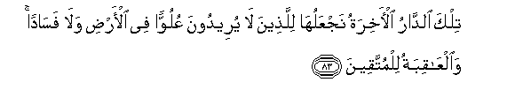
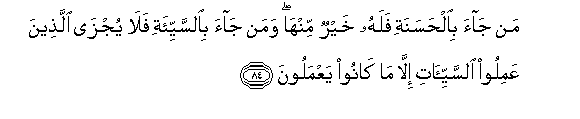
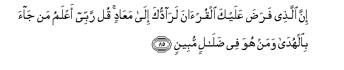
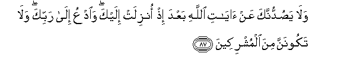
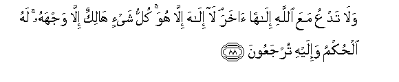

  
[Intangible Textual Heritage](../../index)  [Islam](../index.md) 
[Index](index.md)   
[Hypertext Qur'an](../htq/index)  [Unicode](../uq/028.htm#028_083.md) 
[Palmer](../sbe09/028)  [Pickthall](../pick/028.htm#028_083.md)  [Yusuf Ali
English](../yaq/yaq028)  [Rodwell](../qr/028.md)   
  
[Sūra XXVIII.: Qaṣaṣ, or the Narration. Index](028.md)  
  [Previous](02808)  [Next](02901.md) 

------------------------------------------------------------------------

  
*The Holy Quran*, tr. by Yusuf Ali, \[1934\], at Intangible Textual
Heritage

------------------------------------------------------------------------

# Sūra XXVIII.: Qaṣaṣ, or the Narration.

### Section 9

------------------------------------------------------------------------

83. Tilka a**l**dd<u>a</u>ru al-<u>a</u>khiratu najAAaluh<u>a</u>
lilla<u>th</u>eena l<u>a</u> yureedoona AAuluwwan fee al-ar<u>d</u>i
wal<u>a</u> fas<u>a</u>dan wa**a**lAA<u>a</u>qibatu lilmuttaqeen**a**

83\. What Home of the Hereafter  
We shall give to those  
Who intend not high-handedness  
Or mischief on earth:  
And the End is (best)  
For the righteous.

------------------------------------------------------------------------

84. Man j<u>a</u>a bi**a**l<u>h</u>asanati falahu khayrun minh<u>a</u>
waman j<u>a</u>a bi**al**ssayyi-ati fal<u>a</u> yujz<u>a</u>
alla<u>th</u>eena AAamiloo a**l**ssayyi-<u>a</u>ti ill<u>a</u> m<u>a</u>
k<u>a</u>noo yaAAmaloon**a**

84\. If any does good, the reward  
To him is better than  
His deed; but if any  
Does evil, the doers of evil  
Are only punished (to the extent)  
Of their deeds.

------------------------------------------------------------------------

85. Inna alla<u>th</u>ee fara<u>d</u>a AAalayka alqur-<u>a</u>na
lar<u>a</u>dduka il<u>a</u> maAA<u>a</u>din qul rabbee aAAlamu man
j<u>a</u>a bi**a**lhud<u>a</u> waman huwa fee <u>d</u>al<u>a</u>lin
mubeen**in**

85\. Verily He Who ordained  
The Qur-ān for thee, will bring  
Thee back to the Place  
Of Return. Say: "My Lord  
Knows best who it is  
That brings true guidance,  
And who is in manifest error."

------------------------------------------------------------------------

86. Wam<u>a</u> kunta tarjoo an yulq<u>a</u> ilayka alkit<u>a</u>bu
ill<u>a</u> ra<u>h</u>matan min rabbika fal<u>a</u> takoonanna
*<u>th</u>*aheeran lilk<u>a</u>fireen**a**

86\. And thou hadst not expected  
That the Book would be  
Sent to thee except as  
A Mercy from thy Lord:  
Therefore lend not thou support  
In any way to those  
Who reject (God's Message).

------------------------------------------------------------------------

87. Wal<u>a</u> ya<u>s</u>uddunnaka AAan <u>a</u>y<u>a</u>ti
All<u>a</u>hi baAAda i<u>th</u> onzilat ilayka wa**o**dAAu il<u>a</u>
rabbika wal<u>a</u> takoonanna mina almushrikeen**a**

87\. And let nothing keep thee  
Back from the Signs of God  
After they have been revealed  
To thee: and invite (men)  
To thy Lord, and be not  
Of the company of those  
Who join gods with God.

------------------------------------------------------------------------

88. Wal<u>a</u> tadAAu maAAa All<u>a</u>hi il<u>a</u>han <u>a</u>khara
l<u>a</u> il<u>a</u>ha ill<u>a</u> huwa kullu shay-in h<u>a</u>likun
ill<u>a</u> wajhahu lahu al<u>h</u>ukmu wa-ilayhi turjaAAoon**a**

88\. And call not, besides God,  
On another god. There is  
No god but He. Everything  
(That exists) will perish  
Except His own Face  
To Him belongs the Command,  
And to Him will ye  
(All) be brought back.

------------------------------------------------------------------------

[Next: Section 1 (1-13)](02901.md)

