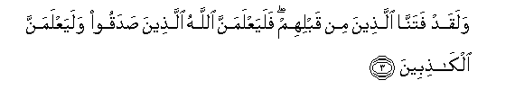
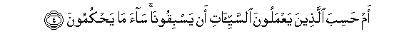
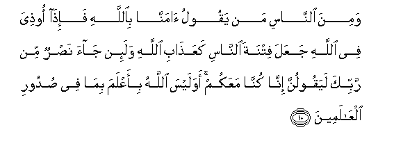
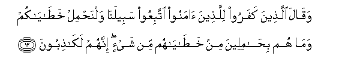

  
[Intangible Textual Heritage](../../index)  [Islam](../index) 
[Index](index)   
[Hypertext Qur'an](../htq/index)  [Unicode](../uq/029.htm#029_001) 
[Palmer](../sbe09/029)  [Pickthall](../pick/029.htm#029_001)  [Yusuf Ali
English](../yaq/yaq029)  [Rodwell](../qr/029)   
  
[Sūra XXIX.: ‘Ankabūt, or the Spider Index](029)  
  [Previous](02809)  [Next](02902) 

------------------------------------------------------------------------

  
*The Holy Quran*, tr. by Yusuf Ali, \[1934\], at Intangible Textual
Heritage

------------------------------------------------------------------------

# Sūra XXIX.: ‘Ankabūt, or the Spider

### Section 1

1. Alif-l<u>a</u>m-meem

1\. A. L. M.

------------------------------------------------------------------------

2. A<u>h</u>asiba a**l**nn<u>a</u>su an yutrakoo an yaqooloo
<u>a</u>mann<u>a</u> wahum l<u>a</u> yuftanoon**a**

2\. Do men think that  
They will he left alone  
On saying, "We believe",  
And that they will not  
Be tested?

------------------------------------------------------------------------

3. Walaqad fatann<u>a</u> alla<u>th</u>eena min qablihim falayaAAlamanna
All<u>a</u>hu alla<u>th</u>eena <u>s</u>adaqoo walayaAAlamanna
alk<u>ath</u>ibeen**a**

3\. We did test those  
Before them, and God will  
Certainly know those who are  
True from those who are false.

------------------------------------------------------------------------

4. Am <u>h</u>asiba alla<u>th</u>eena yaAAmaloona
a**l**ssayyi-<u>a</u>ti an yasbiqoon<u>a</u> s<u>a</u>a m<u>a</u>
ya<u>h</u>kumoon**a**

4\. Do those who practise  
Evil think that they  
Will get the better of us?  
Evil is their judgment!

------------------------------------------------------------------------

5. Man k<u>a</u>na yarjoo liq<u>a</u>a All<u>a</u>hi fa-inna ajala
All<u>a</u>hi la<u>a</u>tin wahuwa a**l**ssameeAAu alAAaleem**u**

5\. For those whose hopes are  
in the meeting with God  
(In the Hereafter, let them strive);  
For the Term (appointed)  
By God is surely coming:  
And He hears and knows  
(All things).

------------------------------------------------------------------------

6. Waman j<u>a</u>hada fa-innam<u>a</u> yuj<u>a</u>hidu linafsihi inna
All<u>a</u>ha laghaniyyun AAani alAA<u>a</u>lameen**a**

6\. And if any strive (with might  
And main), they do so  
For their own souls:  
For God is free of all  
Needs from all creation.

------------------------------------------------------------------------

7. Wa**a**lla<u>th</u>eena <u>a</u>manoo waAAamiloo
a**l**<u>ssa</u>li<u>ha</u>ti lanukaffiranna AAanhum sayyi-<u>a</u>tihim
walanajziyannahum a<u>h</u>sana alla<u>th</u>ee k<u>a</u>noo
yaAAmaloon**a**

7\. Whose who believe and work  
Righteous deeds,—from them  
Shall We blot out all evil  
(That may be) in them,  
And We shall reward  
Them according to  
The best of their deeds.

------------------------------------------------------------------------

8. Wawa<u>ss</u>ayn<u>a</u> al-ins<u>a</u>na biw<u>a</u>lidayhi
<u>h</u>usnan wa-in j<u>a</u>had<u>a</u>ka litushrika bee m<u>a</u>
laysa laka bihi AAilmun fal<u>a</u> tu<u>t</u>iAAhum<u>a</u> ilayya
marjiAAukum faonabbi-okum bim<u>a</u> kuntum taAAmaloon**a**

8\. We have enjoined on man  
Kindness to parents: but if  
They (either of them) strive  
(To force) thee to join  
With Me (in worship)  
Anything of which thou hast  
No knowledge, obey them not.  
Ye have (all) to return  
To Me, and I will  
Tell you (the truth)  
Of all that ye did.

------------------------------------------------------------------------

9. Wa**a**lla<u>th</u>eena <u>a</u>manoo waAAamiloo
a**l**<u>ssa</u>li<u>ha</u>ti lanudkhilannahum fee
a**l**<u>ssa</u>li<u>h</u>een**a**

9\. And those who believe  
And work righteous deeds,—  
Them shall We admit  
To the company of the Righteous.

------------------------------------------------------------------------

10. Wamina a**l**nn<u>a</u>si man yaqoolu <u>a</u>mann<u>a</u>
bi**A**ll<u>a</u>hi fa-i<u>tha</u> oo<u>th</u>iya fee All<u>a</u>hi
jaAAala fitnata a**l**nn<u>a</u>si kaAAa<u>tha</u>bi All<u>a</u>hi
wala-in j<u>a</u>a na<u>s</u>run min rabbika layaqoolunna inn<u>a</u>
kunn<u>a</u> maAAakum awa laysa All<u>a</u>hu bi-aAAlama bim<u>a</u> fee
<u>s</u>udoori alAA<u>a</u>lameen**a**

10\. Then there are among men  
Such as say, "We believe  
In God"; but when they suffer  
Affliction in (the cause of) God,  
They treat men's oppression  
As if it were the Wrath  
Of God! And if help  
Comes (to thee) from thy Lord,  
They are sure to say,'  
"We have (always) been  
With you!" Does not God  
Know best all that is  
In the hearts of all Creation?

------------------------------------------------------------------------

11. WalayaAAlamanna All<u>a</u>hu alla<u>th</u>eena <u>a</u>manoo
walayaAAlamanna almun<u>a</u>fiqeen**a**

11\. And God most certainly knows  
Those who believe, and as certainly  
Those who are Hypocrites.

------------------------------------------------------------------------

12. Waq<u>a</u>la alla<u>th</u>eena kafaroo lilla<u>th</u>eena
<u>a</u>manoo ittabiAAoo sabeelan<u>a</u> walna<u>h</u>mil
kha<u>ta</u>y<u>a</u>kum wam<u>a</u> hum bi<u>ha</u>mileena min
kha<u>ta</u>y<u>a</u>hum min shay-in innahum lak<u>ath</u>iboon**a**

12\. And the Unbelievers say  
To those who believe:  
"Follow our path, and we  
Will bear (the consequences)"  
Of your faults." Never  
In the least will they  
Bear their faults: in fact  
They are liars!

------------------------------------------------------------------------

13. Walaya<u>h</u>milunna athq<u>a</u>lahum waathq<u>a</u>lan maAAa
athq<u>a</u>lihim walayus-alunna yawma alqiy<u>a</u>mati AAamm<u>a</u>
k<u>a</u>noo yaftaroon**a**

13\. They will bear their own  
Burdens, and (other) burdens  
Along with their own,  
And on the Day of Judgment.  
They will be called to account  
For their falsehoods.

------------------------------------------------------------------------

[Next: Section 2 (14-22)](02902)

