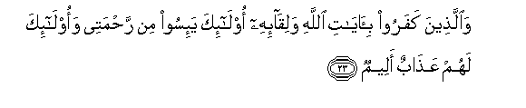
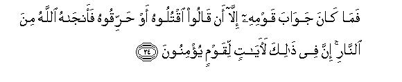
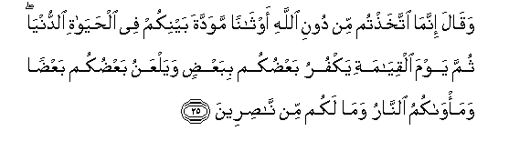
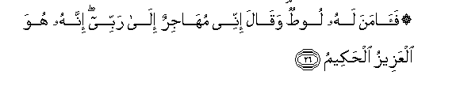
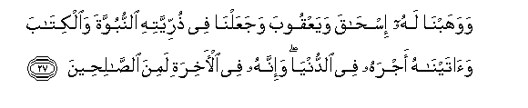
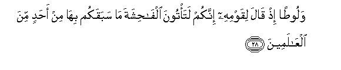
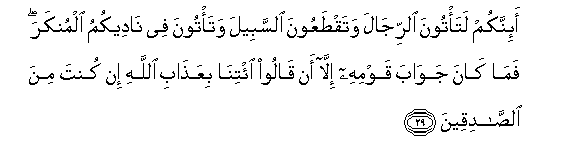

  
[Intangible Textual Heritage](../../index)  [Islam](../index.md) 
[Index](index.md)   
[Hypertext Qur'an](../htq/index)  [Unicode](../uq/029.htm#029_023.md) 
[Palmer](../sbe09/029)  [Pickthall](../pick/029.htm#029_023.md)  [Yusuf Ali
English](../yaq/yaq029)  [Rodwell](../qr/029.md)   
  
[Sūra XXIX.: ‘Ankabūt, or the Spider Index](029.md)  
  [Previous](02902)  [Next](02904.md) 

------------------------------------------------------------------------

  
*The Holy Quran*, tr. by Yusuf Ali, \[1934\], at Intangible Textual
Heritage

------------------------------------------------------------------------

# Sūra XXIX.: ‘Ankabūt, or the Spider

### Section 3

------------------------------------------------------------------------

23. Wa**a**lla<u>th</u>eena kafaroo bi-<u>a</u>y<u>a</u>ti All<u>a</u>hi
waliq<u>a</u>-ihi ol<u>a</u>-ika ya-isoo min ra<u>h</u>matee
waol<u>a</u>-ika lahum AAa<u>tha</u>bun aleem**un**

23\. Those who reject the Signs  
Of God and the Meeting  
With Him (in the Hereafter),  
It is they who shall despair  
Of My mercy: it is they  
Who will (suffer)  
A most grievous Penalty.

------------------------------------------------------------------------

24. Fam<u>a</u> k<u>a</u>na jaw<u>a</u>ba qawmihi ill<u>a</u> an
q<u>a</u>loo oqtuloohu aw <u>h</u>arriqoohu faanj<u>a</u>hu
All<u>a</u>hu mina a**l**nn<u>a</u>ri inna fee <u>tha</u>lika
la<u>a</u>y<u>a</u>tin liqawmin yu/minoon**a**

24\. So naught was the answer  
Of (Abraham's) people except  
That they said: "Slay him  
Or burn him." But God  
Did save him from the Fire  
Verily in this are Signs  
For people who believe.

------------------------------------------------------------------------

25. Waq<u>a</u>la innam<u>a</u> ittakha<u>th</u>tum min dooni
All<u>a</u>hi awth<u>a</u>nan mawaddata baynikum fee
al<u>h</u>ay<u>a</u>ti a**l**dduny<u>a</u> thumma yawma
alqiy<u>a</u>mati yakfuru baAA<u>d</u>ukum bibaAA<u>d</u>in wayalAAanu
baAA<u>d</u>ukum baAA<u>d</u>an wama-w<u>a</u>kumu a**l**nn<u>a</u>ru
wam<u>a</u> lakum min n<u>as</u>ireen**a**

25\. And he said: "For you,  
Ye have taken (for worship)  
Idols besides God, out of  
Mutual love and regard  
Between yourselves in this life;  
But on the Day of Judgment  
Ye shall disown each other  
And curse each other:  
And your abode will be  
The Fire, and ye shall have  
None to help."

------------------------------------------------------------------------

26. Fa<u>a</u>mana lahu loo<u>t</u>un waq<u>a</u>la innee
muh<u>a</u>jirun il<u>a</u> rabbee innahu huwa alAAazeezu
al<u>h</u>akeem**u**

26\. But Lūṭ had faith in Him:  
He said: "I will leave  
Home for the sake of  
My Lord: for He is  
Exalted in Might, and Wise."

------------------------------------------------------------------------

27. Wawahabn<u>a</u> lahu is<u>ha</u>qa wayaAAqooba wajaAAaln<u>a</u>
fee <u>th</u>urriyyatihi a**l**nnubuwwata wa**a**lkit<u>a</u>ba
wa<u>a</u>tayn<u>a</u>hu ajrahu fee a**l**dduny<u>a</u> wa-innahu fee
al-<u>a</u>khirati lamina a**l**<u>ssa</u>li<u>h</u>een**a**

27\. And We gave (Abraham)  
Isaac and Jacob, and ordained  
Among his progeny Prophethood  
And Revelation, and We  
Granted him his reward  
In this life; and he was  
In the Hereafter (of the company)  
Of the Righteous.

------------------------------------------------------------------------

28. Waloo<u>t</u>an i<u>th</u> q<u>a</u>la liqawmihi innakum lata/toona
alf<u>ah</u>ishata m<u>a</u> sabaqakum bih<u>a</u> min a<u>h</u>adin
mina alAA<u>a</u>lameen**a**

28\. And (remember) Lūṭ: behold,  
He said to his people:  
"Ye do commit lewdness,  
Such as no people in Creation  
(Ever) committed before you.

------------------------------------------------------------------------

29. A-innakum lata/toona a**l**rrij<u>a</u>la wataq<u>t</u>aAAoona
a**l**ssabeela wata/toona fee n<u>a</u>deekumu almunkara fam<u>a</u>
k<u>a</u>na jaw<u>a</u>ba qawmihi ill<u>a</u> an q<u>a</u>loo
i/tin<u>a</u> biAAa<u>tha</u>bi All<u>a</u>hi in kunta mina
a**l**<u>ssa</u>diqeen**a**

29\. "Do ye indeed approach men,  
And cut off the highway?  
And practise wickedness  
(Even) in your councils?"  
But his people gave no answer  
But this: they said:  
"Bring us the Wrath of God  
If thou tellest the truth."

------------------------------------------------------------------------

30. Q<u>a</u>la rabbi on<u>s</u>urnee AAal<u>a</u> alqawmi
almufsideen**a**

30\. He said: "O my Lord!  
Help Thou me against people  
Who do mischief!"

------------------------------------------------------------------------

[Next: Section 4 (31-44)](02904.md)

