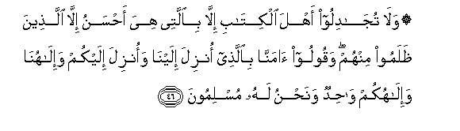
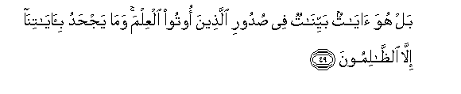

  
[Intangible Textual Heritage](../../index)  [Islam](../index.md) 
[Index](index.md)   
[Hypertext Qur'an](../htq/index)  [Unicode](../uq/029.htm#029_045.md) 
[Palmer](../sbe09/029)  [Pickthall](../pick/029.htm#029_045.md)  [Yusuf Ali
English](../yaq/yaq029)  [Rodwell](../qr/029.md)   
  
[Sūra XXIX.: ‘Ankabūt, or the Spider Index](029.md)  
  [Previous](02904)  [Next](02906.md) 

------------------------------------------------------------------------

  
*The Holy Quran*, tr. by Yusuf Ali, \[1934\], at Intangible Textual
Heritage

------------------------------------------------------------------------

# Sūra XXIX.: ‘Ankabūt, or the Spider

### Section 5

------------------------------------------------------------------------

45. Otlu m<u>a</u> oo<u>h</u>iya ilayka mina alkit<u>a</u>bi waaqimi
a**l**<u>ss</u>al<u>a</u>ta inna a**l**<u>ss</u>al<u>a</u>ta
tanh<u>a</u> AAani alfa<u>h</u>sh<u>a</u>-i wa**a**lmunkari
wala<u>th</u>ikru All<u>a</u>hi akbaru wa**A**ll<u>a</u>hu yaAAlamu
m<u>a</u> ta<u>s</u>naAAoon**a**

45\. Recite what is sent  
Of the Book by inspiration  
To thee, and establish  
Regular Prayer: for Prayer  
Restrains from shameful  
And unjust deeds;  
And remembrance of God  
Is the greatest (thing in life)  
Without doubt. And God knows  
The (deeds) that ye do.

------------------------------------------------------------------------

46. Wal<u>a</u> tuj<u>a</u>diloo ahla alkit<u>a</u>bi ill<u>a</u>
bi**a**llatee hiya a<u>h</u>sanu ill<u>a</u> alla<u>th</u>eena
*<u>th</u>*alamoo minhum waqooloo <u>a</u>mann<u>a</u>
bi**a**lla<u>th</u>ee onzila ilayn<u>a</u> waonzila ilaykum
wa-il<u>a</u>hun<u>a</u> wa-il<u>a</u>hukum w<u>ah</u>idun
wana<u>h</u>nu lahu muslimoon**a**

46\. And dispute ye not  
With the People of the Book,  
Except with means better  
(Than mere disputation), unless  
It be with those of them  
Who inflict wrong (and injury):  
But say, "We believe  
In the Revelation which has  
Come down to us and in that  
Which came down to you;  
Our God and your God  
Is One; and it is to Him  
We bow (in Islam)."

------------------------------------------------------------------------

47. Waka<u>tha</u>lika anzaln<u>a</u> ilayka alkit<u>a</u>ba
fa**a**lla<u>th</u>eena <u>a</u>tayn<u>a</u>humu alkit<u>a</u>ba
yu/minoona bihi wamin h<u>a</u>ol<u>a</u>-i man yu/minu bihi wam<u>a</u>
yaj<u>h</u>adu bi-<u>a</u>y<u>a</u>tin<u>a</u> ill<u>a</u>
alk<u>a</u>firoon**a**

47\. And thus (it is) that We  
Have sent down the Book  
To thee. So the People  
Of the Book believe therein,  
As also do some of these  
(Pagan Arabs): and none  
But Unbelievers reject Our Signs.

------------------------------------------------------------------------

48. Wam<u>a</u> kunta tatloo min qablihi min kit<u>a</u>bin wal<u>a</u>
takhu<u>tt</u>uhu biyameenika i<u>th</u>an la**i**rt<u>a</u>ba
almub<u>t</u>iloon**a**

48\. And thou vast not (able)  
To recite a Book before  
This (Book came), nor art thou  
(Able) to transcribe it  
With thy right hand:  
In that case, indeed, would  
The talkers of vanities  
Have doubted.

------------------------------------------------------------------------

49. Bal huwa <u>a</u>y<u>a</u>tun bayyin<u>a</u>tun fee <u>s</u>udoori
alla<u>th</u>eena ootoo alAAilma wam<u>a</u> yaj<u>h</u>adu
bi-<u>a</u>y<u>a</u>tin<u>a</u> ill<u>a</u>
a**l***<u>thth</u>*<u>a</u>limoon**a**

49\. Nay, here are Signs  
Self-evident in the hearts  
Of those endowed with  
knowledge:  
And none but the unjust  
Reject Our Signs.

------------------------------------------------------------------------

50. Waq<u>a</u>loo lawl<u>a</u> onzila AAalayhi <u>a</u>y<u>a</u>tun min
rabbihi qul innam<u>a</u> al-<u>a</u>y<u>a</u>tu AAinda All<u>a</u>hi
wa-innam<u>a</u> an<u>a</u> na<u>th</u>eerun mubeen**un**

50\. Yet they say: "Why  
Are not Signs sent down  
To him from his Lord?"  
Say: "The Signs are indeed  
With God: and I am  
Indeed a clear Warner.

------------------------------------------------------------------------

51. Awa lam yakfihim ann<u>a</u> anzaln<u>a</u> AAalayka alkit<u>a</u>ba
yutl<u>a</u> AAalayhim inna fee <u>tha</u>lika lara<u>h</u>matan
wa<u>th</u>ikr<u>a</u> liqawmin yu/minoon**a**

51\. And is it not enough  
For them that We have  
Sent down to thee  
The Book which is rehearsed  
To them? Verily, in it  
Is Mercy and a Reminder  
To those who believe.

------------------------------------------------------------------------

[Next: Section 6 (52-63)](02906.md)

