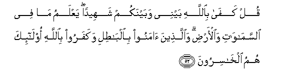
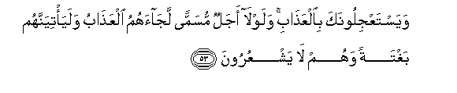
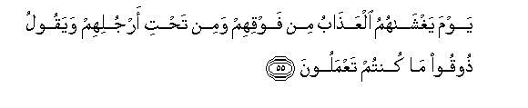
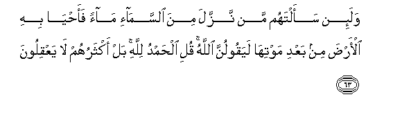

  
[Intangible Textual Heritage](../../index)  [Islam](../index.md) 
[Index](index.md)   
[Hypertext Qur'an](../htq/index)  [Unicode](../uq/029.htm#029_052.md) 
[Palmer](../sbe09/029)  [Pickthall](../pick/029.htm#029_052.md)  [Yusuf Ali
English](../yaq/yaq029)  [Rodwell](../qr/029.md)   
  
[Sūra XXIX.: ‘Ankabūt, or the Spider Index](029.md)  
  [Previous](02905)  [Next](02907.md) 

------------------------------------------------------------------------

  
*The Holy Quran*, tr. by Yusuf Ali, \[1934\], at Intangible Textual
Heritage

------------------------------------------------------------------------

# Sūra XXIX.: ‘Ankabūt, or the Spider

### Section 6

------------------------------------------------------------------------

52. Qul kaf<u>a</u> bi**A**ll<u>a</u>hi baynee wabaynakum shaheedan
yaAAlamu m<u>a</u> fee a**l**ssam<u>a</u>w<u>a</u>ti
wa**a**l-ar<u>d</u>i wa**a**lla<u>th</u>eena <u>a</u>manoo
bi**a**lb<u>at</u>ili wakafaroo bi**A**ll<u>a</u>hi ol<u>a</u>-ika humu
alkh<u>a</u>siroon**a**

52\. Say: "Enough is God  
For a Witness between me  
And you: He knows  
What is in the heavens  
And on earth. And it is  
Those who believe in vanities  
And reject God, that  
Will perish (in the end).

------------------------------------------------------------------------

53. WayastaAAjiloonaka bi**a**lAAa<u>tha</u>bi walawl<u>a</u> ajalun
musamman laj<u>a</u>ahumu alAAa<u>tha</u>bu walaya/tiyannahum baghtatan
wahum l<u>a</u> yashAAuroon**a**

53\. They ask thee  
To hasten on the Punishment  
(For them): had it not been  
For a term (of respite)  
Appointed, the Punishment  
Would certainly have come  
To them: and it will  
Certainly reach them,—  
Of a sudden, while they  
Perceive not!

------------------------------------------------------------------------

54. YastaAAjiloonaka bi**a**lAAa<u>tha</u>bi wa-inna jahannama
lamu<u>h</u>ee<u>t</u>atun bi**a**lk<u>a</u>fireen**a**

54\. They ask thee  
To hasten on the Punishment:  
But, of a surety,  
Hell will encompass  
The rejecters of Faith!—

------------------------------------------------------------------------

55. Yawma yaghsh<u>a</u>humu alAAa<u>tha</u>bu min fawqihim wamin
ta<u>h</u>ti arjulihim wayaqoolu <u>th</u>ooqoo m<u>a</u> kuntum
taAAmaloon**a**

55\. On the Day that  
The Punishment shall cover them  
From above them and  
From below them,  
And (a Voice) shall say:  
"Taste ye (the fruits)  
Of your deeds!

------------------------------------------------------------------------

56. Y<u>a</u> AAib<u>a</u>diya alla<u>th</u>eena <u>a</u>manoo inna
ar<u>d</u>ee w<u>a</u>siAAatun fa-iyy<u>a</u>ya fa**o**AAbudoon**i**

56\. O My servants who believe!  
Truly, spacious is My Earth:  
Therefore serve ye Me—  
(And Me alone)!

------------------------------------------------------------------------

57. Kullu nafsin <u>tha</u>-iqatu almawti thumma ilayn<u>a</u>
turjaAAoon**a**

57\. Every soul shall have  
A taste of death:  
In the end to Us  
Shall ye be brought back.

------------------------------------------------------------------------

58. Wa**a**lla<u>th</u>eena <u>a</u>manoo waAAamiloo
a**l**<u>ssa</u>li<u>ha</u>ti lanubawwi-annahum mina aljannati ghurafan
tajree min ta<u>h</u>tih<u>a</u> al-anh<u>a</u>ru kh<u>a</u>lideena
feeh<u>a</u> niAAma ajru alAA<u>a</u>mileen**a**

58\. But those who believe  
And work deeds of righteousness—  
To them shall We give  
A Home in Heaven,—  
Lofty mansions beneath which  
Flow rivers,—to dwell therein  
For aye;—an excellent reward  
For those who do (good)!—

------------------------------------------------------------------------

59. Alla<u>th</u>eena <u>s</u>abaroo waAAal<u>a</u> rabbihim
yatawakkaloon**a**

59\. Those who persevere in patience,  
And put their trust  
In their Lord and Cherisher.

------------------------------------------------------------------------

60. Wakaayyin min d<u>a</u>bbatin l<u>a</u> ta<u>h</u>milu
rizqah<u>a</u> All<u>a</u>hu yarzuquh<u>a</u> wa-iyy<u>a</u>kum wahuwa
a**l**ssameeAAu alAAaleem**u**

60\. How many are the creatures  
That carry not their own  
Sustenance? It is God  
Who feeds (both) them and you:  
For He hears and knows  
(All things).

------------------------------------------------------------------------

61. Wala-in saaltahum man khalaqa a**l**ssam<u>a</u>w<u>a</u>ti
wa**a**l-ar<u>d</u>a wasakhkhara a**l**shshamsa wa**a**lqamara
layaqoolunna All<u>a</u>hu faann<u>a</u> yu/fakoon**a**

61\. If indeed thou ask them  
Who has created the heavens  
And the earth and subjected  
The sun and the moon  
(To His Law), they will  
Certainly reply, "God".  
How are they then deluded  
Away (from the truth)?

------------------------------------------------------------------------

62. All<u>a</u>hu yabsu<u>t</u>u a**l**rrizqa liman yash<u>a</u>o min
AAib<u>a</u>dihi wayaqdiru lahu inna All<u>a</u>ha bikulli shay-in
AAaleem**un**

62\. God enlarges the sustenance  
(Which He gives) to whichever  
Of His servants He pleases;  
And He (similarly) grants  
By (strict) measure, (as He pleases):  
For God has full knowledge  
Of all things.

------------------------------------------------------------------------

63. Wala-in saaltahum man nazzala mina a**l**ssam<u>a</u>-i m<u>a</u>an
faa<u>h</u>y<u>a</u> bihi al-ar<u>d</u>a min baAAdi mawtih<u>a</u>
layaqoolunna All<u>a</u>hu quli al<u>h</u>amdu lill<u>a</u>hi bal
aktharuhum l<u>a</u> yaAAqiloon**a**

63\. And if indeed thou ask them  
Who it is that sends down  
Rain from the sky,  
And gives life therewith  
To the earth after its death,  
They will certainly reply,  
"God!" Say, "Praise be  
To God!" But most  
Of them understand not.

------------------------------------------------------------------------

[Next: Section 7 (64-69)](02907.md)

