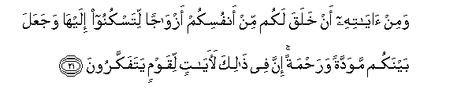
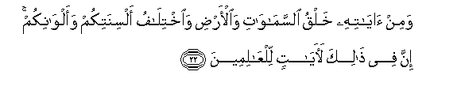
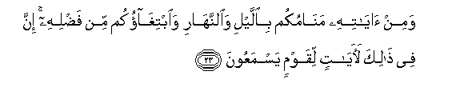
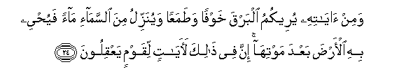
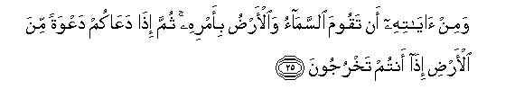
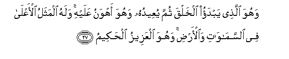

  
[Intangible Textual Heritage](../../index)  [Islam](../index) 
[Index](index)   
[Hypertext Qur'an](../htq/index)  [Unicode](../uq/030.htm#030_020) 
[Palmer](../sbe09/030)  [Pickthall](../pick/030.htm#030_020)  [Yusuf Ali
English](../yaq/yaq030)  [Rodwell](../qr/030)   
  
[Sūra XXX.: Rūm, or The Roman Empire. Index](030)  
  [Previous](03002)  [Next](03004) 

------------------------------------------------------------------------

  
*The Holy Quran*, tr. by Yusuf Ali, \[1934\], at Intangible Textual
Heritage

------------------------------------------------------------------------

# Sūra XXX.: Rūm, or The Roman Empire.

### Section 3

------------------------------------------------------------------------

20. Wamin <u>a</u>y<u>a</u>tihi an khalaqakum min tur<u>a</u>bin thumma
i<u>tha</u> antum basharun tantashiroon**a**

20\. Among His Signs is this,  
That He created you  
From dust; and then,—  
Behold, ye are men  
Scattered (far and wide)!

------------------------------------------------------------------------

21. Wamin <u>a</u>y<u>a</u>tihi an khalaqa lakum min anfusikum
azw<u>a</u>jan litaskunoo ilayh<u>a</u> wajaAAala baynakum mawaddatan
wara<u>h</u>matan inna fee <u>tha</u>lika la<u>a</u>y<u>a</u>tin
liqawmin yatafakkaroon**a**

21\. And among His Signs  
Is this, that He created  
For you mates from among  
Yourselves, that ye may  
Dwell in tranquillity with them,  
And He has put love  
And mercy between your (hearts):  
Verily in that are Signs  
For those who reflect.

------------------------------------------------------------------------

22. Wamin <u>a</u>y<u>a</u>tihi khalqu a**l**ssam<u>a</u>w<u>a</u>ti
wa**a**l-ar<u>d</u>i wa**i**khtil<u>a</u>fu alsinatikum
waalw<u>a</u>nikum inna fee <u>tha</u>lika la<u>a</u>y<u>a</u>tin
lilAA<u>a</u>limeen**a**

22\. And among His Signs  
Is the creation of the heavens  
And the earth, and the variations  
In your languages  
And your colours: verily  
In that are Signs  
For those who know.

------------------------------------------------------------------------

23. Wamin <u>a</u>y<u>a</u>tihi man<u>a</u>mukum bi**a**llayli
wa**al**nnah<u>a</u>ri wa**i**btigh<u>a</u>okum min fa<u>d</u>lihi inna
fee <u>tha</u>lika la<u>a</u>y<u>a</u>tin liqawmin yasmaAAoon**a**

23\. And among His Signs  
Is the sleep that ye take  
By night and by day,  
And the quest that ye  
(Make for livelihood)  
Out of His Bounty: verily  
In that are Signs  
For those who hearken.

------------------------------------------------------------------------

24. Wamin <u>a</u>y<u>a</u>tihi yureekumu albarqa khawfan
wa<u>t</u>amaAAan wayunazzilu mina a**l**ssam<u>a</u>-i m<u>a</u>an
fayu<u>h</u>yee bihi al-ar<u>d</u>a baAAda mawtih<u>a</u> inna fee
<u>tha</u>lika la<u>a</u>y<u>a</u>tin liqawmin yaAAqiloon**a**

24\. And among His Signs,  
He shows you the lightning,  
By way both of fear  
And of hope, and He sends  
Down rain from the sky  
And with it gives life to  
The earth after it is dead:  
Verily in that are Signs  
For those who are wise.

------------------------------------------------------------------------

25. Wamin <u>a</u>y<u>a</u>tihi an taqooma a**l**ssam<u>a</u>o
wa**a**l-ar<u>d</u>u bi-amrihi thumma i<u>tha</u> daAA<u>a</u>kum
daAAwatan mina al-ar<u>d</u>i i<u>tha</u> antum takhrujoon**a**

25\. And among His Signs is this,  
That heaven and earth  
Stand by His Command:  
Then when He calls you,  
By a single call, from the earth,  
Behold, ye (straightway) come forth.

------------------------------------------------------------------------

26. Walahu man fee a**l**ssam<u>a</u>w<u>a</u>ti wa**a**l-ar<u>d</u>i
kullun lahu q<u>a</u>nitoon**a**

26\. To Him belongs every being  
That is in the heavens  
And on earth: all are  
Devoutly obedient to Him.

------------------------------------------------------------------------

27. Wahuwa alla<u>th</u>ee yabdao alkhalqa thumma yuAAeeduhu wahuwa
ahwanu AAalayhi walahu almathalu al-aAAl<u>a</u> fee
a**l**ssam<u>a</u>w<u>a</u>ti wa**a**l-ar<u>d</u>i wahuwa alAAazeezu
al<u>h</u>akeem**u**

27\. It is He Who begins  
(The process of) creation;  
Then repeats it; and  
For Him it is most easy.  
To Him belongs the loftiest  
Similitude (we can think of)  
In the heavens and the earth:  
For He is Exalted in Might,  
Full of wisdom.

------------------------------------------------------------------------

[Next: Section 4 (28-40)](03004)

