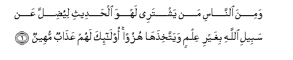
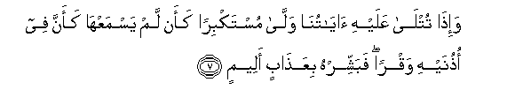
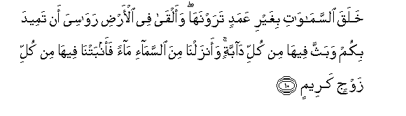
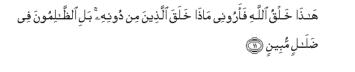

  
[Intangible Textual Heritage](../../index)  [Islam](../index.md) 
[Index](index.md)   
[Hypertext Qur'an](../htq/index)  [Unicode](../uq/031.htm#031_001.md) 
[Palmer](../sbe09/031)  [Pickthall](../pick/031.htm#031_001.md)  [Yusuf Ali
English](../yaq/yaq031)  [Rodwell](../qr/031.md)   
  
[Sūra XXXI.: Luqmān (the Wise). Index](031.md)  
  [Previous](03006)  [Next](03102.md) 

------------------------------------------------------------------------

  
*The Holy Quran*, tr. by Yusuf Ali, \[1934\], at Intangible Textual
Heritage

------------------------------------------------------------------------

# Sūra XXXI.: Luqmān (the Wise).

### Section 1

1. Alif-l<u>a</u>m-meem

1\. A. L. M.

------------------------------------------------------------------------

2. Tilka <u>a</u>y<u>a</u>tu alkit<u>a</u>bi al<u>h</u>akeem**i**

2\. These are Verses  
Of the Wise Book,—

------------------------------------------------------------------------

3. Hudan wara<u>h</u>matan lilmu<u>h</u>sineen**a**

3\. A Guide and a Mercy  
To the Doers of Good,—

------------------------------------------------------------------------

4. Alla<u>th</u>eena yuqeemoona a**l**<u>ss</u>al<u>a</u>ta wayu/toona
a**l**zzak<u>a</u>ta wahum bi**a**l-<u>a</u>khirati hum yooqinoon**a**

4\. Those who establish regular Prayer,  
And give regular Charity,  
And have (in their hearts)  
The assurance of the Hereafter.

------------------------------------------------------------------------

5. Ol<u>a</u>-ika AAal<u>a</u> hudan min rabbihim waol<u>a</u>-ika humu
almufli<u>h</u>oon**a**

5\. These are on (true) guidance  
From their Lord; and these  
Are the ones who will prosper.

------------------------------------------------------------------------

6. Wamina a**l**nn<u>a</u>si man yashtaree lahwa al<u>h</u>adeethi
liyu<u>d</u>illa AAan sabeeli All<u>a</u>hi bighayri AAilmin
wayattakhi<u>th</u>ah<u>a</u> huzuwan ol<u>a</u>-ika lahum
AAa<u>tha</u>bun muheen**un**

6\. But there are, among men,  
Those who purchase idle tales,'  
Without knowledge (or meaning),  
To mislead (men) from the Path  
Of God and throw ridicule  
(On the Path): for such  
There will be a humiliating  
Penalty.

------------------------------------------------------------------------

7. Wa-i<u>tha</u> tutl<u>a</u> AAalayhi <u>a</u>y<u>a</u>tun<u>a</u>
wall<u>a</u> mustakbiran kaan lam yasmaAAh<u>a</u> kaanna fee
o<u>th</u>unayhi waqran fabashshirhu biAAa<u>tha</u>bin aleem**in**

7\. When Our Signs are rehearsed  
To such a one, he turns  
Away in arrogance, as if  
He heard them not, as if  
There were deafness in both  
His ears: announce to him  
A grievous Penalty.

------------------------------------------------------------------------

8. Inna alla<u>th</u>eena <u>a</u>manoo waAAamiloo
a**l**<u>ssa</u>li<u>ha</u>ti lahum jann<u>a</u>tu a**l**nnaAAeem**i**

8\. For those who believe  
And work righteous deeds,  
There will be Gardens  
Of Bliss,—

------------------------------------------------------------------------

9. Kh<u>a</u>lideena feeh<u>a</u> waAAda All<u>a</u>hi <u>h</u>aqqan
wahuwa alAAazeezu al<u>h</u>akeem**u**

9\. To dwell therein. The promise  
Of God is true: and He  
Is Exalted in power, Wise.

------------------------------------------------------------------------

10. Khalaqa a**l**ssam<u>a</u>w<u>a</u>ti bighayri AAamadin
tarawnah<u>a</u> waalq<u>a</u> fee al-ar<u>d</u>i raw<u>a</u>siya an
tameeda bikum wabaththa feeh<u>a</u> min kulli d<u>a</u>bbatin
waanzaln<u>a</u> mina a**l**ssam<u>a</u>-i m<u>a</u>an faanbatn<u>a</u>
feeh<u>a</u> min kulli zawjin kareem**in**

10\. He created the heavens  
Without any pillars that ye  
Can see; He set  
On the earth mountains  
Standing firm, lest it  
Should shake with you;  
And He scattered through it  
Beasts of all kinds.  
We send down rain  
From the sky, and produce  
On the earth every kind.  
Of noble creature, in pairs.

------------------------------------------------------------------------

11. H<u>atha</u> khalqu All<u>a</u>hi faaroonee m<u>atha</u> khalaqa
alla<u>th</u>eena min doonihi bali a**l***<u>thth</u>*<u>a</u>limoona
fee <u>d</u>al<u>a</u>lin mubeen**in**

11\. Such is the Creation of God:  
Now show Me what is there  
That others besides Him  
Have created: nay, but  
The Transgressors are  
In manifest error.

------------------------------------------------------------------------

[Next: Section 2 (12-19)](03102.md)

