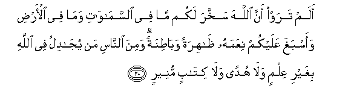
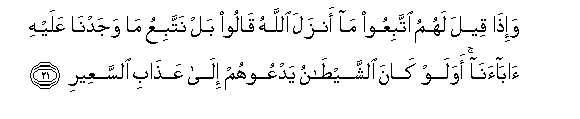
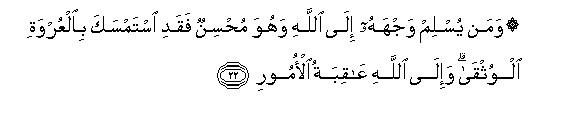
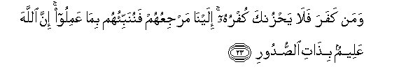
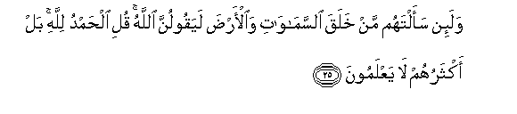
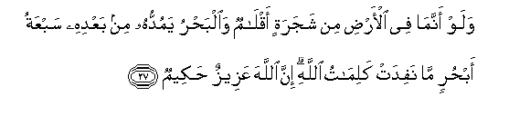
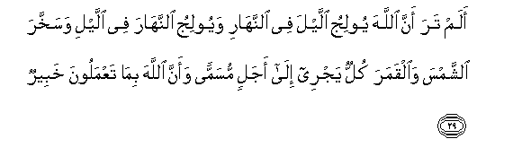
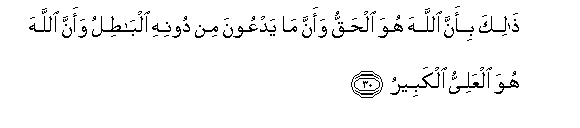

  
[Intangible Textual Heritage](../../index)  [Islam](../index.md) 
[Index](index.md)   
[Hypertext Qur'an](../htq/index)  [Unicode](../uq/031.htm#031_020.md) 
[Palmer](../sbe09/031)  [Pickthall](../pick/031.htm#031_020.md)  [Yusuf Ali
English](../yaq/yaq031)  [Rodwell](../qr/031.md)   
  
[Sūra XXXI.: Luqmān (the Wise). Index](031.md)  
  [Previous](03102)  [Next](03104.md) 

------------------------------------------------------------------------

  
*The Holy Quran*, tr. by Yusuf Ali, \[1934\], at Intangible Textual
Heritage

------------------------------------------------------------------------

# Sūra XXXI.: Luqmān (the Wise).

### Section 3

------------------------------------------------------------------------

20. Alam taraw anna All<u>a</u>ha sakhkhara lakum m<u>a</u> fee
a**l**ssam<u>a</u>w<u>a</u>ti wam<u>a</u> fee al-ar<u>d</u>i waasbagha
AAalaykum niAAamahu *<u>th</u>*<u>a</u>hiratan wab<u>at</u>inatan wamina
a**l**nn<u>a</u>si man yuj<u>a</u>dilu fee All<u>a</u>hi bighayri
AAilmin wal<u>a</u> hudan wal<u>a</u> kit<u>a</u>bin muneer**in**

20\. Do ye not see  
That God has subjected  
To your (use) all things  
In the heavens and on earth,  
And has made His bounties  
Flow to you in exceeding  
Measure, (both) seen and unseen?  
Yet there are among men  
Those who dispute about God,  
Without knowledge and without  
Guidance, and without a Book  
To enlighten them!

------------------------------------------------------------------------

21. Wa-i<u>tha</u> qeela lahumu ittabiAAoo m<u>a</u> anzala
All<u>a</u>hu q<u>a</u>loo bal nattabiAAu m<u>a</u> wajadn<u>a</u>
AAalayhi <u>a</u>b<u>a</u>an<u>a</u> awa law k<u>a</u>na
a**l**shshay<u>ta</u>nu yadAAoohum il<u>a</u> AAa<u>tha</u>bi
a**l**ssaAAeer**i**

21\. When they are told to follow  
The (Revelation) that God  
Has sent down, they say:  
"Nay, we shall follow  
The ways that we found  
Our fathers (following)."  
What! even if it is  
Satan beckoning them  
To the Penalty  
Of the (Blazing) Fire?

------------------------------------------------------------------------

22. Waman yuslim wajhahu il<u>a</u> All<u>a</u>hi wahuwa mu<u>h</u>sinun
faqadi istamsaka bi**a**lAAurwati alwuthq<u>a</u> wa-il<u>a</u>
All<u>a</u>hi AA<u>a</u>qibatu al-omoor**i**

22\. Whoever submits  
His whole self to God,  
And is a doer of good,  
Has grasped indeed  
The most trustworthy hand-hold  
And with God rests the End  
And Decision of (all) affairs.

------------------------------------------------------------------------

23. Waman kafara fal<u>a</u> ya<u>h</u>zunka kufruhu ilayn<u>a</u>
marjiAAuhum fanunabbi-ohum bim<u>a</u> AAamiloo inna All<u>a</u>ha
AAaleemun bi<u>tha</u>ti a**l**<u>ss</u>udoor**i**

23\. But if any reject Faith,  
Let not his rejection  
Grieve thee: to Us  
Is their Return, and We  
Shall tell them the truth  
Of their deeds: for God  
Knows well all that is  
In (men's) hearts.

------------------------------------------------------------------------

24. NumattiAAuhum qaleelan thumma na<u>dt</u>arruhum il<u>a</u>
AAa<u>tha</u>bin ghalee*<u>th</u>***in**

24\. We grant them their pleasure  
For a little while  
In the end shall We  
Drive them to  
A chastisement unrelenting.

------------------------------------------------------------------------

25. Wala-in saaltahum man khalaqa a**l**ssam<u>a</u>w<u>a</u>ti
wa**a**l-ar<u>d</u>a layaqoolunna All<u>a</u>hu quli al<u>h</u>amdu
lill<u>a</u>hi bal aktharuhum l<u>a</u> yaAAlamoon**a**

25\. If thou ask them,  
Who it is that created  
The heavens and the earth.  
They will certainly say,  
"God". Say: "Praise be to God!"  
But most of them  
Understand not.

------------------------------------------------------------------------

26. Lill<u>a</u>hi m<u>a</u> fee a**l**ssam<u>a</u>w<u>a</u>ti
wa**a**l-ar<u>d</u>i inna All<u>a</u>ha huwa alghaniyyu
al<u>h</u>ameed**u**

26\. To God belong all things  
In heaven and earth: verily  
God is He (that is)  
Free of all wants,  
Worthy of all praise.

------------------------------------------------------------------------

27. Walaw annam<u>a</u> fee al-ar<u>d</u>i min shajaratin aql<u>a</u>mun
wa**a**lba<u>h</u>ru yamudduhu min baAAdihi sabAAatu ab<u>h</u>urin
m<u>a</u> nafidat kalim<u>a</u>tu All<u>a</u>hi inna All<u>a</u>ha
AAazeezun <u>h</u>akeem**un**

27\. And if all the trees  
On earth were pens  
And the Ocean (were ink),  
With seven Oceans behind it  
To add to its (supply),  
Yet would not the Words  
Of God be exhausted  
(In the writing): for God  
Is Exalted in power,  
Full of Wisdom.

------------------------------------------------------------------------

28. M<u>a</u> khalqukum wal<u>a</u> baAAthukum ill<u>a</u> kanafsin
w<u>ah</u>idatin inna All<u>a</u>ha sameeAAun ba<u>s</u>eer**un**

28\. And your creation  
Or your resurrection  
Is in no wise but  
As an individual soul:  
For God is He Who  
Hears and sees (all things).

------------------------------------------------------------------------

29. Alam tara anna All<u>a</u>ha yooliju allayla fee
a**l**nnah<u>a</u>ri wayooliju a**l**nnah<u>a</u>ra fee allayli
wasakhkhara a**l**shshamsa wa**a**lqamara kullun yajree il<u>a</u>
ajalin musamman waanna All<u>a</u>ha bim<u>a</u> taAAmaloona
khabeer**un**

29\. Seest thou not that  
God merges Night into Day  
And He merges Day into Night;  
That He has subjected the sun,  
And the moon (to His Law),  
Each running its course  
For a term appointed; and  
That God is well acquainted  
With all that ye do?

------------------------------------------------------------------------

30. <u>Tha</u>lika bi-anna All<u>a</u>ha huwa al<u>h</u>aqqu waanna
m<u>a</u> yadAAoona min doonihi alb<u>at</u>ilu waanna All<u>a</u>ha
huwa alAAaliyyu alkabeer**u**

30\. That is because God is  
The (only) Reality, and because  
Whatever else they invoke  
Besides Him is Falsehood;  
And because God,—He is  
The Most High, Most Great.

------------------------------------------------------------------------

[Next: Section 4 (31-34)](03104.md)

