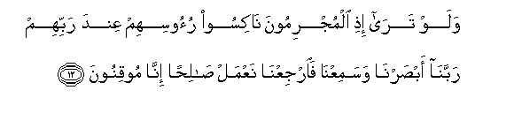
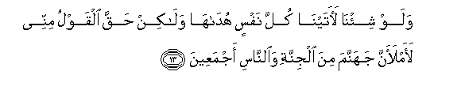
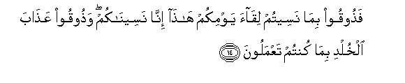
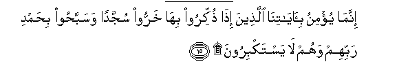
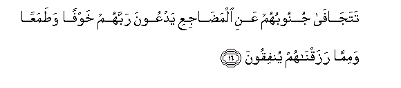
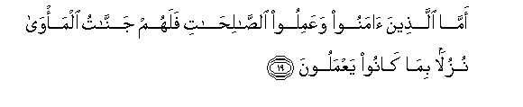
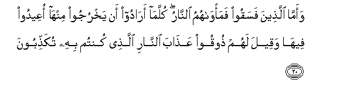
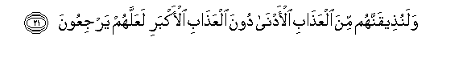
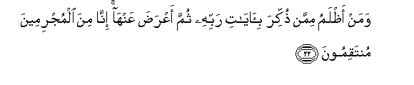

  
[Intangible Textual Heritage](../../index)  [Islam](../index.md) 
[Index](index.md)   
[Hypertext Qur'an](../htq/index)  [Unicode](../uq/032.htm#032_012.md) 
[Palmer](../sbe09/032)  [Pickthall](../pick/032.htm#032_012.md)  [Yusuf Ali
English](../yaq/yaq032)  [Rodwell](../qr/032.md)   
  
[Sūra XXXII: Sajda, or Adoration. Index](032.md)  
  [Previous](03201)  [Next](03203.md) 

------------------------------------------------------------------------

  
*The Holy Quran*, tr. by Yusuf Ali, \[1934\], at Intangible Textual
Heritage

------------------------------------------------------------------------

# Sūra XXXII: Sajda, or Adoration.

### Section 2

------------------------------------------------------------------------

12. Walaw tar<u>a</u> i<u>th</u>i almujrimoona n<u>a</u>kisoo ruoosihim
AAinda rabbihim rabban<u>a</u> ab<u>s</u>arn<u>a</u> wasamiAAn<u>a</u>
faarjiAAn<u>a</u> naAAmal <u>sa</u>li<u>h</u>an inn<u>a</u>
mooqinoon**a**

12\. If only thou couldst see  
When the guilty ones  
Will bend low their heads  
Before their Lord, (saying:)  
"Our Lord! We have seen  
And we have heard:  
Now then send us back  
(To the world): we will  
Work righteousness: for we  
Do indeed (now) believe."

------------------------------------------------------------------------

13. Walaw shi-n<u>a</u> la<u>a</u>tayn<u>a</u> kulla nafsin
hud<u>a</u>h<u>a</u> wal<u>a</u>kin <u>h</u>aqqa alqawlu minnee
laamlaanna jahannama mina aljinnati wa**al**nn<u>a</u>si ajmaAAeen**a**

13\. If We had so willed,  
We could certainly have brought  
Every soul its true guidance:  
But the Word from Me  
Will come true, "I will  
Fill Hell with Jinns  
And men all together."

------------------------------------------------------------------------

14. Fa<u>th</u>ooqoo bim<u>a</u> naseetum liq<u>a</u>a yawmikum
h<u>atha</u> inn<u>a</u> naseen<u>a</u>kum wa<u>th</u>ooqoo
AAa<u>tha</u>ba alkhuldi bim<u>a</u> kuntum taAAmaloon**a**

14\. "Taste ye then—for ye  
Forgot the Meeting  
Of this Day of yours,  
And We too will  
Forget you—taste ye  
The Penalty of Eternity  
For your (evil) deeds!"

------------------------------------------------------------------------

15. Innam<u>a</u> yu/minu bi-<u>a</u>y<u>a</u>tin<u>a</u>
alla<u>th</u>eena i<u>tha</u> <u>th</u>ukkiroo bih<u>a</u> kharroo
sujjadan wasabba<u>h</u>oo bi<u>h</u>amdi rabbihim wahum l<u>a</u>
yastakbiroon**a**

15\. Only those believe  
In Our Signs, who, when  
They are recited to them,  
Fall down in adoration,  
And celebrate the praises  
Of their Lord, nor are they  
(Ever) puffed up with pride.

------------------------------------------------------------------------

16. Tataj<u>a</u>f<u>a</u> junoobuhum AAani alma<u>da</u>jiAAi yadAAoona
rabbahum khawfan wa<u>t</u>amaAAan wamimm<u>a</u> razaqn<u>a</u>hum
yunfiqoon**a**

16\. Their limbs do forsake  
Their beds of sleep, the while  
They call on their Lord,  
In Fear and Hope:  
And they spend (in charity)  
Out of the sustenance which  
We have bestowed on them.

------------------------------------------------------------------------

17. Fal<u>a</u> taAAlamu nafsun m<u>a</u> okhfiya lahum min qurrati
aAAyunin jaz<u>a</u>an bim<u>a</u> k<u>a</u>noo yaAAmaloon**a**

17\. Now no person knows  
What delights of the eye  
Are kept hidden (in reserve)  
For them—as a reward  
For their (good) Deeds.

------------------------------------------------------------------------

18. Afaman k<u>a</u>na mu/minan kaman k<u>a</u>na f<u>a</u>siqan
l<u>a</u> yastawoon**a**

18\. Is then the man  
Who believes no better  
Than the man who is  
Rebellious and wicked?  
Not equal are they.

------------------------------------------------------------------------

19. Amm<u>a</u> alla<u>th</u>eena <u>a</u>manoo waAAamiloo
a**l**<u>ssa</u>li<u>ha</u>ti falahum jann<u>a</u>tu alma/w<u>a</u>
nuzulan bim<u>a</u> k<u>a</u>noo yaAAmaloon**a**

19\. For those who believe  
And do righteous deeds,  
Are Gardens as hospitable  
Homes, for their (good) deeds.

------------------------------------------------------------------------

20. Waamm<u>a</u> alla<u>th</u>eena fasaqoo fama/w<u>a</u>humu
a**l**nn<u>a</u>ru kullam<u>a</u> ar<u>a</u>doo an yakhrujoo
minh<u>a</u> oAAeedoo feeh<u>a</u> waqeela lahum <u>th</u>ooqoo
AAa<u>tha</u>ba a**l**nn<u>a</u>ri alla<u>th</u>ee kuntum bihi
tuka<u>thth</u>iboon**a**

20\. As to those who are  
Rebellious and wicked, their abode  
Will be the Fire: every time  
They wish to get away  
Therefrom, they will be forced  
Thereinto, and it will be said  
To them: "Taste ye  
The Penalty of the Fire,  
The which ye were wont  
To reject as false."

------------------------------------------------------------------------

21. Walanu<u>th</u>eeqannahum mina alAAa<u>tha</u>bi al-adn<u>a</u>
doona alAAa<u>tha</u>bi al-akbari laAAallahum yarjiAAoon**a**

21\. And indeed We will make  
Them taste of the Penalty  
Of this (life) prior to  
The supreme Penalty, in order  
That they may (repent and) return.

------------------------------------------------------------------------

22. Waman a*<u>th</u>*lamu mimman <u>th</u>ukkira bi-<u>a</u>y<u>a</u>ti
rabbihi thumma aAAra<u>d</u>a AAanh<u>a</u> inn<u>a</u> mina
almujrimeena muntaqimoon**a**

22\. And who does more wrong  
Than one to whom are recited  
The Signs of his Lord,  
And who then turns away  
Therefrom? Verily from those  
Who transgress We shall exact  
(Due) Retribution.

------------------------------------------------------------------------

[Next: Section 3 (23-30)](03203.md)

