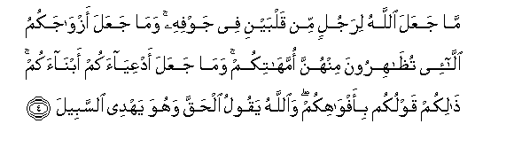
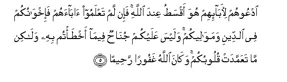
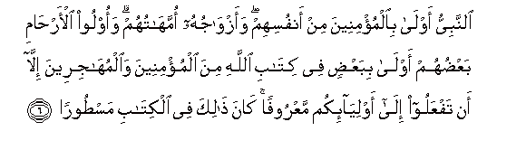
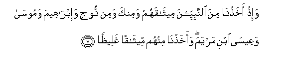

  
[Intangible Textual Heritage](../../index)  [Islam](../index.md) 
[Index](index.md)   
[Hypertext Qur'an](../htq/index)  [Unicode](../uq/033.htm#033_001.md) 
[Palmer](../sbe09/033)  [Pickthall](../pick/033.htm#033_001.md)  [Yusuf Ali
English](../yaq/yaq033)  [Rodwell](../qr/033.md)   
  
[Sūra XXXIII.: Aḥzāb, or The Confederates. Index](033.md)  
  [Previous](03203)  [Next](03302.md) 

------------------------------------------------------------------------

  
*The Holy Quran*, tr. by Yusuf Ali, \[1934\], at Intangible Textual
Heritage

------------------------------------------------------------------------

# Sūra XXXIII.: Aḥzāb, or The Confederates.

### Section 1

1. Y<u>a</u> ayyuh<u>a</u> a**l**nnabiyyu ittaqi All<u>a</u>ha
wal<u>a</u> tu<u>t</u>iAAi alk<u>a</u>fireena wa**a**lmun<u>a</u>fiqeena
inna All<u>a</u>ha k<u>a</u>na AAaleeman <u>h</u>akeem<u>a</u>**n**

1\. O Prophet! Fear God,  
And hearken not  
To the Unbelievers  
And the Hypocrites:  
Verily god is full  
Of knowledge and wisdom.

------------------------------------------------------------------------

2. Wa**i**ttabiAA m<u>a</u> yoo<u>ha</u> ilayka min rabbika inna
All<u>a</u>ha k<u>a</u>na bim<u>a</u> taAAmaloona khabeer<u>a</u>**n**

2\. But follow that which  
Comes to thee by inspiration  
From thy Lord: for God  
Is well acquainted  
With (all) that ye do.

------------------------------------------------------------------------

3. Watawakkal AAal<u>a</u> All<u>a</u>hi wakaf<u>a</u>
bi**A**ll<u>a</u>hi wakeel<u>a</u>**n**

3\. And put thy trust  
In God, and enough is God  
As a Disposer of affairs.

------------------------------------------------------------------------

4. M<u>a</u> jaAAala All<u>a</u>hu lirajulin min qalbayni fee jawfihi
wam<u>a</u> jaAAala azw<u>a</u>jakumu all<u>a</u>-ee
tu*<u>th</u>*<u>a</u>hiroona minhunna ommah<u>a</u>tikum wam<u>a</u>
jaAAala adAAiy<u>a</u>akum abn<u>a</u>akum <u>tha</u>likum qawlukum
bi-afw<u>a</u>hikum wa**A**ll<u>a</u>hu yaqoolu al<u>h</u>aqqa wahuwa
yahdee a**l**ssabeel**a**

4\. God has not made  
For any man two hearts  
In his (one) body: nor has  
He made your wives whom  
Ye divorce by Ẓihār  
Your mothers: nor has He  
Made your adopted sons  
Your sons. Such is (only)  
Your (manner of) speech  
By your mouths. but God  
Tells (you) the Truth, and He  
Shows the (right) Way.

------------------------------------------------------------------------

5. OdAAoohum li-<u>a</u>b<u>a</u>-ihim huwa aqsa<u>t</u>u AAinda
All<u>a</u>hi fa-in lam taAAlamoo <u>a</u>b<u>a</u>ahum
fa-ikhw<u>a</u>nukum fee a**l**ddeeni wamaw<u>a</u>leekum walaysa
AAalaykum jun<u>ah</u>un feem<u>a</u> akh<u>t</u>a/tum bihi
wal<u>a</u>kin m<u>a</u> taAAammadat quloobukum wak<u>a</u>na
All<u>a</u>hu ghafooran ra<u>h</u>eem<u>a</u>**n**

5\. Call them by (the names  
Of) their fathers: that is  
Juster in the sight of God.  
But if ye know not  
Their father's (names, call  
Them) your Brothers in faith,  
Or your Maulās.  
But there is no blame  
On you if ye make  
A mistake therein:  
(What counts is)  
The intention of your hearts:  
And god is Oft-Returning,  
Most Merciful.

------------------------------------------------------------------------

6. A**l**nnabiyyu awl<u>a</u> bi**a**lmu/mineena min anfusihim
waazw<u>a</u>juhu ommah<u>a</u>tuhum waoloo al-ar<u>ha</u>mi
baAA<u>d</u>uhum awl<u>a</u> bibaAA<u>d</u>in fee kit<u>a</u>bi
All<u>a</u>hi mina almu/mineena wa**a**lmuh<u>a</u>jireena ill<u>a</u>
an tafAAaloo il<u>a</u> awliy<u>a</u>-ikum maAAroofan k<u>a</u>na
<u>tha</u>lika fee alkit<u>a</u>bi mas<u>t</u>oor<u>a</u>**n**

6\. The Prophet is closer  
To the Believers than  
Their own selves,  
And his wives are  
Their mothers. Blood-relations  
Among each other have  
Closer personal ties,  
In the Decree of God.  
Than (the Brotherhood of)  
Believers and Muhājirs:  
Nevertheless do ye  
What is just to your  
Closest friends: such is  
The writing in the Decree  
(Of God).

------------------------------------------------------------------------

7. Wa-i<u>th</u> akha<u>th</u>n<u>a</u> mina a**l**nnabiyyeena
meeth<u>a</u>qahum waminka wamin noo<u>h</u>in wa-ibr<u>a</u>heema
wamoos<u>a</u> waAAees<u>a</u> ibni maryama waakha<u>th</u>n<u>a</u>
minhum meeth<u>a</u>qan ghalee*<u>th</u>*<u>a</u>**n**

7\. And remember We took  
From the Prophets their  
Covenant:  
As (We did) from thee:  
From Noah, Abraham, Moses,  
And Jesus the son of Mary:  
We took from them  
A solemn Covenant:

------------------------------------------------------------------------

8. Liyas-ala a**l**<u>ssa</u>diqeena AAan <u>s</u>idqihim waaAAadda
lilk<u>a</u>fireena AAa<u>tha</u>ban aleem<u>a</u>**n**

8\. That (God) may question  
The (Custodians) of Truth concerning  
The Truth they (were charged with):  
And He has prepared  
For the Unbelievers  
A grievous Penalty.

------------------------------------------------------------------------

[Next: Section 2 (9-20)](03302.md)

