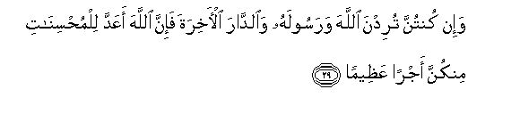
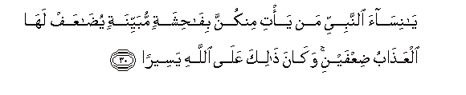
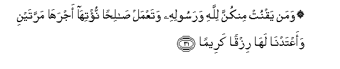
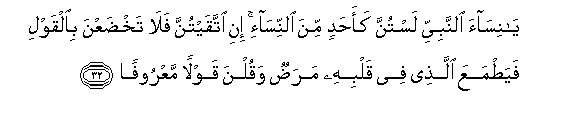
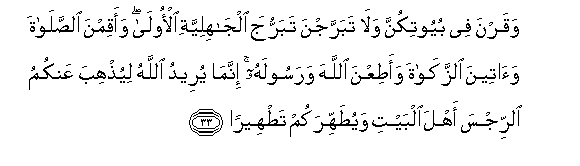

  
[Intangible Textual Heritage](../../index)  [Islam](../index) 
[Index](index)   
[Hypertext Qur'an](../htq/index)  [Unicode](../uq/033.htm#033_028) 
[Palmer](../sbe09/033)  [Pickthall](../pick/033.htm#033_028)  [Yusuf Ali
English](../yaq/yaq033)  [Rodwell](../qr/033)   
  
[Sūra XXXIII.: Aḥzāb, or The Confederates. Index](033)  
  [Previous](03303)  [Next](03305) 

------------------------------------------------------------------------

  
*The Holy Quran*, tr. by Yusuf Ali, \[1934\], at Intangible Textual
Heritage

------------------------------------------------------------------------

# Sūra XXXIII.: Aḥzāb, or The Confederates.

### Section 4

------------------------------------------------------------------------

28. Y<u>a</u> ayyuh<u>a</u> a**l**nnabiyyu qul li-azw<u>a</u>jika in
kuntunna turidna al<u>h</u>ay<u>a</u>ta a**l**dduny<u>a</u>
wazeenatah<u>a</u> fataAA<u>a</u>layna omattiAAkunna
waosarri<u>h</u>kunna sar<u>ah</u>an jameel<u>a</u>**n**

28\. O Prophet! say  
To thy Consorts:  
"If it be that ye desire  
The life of this world,  
And its glitter,—then come!  
I will provide for your  
Enjoyment and set you free  
In a handsome manner.

------------------------------------------------------------------------

29. Wa-in kuntunna turidna All<u>a</u>ha warasoolahu
wa**al**dd<u>a</u>ra al-<u>a</u>khirata fa-inna All<u>a</u>ha aAAadda
lilmu<u>h</u>sin<u>a</u>ti minkunna ajran AAa*<u>th</u>*eem<u>a</u>**n**

29\. But if ye seek God  
And His Apostle, and  
The Home of the Hereafter,  
Verily God has prepared  
For the well-doers amongst you  
A great reward.

------------------------------------------------------------------------

30. Y<u>a</u> nis<u>a</u>a a**l**nnabiyyi man ya/ti minkunna
bif<u>ah</u>ishatin mubayyinatin yu<u>da</u>AAaf lah<u>a</u>
alAAa<u>tha</u>bu <u>d</u>iAAfayni wak<u>a</u>na <u>tha</u>lika
AAal<u>a</u> All<u>a</u>hi yaseer<u>a</u>**n**

30\. O Consorts of the Prophet  
If any of you were guilty  
Of evident unseemly conduct,  
The Punishment would be  
Doubled to her, and that  
Is easy for God

------------------------------------------------------------------------

31. Waman yaqnut minkunna lill<u>a</u>hi warasoolihi wataAAmal
<u>sa</u>li<u>h</u>an nu/tih<u>a</u> ajrah<u>a</u> marratayni
waaAAtadn<u>a</u> lah<u>a</u> rizqan kareem<u>a</u>**n**

31\. But any of you that is  
Devout in the service of  
God and His Apostle,  
And works righteousness,—  
To her shall We grant  
Her reward twice: and We  
Have prepared for her  
A generous Sustenance.

------------------------------------------------------------------------

32. Y<u>a</u> nis<u>a</u>a a**l**nnabiyyi lastunna kaa<u>h</u>adin mina
a**l**nnis<u>a</u>-i ini ittaqaytunna fal<u>a</u> takh<u>d</u>aAAna
bi**a**lqawli faya<u>t</u>maAAa alla<u>th</u>ee fee qalbihi
mara<u>d</u>un waqulna qawlan maAAroof<u>a</u>**n**

32\. O Consorts of the Prophet!  
Ye are not like any  
Of the (other) women:  
If ye do fear (God),  
Be not too complaisant  
Of speech, lest one  
In whose heart is  
A disease should be moved  
With desire: but speak ye  
A speech (that is) just.

------------------------------------------------------------------------

33. Waqarna fee buyootikunna wal<u>a</u> tabarrajna tabarruja
alj<u>a</u>hiliyyati al-ool<u>a</u> waaqimna a**l**<u>ss</u>al<u>a</u>ta
wa<u>a</u>teena a**l**zzak<u>a</u>ta waa<u>t</u>iAAna All<u>a</u>ha
warasoolahu innam<u>a</u> yureedu All<u>a</u>hu liyu<u>th</u>hiba
AAankumu a**l**rrijsa ahla albayti wayu<u>t</u>ahhirakum
ta<u>t</u>heer<u>a</u>**n**

33\. And stay quietly in  
Your houses, and make not  
A dazzling display, like  
That of the former Times  
Of Ignorance; and establish  
Regular Prayer, and give  
Regular Charity; and obey  
God and His Apostle.  
And God only wishes  
To remove all abomination  
From you, ye Members  
Of the Family, and to make  
You pure and spotless.

------------------------------------------------------------------------

34. Wa**o**<u>th</u>kurna m<u>a</u> yutl<u>a</u> fee buyootikunna min
<u>a</u>y<u>a</u>ti All<u>a</u>hi wa**a**l<u>h</u>ikmati inna
All<u>a</u>ha k<u>a</u>na la<u>t</u>eefan khabeer<u>a</u>**n**

34\. And recite what is  
Rehearsed to you in your  
Homes, of the Signs of God  
And His Wisdom:  
For God understands  
The finest mysteries and  
Is well-acquainted (with them).

------------------------------------------------------------------------

[Next: Section 5 (35-40)](03305)

