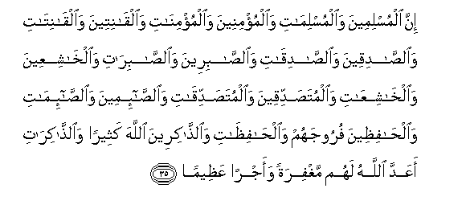
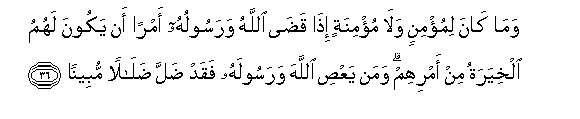
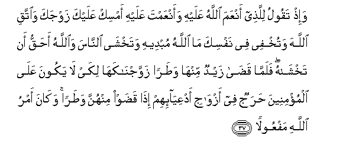
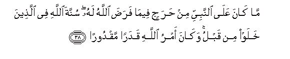
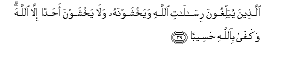
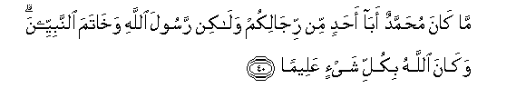

  
[Intangible Textual Heritage](../../index)  [Islam](../index.md) 
[Index](index.md)   
[Hypertext Qur'an](../htq/index)  [Unicode](../uq/033.htm#033_035.md) 
[Palmer](../sbe09/033)  [Pickthall](../pick/033.htm#033_035.md)  [Yusuf Ali
English](../yaq/yaq033)  [Rodwell](../qr/033.md)   
  
[Sūra XXXIII.: Aḥzāb, or The Confederates. Index](033.md)  
  [Previous](03304)  [Next](03306.md) 

------------------------------------------------------------------------

  
*The Holy Quran*, tr. by Yusuf Ali, \[1934\], at Intangible Textual
Heritage

------------------------------------------------------------------------

# Sūra XXXIII.: Aḥzāb, or The Confederates.

### Section 5

------------------------------------------------------------------------

35. Inna almuslimeena wa**a**lmuslim<u>a</u>ti wa**a**lmu/mineena
wa**a**lmu/min<u>a</u>ti wa**a**lq<u>a</u>niteena
wa**a**lq<u>a</u>nit<u>a</u>ti wa**al**<u>ssa</u>diqeena
wa**al**<u>ssa</u>diq<u>a</u>ti wa**al**<u>ssa</u>bireena
wa**al**<u>ssa</u>bir<u>a</u>ti wa**a**lkh<u>a</u>shiAAeena
wa**a**lkh<u>a</u>shiAA<u>a</u>ti wa**a**lmuta<u>s</u>addiqeena
wa**a**lmuta<u>s</u>addiq<u>a</u>ti wa**al**<u>ssa</u>-imeena
wa**al**<u>ssa</u>-im<u>a</u>ti wa**a**l<u>ha</u>fi*<u>th</u>*eena
furoojahum wa**a**l<u>ha</u>fi*<u>th</u>*<u>a</u>ti
wa**al**<u>ththa</u>kireena All<u>a</u>ha katheeran
wa**al**<u>ththa</u>kir<u>a</u>ti aAAadda All<u>a</u>hu lahum
maghfiratan waajran AAa*<u>th</u>*eem<u>a</u>**n**

35\. For Muslim men and women,—  
For believing men and women,  
For devout men and women,  
For true men and women,  
For men and women who are  
Patient and constant, for men  
And women who humble themselves  
For men and women who give  
In charity, for men and women  
Who fast (and deny themselves),  
For men and women who  
Guard their chastity, and  
For men and women who  
Engage much in God's praise,—  
For them has God prepared  
Forgiveness and great reward.

------------------------------------------------------------------------

36. Wam<u>a</u> k<u>a</u>na limu/minin wal<u>a</u> mu/minatin
i<u>tha</u> qa<u>da</u> All<u>a</u>hu warasooluhu amran an yakoona
lahumu alkhiyaratu min amrihim waman yaAA<u>s</u>i All<u>a</u>ha
warasoolahu faqad <u>d</u>alla <u>d</u>al<u>a</u>lan mubeen<u>a</u>**n**

36\. It is not fitting  
For a Believer, man or woman.  
When a matter has been decided  
By God and His Apostle,  
To have any option  
About their decision:  
If any one disobeys God  
And His Apostle, he is indeed  
On a clearly wrong Path.

------------------------------------------------------------------------

37. Wa-i<u>th</u> taqoolu lilla<u>th</u>ee anAAama All<u>a</u>hu
AAalayhi waanAAamta AAalayhi amsik AAalayka zawjaka wa**i**ttaqi
All<u>a</u>ha watukhfee fee nafsika m<u>a</u> All<u>a</u>hu mubdeehi
watakhsh<u>a</u> a**l**nn<u>a</u>sa wa**A**ll<u>a</u>hu a<u>h</u>aqqu an
takhsh<u>a</u>hu falamm<u>a</u> qa<u>da</u> zaydun minh<u>a</u>
wa<u>t</u>aran zawwajn<u>a</u>kah<u>a</u> likay l<u>a</u> yakoona
AAal<u>a</u> almu/mineena <u>h</u>arajun fee azw<u>a</u>ji
adAAiy<u>a</u>-ihim i<u>tha</u> qa<u>d</u>aw minhunna wa<u>t</u>aran
wak<u>a</u>na amru All<u>a</u>hi mafAAool<u>a</u>**n**

37\. Behold! thou didst say  
To one who had received  
The grace of God  
And thy favour: "Retain thou  
(In wedlock) thy wife,  
And fear God." But thou  
Didst hide in thy heart  
That which God was about  
To make manifest: thou didst  
Fear the people, but it is  
More fitting that thou shouldst  
Fear God. Then when Zaid  
Had dissolved (his marriage)  
With her, with the necessary  
(Formality), We joined her  
In marriage to thee:  
In order that (in future)  
There may be no difficulty  
To the Believers in (the matter  
Of) marriage with the vives  
Of their adopted sons, when  
The latter have dissolved  
With the necessary (formality)  
(Their marriage) with them.  
And God's command must  
Be fulfilled.

------------------------------------------------------------------------

38. M<u>a</u> k<u>a</u>na AAal<u>a</u> a**l**nnabiyyi min <u>h</u>arajin
feem<u>a</u> fara<u>d</u>a All<u>a</u>hu lahu sunnata All<u>a</u>hi fee
alla<u>th</u>eena khalaw min qablu wak<u>a</u>na amru All<u>a</u>hi
qadaran maqdoor<u>a</u>**n**

38\. There can be no difficulty  
To the Prophet in what  
God has indicated to him  
As a duty. It was  
The practice (approved) of God  
Amongst those of old  
That have passed away.  
And the command of God  
Is a decree determined.

------------------------------------------------------------------------

39. Alla<u>th</u>eena yuballighoona ris<u>a</u>l<u>a</u>ti All<u>a</u>hi
wayakhshawnahu wal<u>a</u> yakhshawna a<u>h</u>adan ill<u>a</u>
All<u>a</u>ha wakaf<u>a</u> bi**A**ll<u>a</u>hi
<u>h</u>aseeb<u>a</u>**n**

39\. (It is the practice of those)  
Who preach the Messages  
Of God, and fear Him,  
And fear none but God.  
And enough is God  
To call (men) to account.

------------------------------------------------------------------------

40. M<u>a</u> k<u>a</u>na mu<u>h</u>ammadun ab<u>a</u> a<u>h</u>adin min
rij<u>a</u>likum wal<u>a</u>kin rasoola All<u>a</u>hi wakh<u>a</u>tama
a**l**nnabiyyeena wak<u>a</u>na All<u>a</u>hu bikulli shay-in
AAaleem<u>a</u>**n**

40\. Muhammad is not  
The father of any  
Of your men, but (he is)  
The Apostle of God,  
And the Seal of the Prophets:  
And God has full knowledge  
Of all things.

------------------------------------------------------------------------

[Next: Section 6 (41-52)](03306.md)

