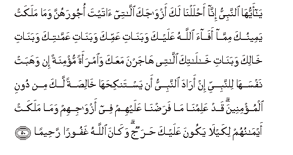

  
[Intangible Textual Heritage](../../index)  [Islam](../index) 
[Index](index)   
[Hypertext Qur'an](../htq/index)  [Unicode](../uq/033.htm#033_041) 
[Palmer](../sbe09/033)  [Pickthall](../pick/033.htm#033_041)  [Yusuf Ali
English](../yaq/yaq033)  [Rodwell](../qr/033)   
  
[Sūra XXXIII.: Aḥzāb, or The Confederates. Index](033)  
  [Previous](03305)  [Next](03307) 

------------------------------------------------------------------------

  
*The Holy Quran*, tr. by Yusuf Ali, \[1934\], at Intangible Textual
Heritage

------------------------------------------------------------------------

# Sūra XXXIII.: Aḥzāb, or The Confederates.

### Section 6

------------------------------------------------------------------------

41. Y<u>a</u> ayyuh<u>a</u> alla<u>th</u>eena <u>a</u>manoo
o<u>th</u>kuroo All<u>a</u>ha <u>th</u>ikran katheer<u>a</u>**n**

41\. O ye who believe!  
Celebrate the praises of God,  
And do this often;

------------------------------------------------------------------------

42. Wasabbi<u>h</u>oohu bukratan waa<u>s</u>eel<u>a</u>**n**

42\. And glorify Him  
Morning and evening.

------------------------------------------------------------------------

43. Huwa alla<u>th</u>ee yu<u>s</u>allee AAalaykum wamal<u>a</u>-ikatuhu
liyukhrijakum mina a**l***<u>thth</u>*ulum<u>a</u>ti il<u>a</u>
a**l**nnoori wak<u>a</u>na bi**a**lmu/mineena ra<u>h</u>eem<u>a</u>**n**

43\. He it is Who sends  
Blessings on you, as do  
His angels, that He may  
Bring you out from the depths  
Of Darkness into Light:  
And He is Full of Mercy  
To the Believers.

------------------------------------------------------------------------

44. Ta<u>h</u>iyyatuhum yawma yalqawnahu sal<u>a</u>mun waaAAadda lahum
ajran kareem<u>a</u>**n**

44\. Their salutation on the Day  
They meet Him will be  
"Peace!"; and He has  
Prepared for them  
A generous Reward.

------------------------------------------------------------------------

45. Y<u>a</u> ayyuh<u>a</u> a**l**nnabiyyu inn<u>a</u> arsaln<u>a</u>ka
sh<u>a</u>hidan wamubashshiran wana<u>th</u>eer<u>a</u>**n**

45\. O Prophet! Truly We  
Have sent thee as  
A Witness, a Bearer  
Of Glad Tidings,  
And a Warner,—

------------------------------------------------------------------------

46. Wad<u>a</u>AAiyan il<u>a</u> All<u>a</u>hi bi-i<u>th</u>nihi
wasir<u>a</u>jan muneer<u>a</u>**n**

46\. And as one who invites  
To God's (Grace) by His leave,  
And as a Lamp  
Spreading Light.

------------------------------------------------------------------------

47. Wabashshiri almu/mineena bi-anna lahum mina All<u>a</u>hi
fa<u>d</u>lan kabeer<u>a</u>**n**

47\. Then give the glad tidings  
To the Believers, that  
They shall have from God  
A very great Bounty.

------------------------------------------------------------------------

48. Wal<u>a</u> tu<u>t</u>iAAi alk<u>a</u>fireena
wa**a**lmun<u>a</u>fiqeena wadaAA a<u>tha</u>hum watawakkal AAal<u>a</u>
All<u>a</u>hi wakaf<u>a</u> bi**A**ll<u>a</u>hi wakeel<u>a</u>**n**

48\. And obey not (the behests)  
Of the Unbelievers  
And the Hypocrites,  
And heed not their annoyances,  
But put thy trust in God.  
For enough is God  
As a Disposer of affairs.

------------------------------------------------------------------------

49. Y<u>a</u> ayyuh<u>a</u> alla<u>th</u>eena <u>a</u>manoo i<u>tha</u>
naka<u>h</u>tumu almu/min<u>a</u>ti thumma <u>t</u>allaqtumoohunna min
qabli an tamassoohunna fam<u>a</u> lakum AAalayhinna min AAiddatin
taAAtaddoonah<u>a</u> famattiAAoohunna wasarri<u>h</u>oohunna
sar<u>ah</u>an jameel<u>a</u>**n**

49\. O ye who believe!  
When ye marry believing women,  
And then divorce them  
Before ye have touched them,  
No period of ’Iddat  
Have ye to count  
In respect of them:  
So give them a present,  
And set them free  
In a handsome manner.

------------------------------------------------------------------------

50. Y<u>a</u> ayyuh<u>a</u> a**l**nnabiyyu inn<u>a</u>
a<u>h</u>laln<u>a</u> laka azw<u>a</u>jaka all<u>a</u>tee <u>a</u>tayta
ojoorahunna wam<u>a</u> malakat yameenuka mimm<u>a</u> af<u>a</u>a
All<u>a</u>hu AAalayka waban<u>a</u>ti AAammika waban<u>a</u>ti
AAamm<u>a</u>tika waban<u>a</u>ti kh<u>a</u>lika waban<u>a</u>ti
kh<u>a</u>l<u>a</u>tika all<u>a</u>tee h<u>a</u>jarna maAAaka
wa**i**mraatan mu/minatan in wahabat nafsah<u>a</u> li**l**nnabiyyi in
ar<u>a</u>da a**l**nnabiyyu an yastanki<u>h</u>ah<u>a</u>
kh<u>a</u>li<u>s</u>atan laka min dooni almu/mineena qad AAalimn<u>a</u>
m<u>a</u> fara<u>d</u>n<u>a</u> AAalayhim fee azw<u>a</u>jihim
wam<u>a</u> malakat aym<u>a</u>nuhum likayl<u>a</u> yakoona AAalayka
<u>h</u>arajun wak<u>a</u>na All<u>a</u>hu ghafooran
ra<u>h</u>eem<u>a</u>**n**

50\. O Prophet! We have  
Made lawful to thee  
Thy wives to whom thou  
Hast paid their dowers;  
And those whom thy  
Right hand possesses out of  
The prisoners of war whom  
God has assigned to thee;  
And daughters of thy paternal  
Uncles and aunts, and daughters  
Of thy maternal uncles  
And aunts, who migrated  
(From Mecca) with thee;  
And any believing woman  
Who dedicates her soul  
To the Prophet if the Prophet  
Wishes to wed her;—this  
Only for thee, and not  
For the Believers (at large);  
We know what We have  
Appointed for them as to  
Their wives and the captives  
Whom their right hands  
Possess;—in order that  
There should be no difficulty  
For thee. And God is  
Oft-Forgiving, Most Merciful.

------------------------------------------------------------------------

51. Turjee man tash<u>a</u>o minhunna watu/wee ilayka man tash<u>a</u>o
wamani ibtaghayta mimman AAazalta fal<u>a</u> jun<u>ah</u>a AAalayka
<u>tha</u>lika adn<u>a</u> an taqarra aAAyunuhunna wal<u>a</u>
ya<u>h</u>zanna wayar<u>d</u>ayna bim<u>a</u> <u>a</u>taytahunna
kulluhunna wa**A**ll<u>a</u>hu yaAAlamu m<u>a</u> fee quloobikum
wak<u>a</u>na All<u>a</u>hu AAaleeman <u>h</u>aleem<u>a</u>**n**

51\. Thou mayest defer (the turn  
Of) any of them that thou  
Pleasest, and thou mayest receive  
Any thou pleasest: and there  
Is no blame on thee if  
Thou invite one whose (turn)  
Thou hadst set aside.  
This were nigher to  
The cooling of their eyes,  
The prevention of their grief,  
And their satisfaction—  
That of all of them—  
With that which thou  
Hast to give them:  
And God knows (all)  
That is in your hearts:  
And God is All-Knowing,  
Most Forbearing.

------------------------------------------------------------------------

52. L<u>a</u> ya<u>h</u>illu laka a**l**nnis<u>a</u>o min baAAdu
wal<u>a</u> an tabaddala bihinna min azw<u>a</u>jin walaw aAAjabaka
<u>h</u>usnuhunna ill<u>a</u> m<u>a</u> malakat yameenuka wak<u>a</u>na
All<u>a</u>hu AAal<u>a</u> kulli shay-in raqeeb<u>a</u>**n**

52\. It is not lawful for thee  
(To marry more) women  
After this, nor to change  
Them for (other) wives,  
Even though their beauty  
Attract thee, except any  
Thy right hand should  
Possess (as handmaidens):  
And God doth watch  
Over all things.

------------------------------------------------------------------------

[Next: Section 7 (53-58)](03307)

