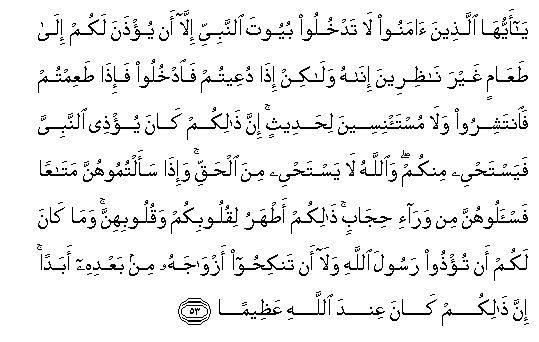

  
[Intangible Textual Heritage](../../index)  [Islam](../index.md) 
[Index](index.md)   
[Hypertext Qur'an](../htq/index)  [Unicode](../uq/033.htm#033_053.md) 
[Palmer](../sbe09/033)  [Pickthall](../pick/033.htm#033_053.md)  [Yusuf Ali
English](../yaq/yaq033)  [Rodwell](../qr/033.md)   
  
[Sūra XXXIII.: Aḥzāb, or The Confederates. Index](033.md)  
  [Previous](03306)  [Next](03308.md) 

------------------------------------------------------------------------

  
*The Holy Quran*, tr. by Yusuf Ali, \[1934\], at Intangible Textual
Heritage

------------------------------------------------------------------------

# Sūra XXXIII.: Aḥzāb, or The Confederates.

### Section 7

------------------------------------------------------------------------

53. Y<u>a</u> ayyuh<u>a</u> alla<u>th</u>eena <u>a</u>manoo l<u>a</u>
tadkhuloo buyoota a**l**nnabiyyi ill<u>a</u> an yu/<u>th</u>ana lakum
il<u>a</u> <u>t</u>aAA<u>a</u>min ghayra n<u>a</u>*<u>th</u>*ireena
in<u>a</u>hu wal<u>a</u>kin i<u>tha</u> duAAeetum fa**o**dkhuloo
fa-i<u>tha</u> <u>t</u>aAAimtum fa**i**ntashiroo wal<u>a</u>
musta/niseena li<u>h</u>adeethin inna <u>tha</u>likum k<u>a</u>na
yu/<u>th</u>ee a**l**nnabiyya fayasta<u>h</u>yee minkum
wa**A**ll<u>a</u>hu l<u>a</u> yasta<u>h</u>yee mina al<u>h</u>aqqi
wa-i<u>tha</u> saaltumoohunna mat<u>a</u>AAan fa**i**s-aloohunna min
war<u>a</u>-i <u>h</u>ij<u>a</u>bin <u>tha</u>likum a<u>t</u>haru
liquloobikum waquloobihinna wam<u>a</u> k<u>a</u>na lakum an
tu/<u>th</u>oo rasoola All<u>a</u>hi wal<u>a</u> an tanki<u>h</u>oo
azw<u>a</u>jahu min baAAdihi abadan inna <u>tha</u>likum k<u>a</u>na
AAinda All<u>a</u>hi AAa*<u>th</u>*eem<u>a</u>**n**

53\. O ye who believe!  
Enter not the Prophet's houses,—  
Until leave is given you,  
For a meal, (and then)  
Not (so early as) to wait  
For its preparation: but when  
Ye are invited, enter;  
And when ye have taken  
Your meal, disperse,  
Without seeking familiar talk.  
Such (behaviour) annoys  
The Prophet: he is ashamed  
To dismiss you, but  
God is not ashamed  
(To tell you) the truth.  
And when ye  
Ask (his ladies)  
For anything ye want,  
Ask them from before  
A screen: that makes  
For greater purity for  
Your hearts and for theirs.  
Nor is it right for you  
That ye should annoy  
God's Apostle, or that  
Ye should marry his widows  
After him at any time.  
Truly such a thing is  
In God's sight an enormity.

------------------------------------------------------------------------

54. In tubdoo shay-an aw tukhfoohu fa-inna All<u>a</u>ha k<u>a</u>na
bikulli shay-in AAaleem<u>a</u>**n**

54\. Whether ye reveal anything  
Or conceal it, verily  
God has full knowledge  
Of all things.

------------------------------------------------------------------------

55. L<u>a</u> jun<u>ah</u>a AAalayhinna fee <u>a</u>b<u>a</u>-ihinna
wal<u>a</u> abn<u>a</u>-ihinna wal<u>a</u> ikhw<u>a</u>nihinna
wal<u>a</u> abn<u>a</u>-i ikhw<u>a</u>nihinna wal<u>a</u> abn<u>a</u>-i
akhaw<u>a</u>tihinna wal<u>a</u> nis<u>a</u>-ihinna wal<u>a</u>
m<u>a</u> malakat aym<u>a</u>nuhunna wa**i**ttaqeena All<u>a</u>ha inna
All<u>a</u>ha k<u>a</u>na AAal<u>a</u> kulli shay-in
shaheed<u>a</u>**n**

55\. There is no blame  
(On these ladies if they  
Appear) before their fathers  
Or their sons, their brothers,  
Or their brothers’ sons,  
Or their sisters’ sons,  
Or their women,  
Or the (slaves) whom  
Their right hands possess.  
And, (ladies), fear God;  
For God is Witness  
To all things.

------------------------------------------------------------------------

56. Inna All<u>a</u>ha wamal<u>a</u>-ikatahu yu<u>s</u>alloona
AAal<u>a</u> a**l**nnabiyyi y<u>a</u> ayyuh<u>a</u> alla<u>th</u>eena
<u>a</u>manoo <u>s</u>alloo AAalayhi wasallimoo tasleem<u>a</u>**n**

56\. God and His Angels  
Send blessings on the Prophet:  
O ye that believe!  
Send ye blessings on him,  
And salute him  
With all respect.

------------------------------------------------------------------------

57. Inna alla<u>th</u>eena yu/<u>th</u>oona All<u>a</u>ha warasoolahu
laAAanahumu All<u>a</u>hu fee a**l**dduny<u>a</u>
wa**a**l-<u>a</u>khirati waaAAadda lahum AAa<u>tha</u>ban
muheen<u>a</u>**n**

57\. Those who annoy  
God and His Apostle—  
God has cursed them  
In this world and  
In the Hereafter,  
And has prepared for them  
A humiliating Punishment.

------------------------------------------------------------------------

58. Wa**a**lla<u>th</u>eena yu/<u>th</u>oona almu/mineena
wa**a**lmu/min<u>a</u>ti bighayri m<u>a</u> iktasaboo faqadi
i<u>h</u>tamaloo buht<u>a</u>nan wa-ithman mubeen<u>a</u>**n**

58\. And those who annoy  
Believing men and women  
Undeservedly, bear  
(on themselves)  
A calumny and a glaring sin.

------------------------------------------------------------------------

[Next: Section 8 (59-68)](03308.md)

