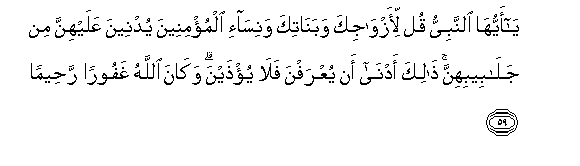
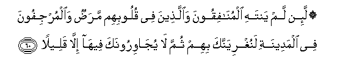

  
[Intangible Textual Heritage](../../index)  [Islam](../index) 
[Index](index)   
[Hypertext Qur'an](../htq/index)  [Unicode](../uq/033.htm#033_059) 
[Palmer](../sbe09/033)  [Pickthall](../pick/033.htm#033_059)  [Yusuf Ali
English](../yaq/yaq033)  [Rodwell](../qr/033)   
  
[Sūra XXXIII.: Aḥzāb, or The Confederates. Index](033)  
  [Previous](03307)  [Next](03309) 

------------------------------------------------------------------------

  
*The Holy Quran*, tr. by Yusuf Ali, \[1934\], at Intangible Textual
Heritage

------------------------------------------------------------------------

# Sūra XXXIII.: Aḥzāb, or The Confederates.

### Section 8

------------------------------------------------------------------------

59. Y<u>a</u> ayyuh<u>a</u> a**l**nnabiyyu qul li-azw<u>a</u>jika
waban<u>a</u>tika wanis<u>a</u>-i almu/mineena yudneena AAalayhinna min
jal<u>a</u>beebihinna <u>tha</u>lika adn<u>a</u> an yuAArafna
fal<u>a</u> yu/<u>th</u>ayna wak<u>a</u>na All<u>a</u>hu ghafooran
ra<u>h</u>eem<u>a</u>**n**

59\. O Prophet! Tell  
Thy wives and daughters,  
And the believing women,  
That they should cast  
Their outer garments over  
Their persons (when abroad):  
That is most convenient,  
That they should be known  
(As such) and not molested.  
And God is Oft-Forgiving,  
Most Merciful.

------------------------------------------------------------------------

60. La-in lam yantahi almun<u>a</u>fiqoona wa**a**lla<u>th</u>eena fee
quloobihim mara<u>d</u>un wa**a**lmurjifoona fee almadeenati
lanughriyannaka bihim thumma l<u>a</u> yuj<u>a</u>wiroonaka feeh<u>a</u>
ill<u>a</u> qaleel<u>a</u>**n**

60\. Truly, if the Hypocrites,  
And those in whose hearts  
Is a disease, and those who  
Stir up sedition in the City,  
Desist not, We shall certainly  
Stir thee up against them:  
Then will they not be  
Able to stay in it  
As thy neighbours  
For any length of time:

------------------------------------------------------------------------

61. MalAAooneena ayna m<u>a</u> thuqifoo okhi<u>th</u>oo waquttiloo
taqteel<u>a</u>**n**

61\. They shall have a curse  
On them: wherever they  
Are found, they shall be  
Seized and slain  
(Without mercy).

------------------------------------------------------------------------

62. Sunnata All<u>a</u>hi fee alla<u>th</u>eena khalaw min qablu walan
tajida lisunnati All<u>a</u>hi tabdeel<u>a</u>**n**

62\. (Such was) the practice  
(Approved) of God among those  
Who lived aforetime:  
No change wilt thou find  
In the practice (approved)  
Of God.

------------------------------------------------------------------------

63. Yas-aluka a**l**nn<u>a</u>su AAani a**l**ss<u>a</u>AAati qul
innam<u>a</u> AAilmuh<u>a</u> AAinda All<u>a</u>hi wam<u>a</u> yudreeka
laAAalla a**l**ss<u>a</u>AAata takoonu qareeb<u>a</u>**n**

63\. Men ask thee concerning  
The Hour: say, "The knowledge  
Thereof is with God (alone)":  
And what will make thee  
Understand?—perchance  
The Hour is nigh!

------------------------------------------------------------------------

64. Inna All<u>a</u>ha laAAana alk<u>a</u>fireena waaAAadda lahum
saAAeer<u>a</u>**n**

64\. Verily God has cursed  
The Unbelievers and prepared  
For them a Blazing Fire,—

------------------------------------------------------------------------

65. Kh<u>a</u>lideena feeh<u>a</u> abadan l<u>a</u> yajidoona waliyyan
wal<u>a</u> na<u>s</u>eer<u>a</u>**n**

65\. To dwell therein for ever:  
No protector will they find,  
Nor helper.

------------------------------------------------------------------------

66. Yawma tuqallabu wujoohuhum fee a**l**nn<u>a</u>ri yaqooloona
y<u>a</u> laytan<u>a</u> a<u>t</u>aAAn<u>a</u> All<u>a</u>ha
waa<u>t</u>aAAn<u>a</u> a**l**rrasool<u>a</u>

66\. The Day that their faces  
Will be turned upside down  
In the Fire, they will say:  
"Woe to us! would that  
We had obeyed God  
And obeyed the Apostle!"

------------------------------------------------------------------------

67. Waq<u>a</u>loo rabban<u>a</u> inn<u>a</u> a<u>t</u>aAAn<u>a</u>
s<u>a</u>datan<u>a</u> wakubar<u>a</u>an<u>a</u>
faa<u>d</u>alloon<u>a</u> a**l**ssabeel<u>a</u>

67\. And they would say:  
"Our Lord! We obeyed  
Our chiefs and our great ones,  
And they misled us  
As to the (right) path.

------------------------------------------------------------------------

68. Rabban<u>a</u> <u>a</u>tihim <u>d</u>iAAfayni mina alAAa<u>tha</u>bi
wa**i**lAAanhum laAAnan kabeer<u>a</u>**n**

68\. "Our Lord! Give them  
Double Penalty  
And curse them  
With a very great Curse!"

------------------------------------------------------------------------

[Next: Section 9 (69-73)](03309)

