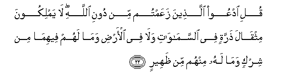
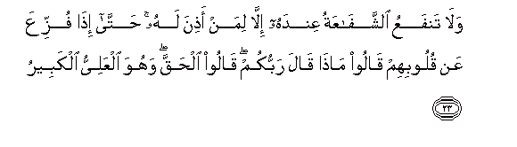
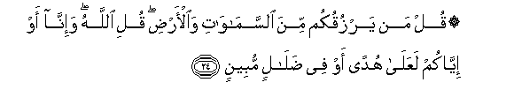
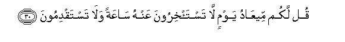

  
[Intangible Textual Heritage](../../index)  [Islam](../index.md) 
[Index](index.md)   
[Hypertext Qur'an](../htq/index)  [Unicode](../uq/034.htm#034_022.md) 
[Palmer](../sbe09/034)  [Pickthall](../pick/034.htm#034_022.md)  [Yusuf Ali
English](../yaq/yaq034)  [Rodwell](../qr/034.md)   
  
[Sūra XXXIV.: Sabā, or the City of Sabā Index](034.md)  
  [Previous](03402)  [Next](03404.md) 

------------------------------------------------------------------------

  
*The Holy Quran*, tr. by Yusuf Ali, \[1934\], at Intangible Textual
Heritage

------------------------------------------------------------------------

# Sūra XXXIV.: Sabā, or the City of Sabā

### Section 3

------------------------------------------------------------------------

22. Quli odAAoo alla<u>th</u>eena zaAAamtum min dooni All<u>a</u>hi
l<u>a</u> yamlikoona mithq<u>a</u>la <u>th</u>arratin fee
a**l**ssam<u>a</u>w<u>a</u>ti wal<u>a</u> fee al-ar<u>d</u>i wam<u>a</u>
lahum feehim<u>a</u> min shirkin wam<u>a</u> lahu minhum min
*<u>th</u>*aheer**in**

22\. Say: "Call upon other (gods)  
Whom ye fancy, besides God:  
They have no power,  
Not the weight of an atom,—  
In the heavens or on earth:  
No (sort of) share have they  
Therein, nor is any of them  
A helper to God.

------------------------------------------------------------------------

23. Wal<u>a</u> tanfaAAu a**l**shshaf<u>a</u>AAatu AAindahu ill<u>a</u>
liman a<u>th</u>ina lahu <u>h</u>att<u>a</u> i<u>tha</u> fuzziAAa AAan
quloobihim q<u>a</u>loo m<u>atha</u> q<u>a</u>la rabbukum q<u>a</u>loo
al<u>h</u>aqqa wahuwa alAAaliyyu alkabeer**u**

23\. "No intercession can avail  
In His Presence, except for those  
For whom He has granted  
Permission. So far (is this  
The case) that, when terror  
Is removed from their hearts  
(At the Day of Judgment, then)  
Will they say, "What is it  
That your Lord commanded?"  
They will say, "That which is  
True and just; and He is  
The Most High, Most Great."

------------------------------------------------------------------------

24. Qul man yarzuqukum mina a**l**ssam<u>a</u>w<u>a</u>ti
wa**a**l-ar<u>d</u>i quli All<u>a</u>hu wa-inn<u>a</u> aw iyy<u>a</u>kum
laAAal<u>a</u> hudan aw fee <u>d</u>al<u>a</u>lin mubeen**in**

24\. Say: "Who gives you  
Sustenance, from the heavens  
And the earth?" Say:  
"It is God; and certain it is  
That either we or ye  
Are on right guidance  
Or in manifest error!"

------------------------------------------------------------------------

25. Qul l<u>a</u> tus-aloona AAamm<u>a</u> ajramn<u>a</u> wal<u>a</u>
nus-alu AAamm<u>a</u> taAAmaloon**a**

25\. Say: "Ye shall not be  
Questioned as to our sins,  
Nor shall we be questioned  
As to what ye do."

------------------------------------------------------------------------

26. Qul yajmaAAu baynan<u>a</u> rabbun<u>a</u> thumma yafta<u>h</u>u
baynan<u>a</u> bi**a**l<u>h</u>aqqi wahuwa alfatt<u>ah</u>u
alAAaleem**u**

26\. Say: "Our Lord will gather us  
Together and will in the end  
Decide the matter between us  
(And you) in truth and justice:  
And He is the One to decide,  
The One Who knows all."

------------------------------------------------------------------------

27. Qul arooniya alla<u>th</u>eena al<u>h</u>aqtum bihi shurak<u>a</u>a
kall<u>a</u> bal huwa All<u>a</u>hu alAAazeezu al<u>h</u>akeem**u**

27\. Say: "Show me those whom  
Ye have joined with Him  
As partners: by no means  
(Can ye). Nay, He is God,  
The Exalted in Power,  
The Wise."

------------------------------------------------------------------------

28. Wam<u>a</u> arsaln<u>a</u>ka ill<u>a</u> k<u>a</u>ffatan
li**l**nn<u>a</u>si basheeran wana<u>th</u>eeran wal<u>a</u>kinna
akthara a**l**nn<u>a</u>si l<u>a</u> yaAAlamoon**a**

28\. We have not sent thee  
But as a universal (Messenger)  
To men, giving them  
Glad tidings, and warning them  
(Against sin), but most men  
Understand not.

------------------------------------------------------------------------

29. Wayaqooloona mat<u>a</u> h<u>atha</u> alwaAAdu in kuntum
<u>sa</u>diqeen**a**

29\. They say: "When will this  
Promise (come to pass)  
If ye are telling the truth?"

------------------------------------------------------------------------

30. Qul lakum meeAA<u>a</u>du yawmin l<u>a</u> tasta/khiroona AAanhu
s<u>a</u>AAatan wal<u>a</u> tastaqdimoon**a**

30\. Say: "The appointment to you  
Is for a Day, which ye  
Cannot put back for an hour  
Nor put forward."

------------------------------------------------------------------------

[Next: Section 4 (31-36)](03404.md)

