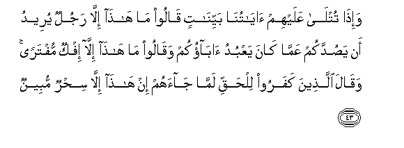

  
[Intangible Textual Heritage](../../index)  [Islam](../index.md) 
[Index](index.md)   
[Hypertext Qur'an](../htq/index)  [Unicode](../uq/034.htm#034_037.md) 
[Palmer](../sbe09/034)  [Pickthall](../pick/034.htm#034_037.md)  [Yusuf Ali
English](../yaq/yaq034)  [Rodwell](../qr/034.md)   
  
[Sūra XXXIV.: Sabā, or the City of Sabā Index](034.md)  
  [Previous](03404)  [Next](03406.md) 

------------------------------------------------------------------------

  
*The Holy Quran*, tr. by Yusuf Ali, \[1934\], at Intangible Textual
Heritage

------------------------------------------------------------------------

# Sūra XXXIV.: Sabā, or the City of Sabā

### Section 5

------------------------------------------------------------------------

37. Wam<u>a</u> amw<u>a</u>lukum wal<u>a</u> awl<u>a</u>dukum
bi**a**llatee tuqarribukum AAindan<u>a</u> zulf<u>a</u> ill<u>a</u> man
<u>a</u>mana waAAamila <u>sa</u>li<u>h</u>an faol<u>a</u>-ika lahum
jaz<u>a</u>o a**l**<u>dd</u>iAAfi bim<u>a</u> AAamiloo wahum fee
alghuruf<u>a</u>ti <u>a</u>minoon**a**

37\. It is not your wealth  
Nor your sons, that will  
Bring you nearer to Us  
In degree: but only  
Those who believe and work  
Righteousness—these are  
The ones for whom there is  
A multiplied Reward  
For their deeds, while  
Secure they (reside)  
In the dwellings on high!

------------------------------------------------------------------------

38. Wa**a**lla<u>th</u>eena yasAAawna fee <u>a</u>y<u>a</u>tin<u>a</u>
muAA<u>a</u>jizeena ol<u>a</u>-ika fee alAAa<u>tha</u>bi
mu<u>hd</u>aroon**a**

38\. Those who strive against  
Our Signs, to frustrate them,  
Will be given over  
Into Punishment.

------------------------------------------------------------------------

39. Qul inna rabbee yabsu<u>t</u>u a**l**rrizqa liman yash<u>a</u>o min
AAib<u>a</u>dihi wayaqdiru lahu wam<u>a</u> anfaqtum min shay-in fahuwa
yukhlifuhu wahuwa khayru a**l**rr<u>a</u>ziqeen**a**

39\. Say: "Verily my Lord enlarges  
And restricts the Sustenance  
To such of His servants  
As He pleases: and nothing  
Do ye spend in the least  
(In His Cause) but He  
Replaces it: for He is  
The Best of those who  
Grant Sustenance.

------------------------------------------------------------------------

40. Wayawma ya<u>h</u>shuruhum jameeAAan thumma yaqoolu
lilmal<u>a</u>-ikati ah<u>a</u>ol<u>a</u>-i iyy<u>a</u>kum k<u>a</u>noo
yaAAbudoon**a**

40\. One Day He will  
Gather them all together,  
And say to the angels,  
"Was it you that these  
Men used to worship?"

------------------------------------------------------------------------

41. Q<u>a</u>loo sub<u>ha</u>naka anta waliyyun<u>a</u> min doonihim bal
k<u>a</u>noo yaAAbudoona aljinna aktharuhum bihim mu/minoon**a**

41\. They will say, "Glory to Thee!  
Our (tie) is with Thee  
As Protector—not with them.  
Nay, but they worshipped  
The Jinns: most of them  
Believed in them."

------------------------------------------------------------------------

42. Fa**a**lyawma l<u>a</u> yamliku baAA<u>d</u>ukum libaAA<u>d</u>in
nafAAan wal<u>a</u> <u>d</u>arran wanaqoolu lilla<u>th</u>eena
*<u>th</u>*alamoo <u>th</u>ooqoo AAa<u>tha</u>ba a**l**nn<u>a</u>ri
allatee kuntum bih<u>a</u> tuka<u>thth</u>iboon**a**

42\. So on that Day  
No power shall they have  
Over each other, for profit  
Or harm: and We shall  
Say to the wrong-doers,  
"Taste ye the Penalty's  
Of the Fire,—the which  
Ye were wont to deny!"

------------------------------------------------------------------------

43. Wa-i<u>tha</u> tutl<u>a</u> AAalayhim <u>a</u>y<u>a</u>tun<u>a</u>
bayyin<u>a</u>tin q<u>a</u>loo m<u>a</u> h<u>atha</u> ill<u>a</u>
rajulun yureedu an ya<u>s</u>uddakum AAamm<u>a</u> k<u>a</u>na yaAAbudu
<u>a</u>b<u>a</u>okum waq<u>a</u>loo m<u>a</u> h<u>atha</u> ill<u>a</u>
ifkun muftaran waq<u>a</u>la alla<u>th</u>eena kafaroo lil<u>h</u>aqqi
lamm<u>a</u> j<u>a</u>ahum in h<u>atha</u> ill<u>a</u> si<u>h</u>run
mubeen**un**

43\. When Our Clear Signs  
Are rehearsed to them,  
They say, "This is only  
A man who wishes  
To hinder you from the (worship)  
Which your fathers practised."  
And they say, "This is  
Only a falsehood invented!"  
And the Unbelievers say  
Of the Truth when it comes  
To them, "This is nothing  
But evident magic!"

------------------------------------------------------------------------

44. Wam<u>a</u> <u>a</u>tayn<u>a</u>hum min kutubin yadrusoonah<u>a</u>
wam<u>a</u> arsaln<u>a</u> ilayhim qablaka min na<u>th</u>eer**in**

44\. But We had not given  
Them Books which they could  
Study, nor sent apostles  
To them before thee  
As Warners.

------------------------------------------------------------------------

45. Waka<u>thth</u>aba alla<u>th</u>eena min qablihim wam<u>a</u>
balaghoo miAAsh<u>a</u>ra m<u>a</u> <u>a</u>tayn<u>a</u>hum
faka<u>thth</u>aboo rusulee fakayfa k<u>a</u>na nakeer**i**

45\. And their predecessors rejected  
(The Truth); these have  
Not received a tenth  
Of what We had granted  
To those: yet when they rejected  
My apostles, how (terrible)  
Was My rejection (of them)!

------------------------------------------------------------------------

[Next: Section 6 (46-54)](03406.md)

