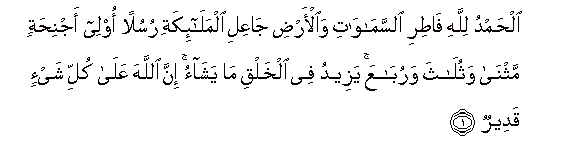
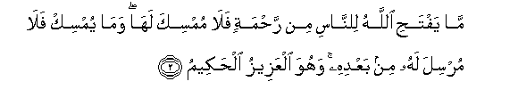
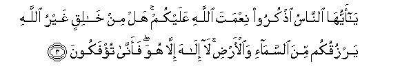
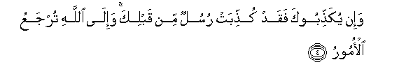
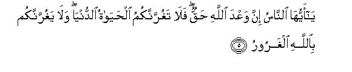
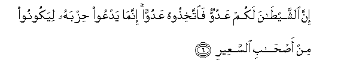
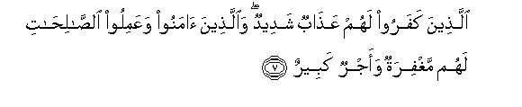

  
[Intangible Textual Heritage](../../index)  [Islam](../index.md) 
[Index](index.md)   
[Hypertext Qur'an](../htq/index)  [Unicode](../uq/035.htm#035_001.md) 
[Palmer](../sbe09/035)  [Pickthall](../pick/035.htm#035_001.md)  [Yusuf Ali
English](../yaq/yaq035)  [Rodwell](../qr/035.md)   
  
[Sūra XXXV.: Fāṭir, or The Originator of Creation; or Malāïka, or The
Angels. Index](035.md)  
  [Previous](03406)  [Next](03502.md) 

------------------------------------------------------------------------

  
*The Holy Quran*, tr. by Yusuf Ali, \[1934\], at Intangible Textual
Heritage

------------------------------------------------------------------------

# Sūra XXXV.: Fāṭir, or The Originator of Creation; or Malāïka, or The Angels.

### Section 1

1. Al<u>h</u>amdu lill<u>a</u>hi f<u>at</u>iri
a**l**ssam<u>a</u>w<u>a</u>ti wa**a**l-ar<u>d</u>i j<u>a</u>AAili
almal<u>a</u>-ikati rusulan olee ajni<u>h</u>atin mathn<u>a</u>
wathul<u>a</u>tha warub<u>a</u>AAa yazeedu fee alkhalqi m<u>a</u>
yash<u>a</u>o inna All<u>a</u>ha AAal<u>a</u> kulli shay-in qadeer**un**

1\. Praise be to God,  
Who created (out of nothing)  
The heavens and the earth,  
Who made the angels  
Messengers with wings,—  
Two, or three, or four (Pairs):  
He adds to Creation  
As He pleases: for God  
Has power over all things.

------------------------------------------------------------------------

2. M<u>a</u> yafta<u>h</u>i All<u>a</u>hu li**l**nn<u>a</u>si min
ra<u>h</u>matin fal<u>a</u> mumsika lah<u>a</u> wam<u>a</u> yumsik
fal<u>a</u> mursila lahu min baAAdihi wahuwa alAAazeezu
al<u>h</u>akeem**u**

2\. What God out of His Mercy  
Doth bestow on mankind  
There is none can withhold:  
What He doth withhold,  
There is none can grant,  
Apart from Him:  
And He is the Exalted  
In Power, Full of Wisdom.

------------------------------------------------------------------------

3. Y<u>a</u> ayyuh<u>a</u> a**l**nn<u>a</u>su o<u>th</u>kuroo niAAmata
All<u>a</u>hi AAalaykum hal min kh<u>a</u>liqin ghayru All<u>a</u>hi
yarzuqukum mina a**l**ssam<u>a</u>-i wa**a**l-ar<u>d</u>i l<u>a</u>
il<u>a</u>ha ill<u>a</u> huwa faann<u>a</u> tu/fakoon**a**

3\. O men! call to mind  
The grace of God unto you!  
Is there a Creator, other  
Than God, to give you  
Sustenance from heaven  
Or earth? There is  
No god but He: how  
Then are ye deluded  
Away from the Truth?

------------------------------------------------------------------------

4. Wa-in yuka<u>thth</u>ibooka faqad kut<u>hth</u>ibat rusulun min
qablika wa-il<u>a</u> All<u>a</u>hi turjaAAu al-omoor**u**

4\. And if they reject thee,  
So were apostles rejected  
Before thee: to God  
Go back for decision  
All affairs.

------------------------------------------------------------------------

5. Y<u>a</u> ayyuh<u>a</u> a**l**nn<u>a</u>su inna waAAda All<u>a</u>hi
<u>h</u>aqqun fal<u>a</u> taghurrannakumu al<u>h</u>ay<u>a</u>tu
a**l**dduny<u>a</u> wal<u>a</u> yaghurrannakum bi**A**ll<u>a</u>hi
algharoor**u**

5\. O men! certainly  
The promise of God  
Is true. Let not then  
This present life deceive you,  
Nor let the Chief Deceiver  
Deceive you about God.

------------------------------------------------------------------------

6. Inna a**l**shshay<u>ta</u>na lakum AAaduwwun
fa**i**ttakhi<u>th</u>oohu AAaduwwan innam<u>a</u> yadAAoo
<u>h</u>izbahu liyakoonoo min a<u>s</u>-<u>ha</u>bi a**l**ssaAAeer**i**

6\. Verily Satan is an enemy  
To you: so treat him  
As an enemy. He only  
Invites his adherents,  
That they may become  
Companions of the Blazing Fire.

------------------------------------------------------------------------

7. Alla<u>th</u>eena kafaroo lahum AAa<u>tha</u>bun shadeedun
wa**a**lla<u>th</u>eena <u>a</u>manoo waAAamiloo
a**l**<u>ssa</u>li<u>ha</u>ti lahum maghfiratun waajrun kabeer**un**

7\. For those who reject God,  
Is a terrible Penalty: but  
For those who believe  
And work righteous deeds,  
Is Forgiveness, and  
A magnificent Reward.

------------------------------------------------------------------------

[Next: Section 2 (8-14)](03502.md)

