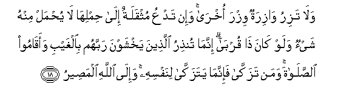
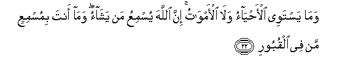
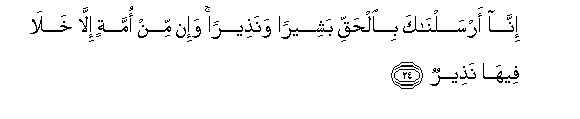

  
[Intangible Textual Heritage](../../index)  [Islam](../index.md) 
[Index](index.md)   
[Hypertext Qur'an](../htq/index)  [Unicode](../uq/035.htm#035_015.md) 
[Palmer](../sbe09/035)  [Pickthall](../pick/035.htm#035_015.md)  [Yusuf Ali
English](../yaq/yaq035)  [Rodwell](../qr/035.md)   
  
[Sūra XXXV.: Fāṭir, or The Originator of Creation; or Malāïka, or The
Angels. Index](035.md)  
  [Previous](03502)  [Next](03504.md) 

------------------------------------------------------------------------

  
*The Holy Quran*, tr. by Yusuf Ali, \[1934\], at Intangible Textual
Heritage

------------------------------------------------------------------------

# Sūra XXXV.: Fāṭir, or The Originator of Creation; or Malāïka, or The Angels.

### Section 3

------------------------------------------------------------------------

15. Y<u>a</u> ayyuh<u>a</u> a**l**nn<u>a</u>su antumu alfuqar<u>a</u>o
il<u>a</u> All<u>a</u>hi wa**A**ll<u>a</u>hu huwa alghaniyyu
al<u>h</u>ameed**u**

15\. O ye men! It is  
Ye that have need  
Of God: but God is  
The One Free of all wants,  
Worthy of all praise.

------------------------------------------------------------------------

16. In yasha/ yu<u>th</u>hibkum waya/ti bikhalqin jadeed**in**

16\. If He so pleased, He  
Could blot you out  
And bring in  
A New Creation.

------------------------------------------------------------------------

17. Wam<u>a</u> <u>tha</u>lika AAal<u>a</u> All<u>a</u>hi
biAAazeez**in**

17\. Nor is that (at all)  
Difficult for God.

------------------------------------------------------------------------

18. Wal<u>a</u> taziru w<u>a</u>ziratun wizra okhr<u>a</u> wa-in tadAAu
muthqalatun il<u>a</u> <u>h</u>imlih<u>a</u> l<u>a</u> yu<u>h</u>mal
minhu shay-on walaw k<u>a</u>na <u>tha</u> qurb<u>a</u> innam<u>a</u>
tun<u>th</u>iru alla<u>th</u>eena yakhshawna rabbahum bi**a**lghaybi
waaq<u>a</u>moo a**l**<u>ss</u>al<u>a</u>ta waman tazakk<u>a</u>
fa-innam<u>a</u> yatazakk<u>a</u> linafsihi wa-il<u>a</u> All<u>a</u>hi
alma<u>s</u>eer**u**

18\. Nor can a bearer of burdens  
Bear another's burden.  
If one heavily laden should  
Call another to (bear) his load,  
Not the least portion of it  
Can be carried (by the other),  
Even though he be nearly  
Related. Thou canst but  
Admonish such as fear  
Their Lord unseen  
And establish regular Prayer.  
And whoever purifies himself  
Does so for the benefit  
Of his own soul; and  
The destination (of all)  
Is to God.

------------------------------------------------------------------------

19. Wam<u>a</u> yastawee al-aAAm<u>a</u> wa**a**lba<u>s</u>eer**u**

19\. The blind and the seeing  
Are not alike;

------------------------------------------------------------------------

20. Wal<u>a</u> a**l***<u>thth</u>*ulum<u>a</u>tu wal<u>a</u>
a**l**nnoor**u**

20\. Nor are the depths  
Of Darkness and the Light;

------------------------------------------------------------------------

21. Wal<u>a</u> a**l***<u>thth</u>*illu wal<u>a</u> al<u>h</u>aroor**u**

21\. Nor are the (chilly) shade  
And the (genial) heat of the sun:

------------------------------------------------------------------------

22. Wam<u>a</u> yastawee al-a<u>h</u>y<u>a</u>o wal<u>a</u>
al-amw<u>a</u>tu inna All<u>a</u>ha yusmiAAu man yash<u>a</u>o
wam<u>a</u> anta bimusmiAAin man fee alquboor**i**

22\. Nor are alike those  
That are living and those  
That are dead. God can  
Make any that He wills  
To hear; but thou  
Canst not make those  
To hear who are  
(Buried) in graves.

------------------------------------------------------------------------

23. In anta ill<u>a</u> na<u>th</u>eer**un**

23\. Thou art no other  
Than a warner.

------------------------------------------------------------------------

24. Inn<u>a</u> arsaln<u>a</u>ka bi**a**l<u>h</u>aqqi basheeran
wana<u>th</u>eeran wa-in min ommatin ill<u>a</u> khal<u>a</u>
feeh<u>a</u> na<u>th</u>eer**un**

24\. Verily We have sent thee  
In truth, as a bearer  
Of glad tidings,  
And as a warner:  
And there never was  
A people, without a warner  
Having lived among them  
(In the past).

------------------------------------------------------------------------

25. Wa-in yuka<u>thth</u>ibooka faqad ka<u>thth</u>aba alla<u>th</u>eena
min qablihim j<u>a</u>at-hum rusuluhum bi**a**lbayyin<u>a</u>ti
wabi**al**zzuburi wabi**a**lkit<u>a</u>bi almuneer**i**

25\. And if they reject thee,  
So did their predecessors,  
To whom came their apostles  
With Clear Signs, Books  
Of dark prophecies,  
And the Book  
Of Enlightenment.

------------------------------------------------------------------------

26. Thumma akha<u>th</u>tu alla<u>th</u>eena kafaroo fakayfa k<u>a</u>na
nakeer**i**

26\. In the end did I  
Punish those who rejected  
Faith: and how (terrible)  
Was My rejection (of them)!

------------------------------------------------------------------------

[Next: Section 4 (27-37)](03504.md)

