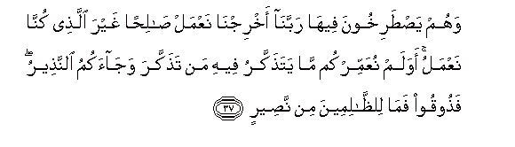

  
[Intangible Textual Heritage](../../index)  [Islam](../index) 
[Index](index)   
[Hypertext Qur'an](../htq/index)  [Unicode](../uq/035.htm#035_027) 
[Palmer](../sbe09/035)  [Pickthall](../pick/035.htm#035_027)  [Yusuf Ali
English](../yaq/yaq035)  [Rodwell](../qr/035)   
  
[Sūra XXXV.: Fāṭir, or The Originator of Creation; or Malāïka, or The
Angels. Index](035)  
  [Previous](03503)  [Next](03505) 

------------------------------------------------------------------------

  
*The Holy Quran*, tr. by Yusuf Ali, \[1934\], at Intangible Textual
Heritage

------------------------------------------------------------------------

# Sūra XXXV.: Fāṭir, or The Originator of Creation; or Malāïka, or The Angels.

### Section 4

------------------------------------------------------------------------

27. Alam tara anna All<u>a</u>ha anzala mina a**l**ssam<u>a</u>-i
m<u>a</u>an faakhrajn<u>a</u> bihi thamar<u>a</u>tin mukhtalifan
alw<u>a</u>nuh<u>a</u> wamina aljib<u>a</u>li judadun bee<u>d</u>un
wa<u>h</u>umrun mukhtalifun alw<u>a</u>nuh<u>a</u> waghar<u>a</u>beebu
sood**un**

27\. Seest thou not that  
God sends down rain  
From the sky? With it  
We then bring out produce  
Of various colours  
And in the mountains  
Are tracts white and red,  
Of various shades of colour,  
And black intense in hue.

------------------------------------------------------------------------

28. Wamina a**l**nn<u>a</u>si wa**al**ddaw<u>a</u>bbi
wa**a**l-anAA<u>a</u>mi mukhtalifun alw<u>a</u>nuhu ka<u>tha</u>lika
innam<u>a</u> yakhsh<u>a</u> All<u>a</u>ha min AAib<u>a</u>dihi
alAAulam<u>a</u>o inna All<u>a</u>ha AAazeezun ghafoor**un**

28\. And so amongst men  
And crawling creatures and cattle,  
Are they of various colours.  
Those truly fear God,  
Among His Servants,  
Who have knowledge:  
For God is Exalted in Might,  
Oft-Forgiving.

------------------------------------------------------------------------

29. Inna alla<u>th</u>eena yatloona kit<u>a</u>ba All<u>a</u>hi
waaq<u>a</u>moo a**l**<u>ss</u>al<u>a</u>ta waanfaqoo mimm<u>a</u>
razaqn<u>a</u>hum sirran waAAal<u>a</u>niyatan yarjoona tij<u>a</u>ratan
lan taboor**a**

29\. Those who rehearse the Book  
Of God, establish regular Prayer,  
And spend (in Charity)  
Out of what We have provided  
For them, secretly and openly,  
Hope for a Commerce  
That will never fail:

------------------------------------------------------------------------

30. Liyuwaffiyahum ojoorahum wayazeedahum min fa<u>d</u>lihi innahu
ghafoorun shakoor**un**

30\. For He will pay them  
Their meed, nay, He will  
Give them (even) more  
Out of His Bounty:  
For He is Oft-Forgiving,  
Most Ready to appreciate (service).

------------------------------------------------------------------------

31. Wa**a**lla<u>th</u>ee aw<u>h</u>ayn<u>a</u> ilayka mina
alkit<u>a</u>bi huwa al<u>h</u>aqqu mu<u>s</u>addiqan lim<u>a</u> bayna
yadayhi inna All<u>a</u>ha biAAib<u>a</u>dihi lakhabeerun
ba<u>s</u>eer**un**

31\. That which We have revealed  
To thee of the Book  
Is the Truth,—confirming  
What was (revealed) before it:  
For God is assuredly—  
With respect to His servants—  
Well acquainted and  
Fully Observant.

------------------------------------------------------------------------

32. Thumma awrathn<u>a</u> alkit<u>a</u>ba alla<u>th</u>eena
i<u>st</u>afayn<u>a</u> min AAib<u>a</u>din<u>a</u> faminhum
*<u>th</u>*<u>a</u>limun linafsihi waminhum muqta<u>s</u>idun waminhum
s<u>a</u>biqun bi**a**lkhayr<u>a</u>ti bi-i<u>th</u>ni All<u>a</u>hi
<u>tha</u>lika huwa alfa<u>d</u>lu alkabeer**u**

32\. Then We have given  
The Book for inheritance  
To such of Our servants  
As We have chosen:  
But there are among them  
Some who wrong their own  
Souls; some who follow  
A middle course; and some  
Who are, by God's leave,  
Foremost in good deeds;  
That is the highest Grace.

------------------------------------------------------------------------

33. Jann<u>a</u>tu AAadnin yadkhuloonah<u>a</u> yu<u>h</u>allawna
feeh<u>a</u> min as<u>a</u>wira min <u>th</u>ahabin walu/lu-an
walib<u>a</u>suhum feeh<u>a</u> <u>h</u>areer**un**

33\. Gardens of Eternity will they  
Enter: therein will they  
Be adorned with bracelets  
Of gold and pearls;  
And their garments there  
Will be of silk.

------------------------------------------------------------------------

34. Waq<u>a</u>loo al<u>h</u>amdu lill<u>a</u>hi alla<u>th</u>ee
a<u>th</u>haba AAann<u>a</u> al<u>h</u>azana inna rabban<u>a</u>
laghafoorun shakoor**un**

34\. And they will say:  
"Praise be to God,  
Who has removed from us  
(All) sorrow: for our Lord  
Is indeed Oft-Forgiving  
Ready to appreciate (service):

------------------------------------------------------------------------

35. Alla<u>th</u>ee a<u>h</u>allan<u>a</u> d<u>a</u>ra almuq<u>a</u>mati
min fa<u>d</u>lihi l<u>a</u> yamassun<u>a</u> feeh<u>a</u>
na<u>s</u>abun wal<u>a</u> yamassun<u>a</u> feeh<u>a</u> lughoob**un**

35\. "Who has, out of His Bounty,  
Settled us in a Home  
That will last: no toil  
Nor sense of weariness  
Shall touch us therein."

------------------------------------------------------------------------

36. Wa**a**lla<u>th</u>eena kafaroo lahum n<u>a</u>ru jahannama
l<u>a</u> yuq<u>da</u> AAalayhim fayamootoo wal<u>a</u> yukhaffafu
AAanhum min AAa<u>tha</u>bih<u>a</u> ka<u>tha</u>lika najzee kulla
kafoor**in**

36\. But those who reject (God)—  
For them will be  
The Fire of Hell:  
No term shall be determined  
For them, so they should die,  
Nor shall its Penalty  
Be lightened for them.  
Thus do We reward  
Every ungrateful one!

------------------------------------------------------------------------

37. Wahum ya<u>st</u>arikhoona feeh<u>a</u> rabban<u>a</u>
akhrijn<u>a</u> naAAmal <u>sa</u>li<u>h</u>an ghayra alla<u>th</u>ee
kunn<u>a</u> naAAmalu awa lam nuAAammirkum m<u>a</u> yata<u>th</u>akkaru
feehi man ta<u>th</u>akkara waj<u>a</u>akumu a**l**nna<u>th</u>eeru
fa<u>th</u>ooqoo fam<u>a</u> li**l***<u>thth</u>*<u>a</u>limeena min
na<u>s</u>eer**in**

37\. Therein will they cry  
Aloud (for assistance):  
"Our Lord! Bring us out:  
We shall work righteousness,  
Not the (deeds) we used  
To do"—"Did We not  
Give you long enough life  
So that he that would  
Should receive admonition?  
And (moreover) the warner  
Came to you. So taste ye  
(The fruits of your deeds):  
For the Wrong-doers  
There is no helper."

------------------------------------------------------------------------

[Next: Section 5 (38-45)](03505)

