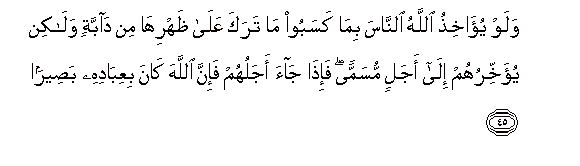

  
[Intangible Textual Heritage](../../index)  [Islam](../index) 
[Index](index)   
[Hypertext Qur'an](../htq/index)  [Unicode](../uq/035.htm#035_038) 
[Palmer](../sbe09/035)  [Pickthall](../pick/035.htm#035_038)  [Yusuf Ali
English](../yaq/yaq035)  [Rodwell](../qr/035)   
  
[Sūra XXXV.: Fāṭir, or The Originator of Creation; or Malāïka, or The
Angels. Index](035)  
  [Previous](03504)  [Next](03601) 

------------------------------------------------------------------------

  
*The Holy Quran*, tr. by Yusuf Ali, \[1934\], at Intangible Textual
Heritage

------------------------------------------------------------------------

# Sūra XXXV.: Fāṭir, or The Originator of Creation; or Malāïka, or The Angels.

### Section 5

------------------------------------------------------------------------

38. Inna All<u>a</u>ha AA<u>a</u>limu ghaybi
a**l**ssam<u>a</u>w<u>a</u>ti wa**a**l-ar<u>d</u>i innahu AAaleemun
bi<u>tha</u>ti a**l**<u>ss</u>udoor**i**

38\. Verily God knows  
(All) the hidden things  
Of the heavens and the earth:  
Verily He has full knowledge  
Of all that is  
In (men's) hearts.

------------------------------------------------------------------------

39. Huwa alla<u>th</u>ee jaAAalakum khal<u>a</u>-ifa fee al-ar<u>d</u>i
faman kafara faAAalayhi kufruhu wal<u>a</u> yazeedu alk<u>a</u>fireena
kufruhum AAinda rabbihim ill<u>a</u> maqtan wal<u>a</u> yazeedu
alk<u>a</u>fireena kufruhum ill<u>a</u> khas<u>a</u>r<u>a</u>**n**

39\. He it is that has made  
You inheritors in the earth:  
If, then, any do reject  
(God), their rejection (works)  
Against themselves: their rejection  
But adds to the odium  
For the Unbelievers  
In the sight of their Lord:  
Their rejection but adds  
To (their own) undoing.

------------------------------------------------------------------------

40. Qul araaytum shurak<u>a</u>akumu alla<u>th</u>eena tadAAoona min
dooni All<u>a</u>hi aroonee m<u>atha</u> khalaqoo mina al-ar<u>d</u>i am
lahum shirkun fee a**l**ssam<u>a</u>w<u>a</u>ti am
<u>a</u>tayn<u>a</u>hum kit<u>a</u>ban fahum AAal<u>a</u> bayyinatin
minhu bal in yaAAidu a**l***<u>thth</u>*<u>a</u>limoona baAA<u>d</u>uhum
baAA<u>d</u>an ill<u>a</u> ghuroor<u>a</u>**n**

40\. Say: "Have ye seen  
(These) "Partners" of yours  
Whom ye call upon  
Besides God? Show me  
What it is they have created  
In the (wide) earth.  
Or have they a share  
In the heavens? Or  
Have We given them a Book  
From which they (can derive)  
Clear (evidence)?—Nay,  
The wrong-doers promise  
Each other nothing but delusions.

------------------------------------------------------------------------

41. Inna All<u>a</u>ha yumsiku a**l**ssam<u>a</u>w<u>a</u>ti
wa**a**l-ar<u>d</u>a an tazool<u>a</u> wala-in z<u>a</u>lat<u>a</u> in
amsakahum<u>a</u> min a<u>h</u>adin min baAAdihi innahu k<u>a</u>na
<u>h</u>aleeman ghafoor<u>a</u>**n**

41\. It is God Who sustains  
The heavens and the earth,  
Lest they cease (to function):  
And if they should fail,  
There is none—not one—  
Can sustain them thereafter:  
Verily He is Most Forbearing,  
Oft-Forgiving.

------------------------------------------------------------------------

42. Waaqsamoo bi**A**ll<u>a</u>hi jahda aym<u>a</u>nihim la-in
j<u>a</u>ahum na<u>th</u>eerun layakoonunna ahd<u>a</u> min
i<u>h</u>d<u>a</u> al-omami falamm<u>a</u> j<u>a</u>ahum
na<u>th</u>eerun m<u>a</u> z<u>a</u>dahum ill<u>a</u>
nufoor<u>a</u>**n**

42\. They swore their strongest oaths  
By God that if a warner  
Came to them, they would  
Follow his guidance better  
Than any (other) of the Peoples:  
But when a warner came  
To them, it has only  
Increased their flight  
(From righteousness),—

------------------------------------------------------------------------

43. Istikb<u>a</u>ran fee al-ar<u>d</u>i wamakra a**l**ssayyi-i
wal<u>a</u> ya<u>h</u>eequ almakru a**l**ssayyi-o ill<u>a</u> bi-ahlihi
fahal yan*<u>th</u>*uroona ill<u>a</u> sunnata al-awwaleena falan tajida
lisunnati All<u>a</u>hi tabdeelan walan tajida lisunnati All<u>a</u>hi
ta<u>h</u>weel<u>a</u>**n**

43\. On account of their arrogance  
In the land and their  
Plotting of Evil.  
But the plotting of Evil  
Will hem in only  
The authors thereof. Now  
Are they but looking for  
The way the ancients  
Were dealt with? But  
No change wilt thou find  
In God's way (of dealing):  
No turning off wilt thou  
Find in God's way (of dealing).

------------------------------------------------------------------------

44. Awa lam yaseeroo fee al-ar<u>d</u>i fayan*<u>th</u>*uroo kayfa
k<u>a</u>na AA<u>a</u>qibatu alla<u>th</u>eena min qablihim
wak<u>a</u>noo ashadda minhum quwwatan wam<u>a</u> k<u>a</u>na
All<u>a</u>hu liyuAAjizahu min shay-in fee a**l**ssam<u>a</u>w<u>a</u>ti
wal<u>a</u> fee al-ar<u>d</u>i innahu k<u>a</u>na AAaleeman
qadeer<u>a</u>**n**

44\. Do they not travel  
Through the earth, and see.  
What was the End  
Of those before them,  
Though they were superior  
To them in strength?  
Nor is God to be frustrated  
By anything whatever  
In the heavens  
Or on earth: for He  
Is All-Knowing, All-Powerful.

------------------------------------------------------------------------

45. Walaw yu-<u>a</u>khi<u>th</u>u All<u>a</u>hu a**l**nn<u>a</u>sa
bim<u>a</u> kasaboo m<u>a</u> taraka AAal<u>a</u>
*<u>th</u>*ahrih<u>a</u> min d<u>a</u>bbatin wal<u>a</u>kin
yu-akhkhiruhum il<u>a</u> ajalin musamman fa-i<u>tha</u> j<u>a</u>a
ajaluhum fa-inna All<u>a</u>ha k<u>a</u>na biAAib<u>a</u>dihi
ba<u>s</u>eer<u>a</u>**n**

45\. If God were to punish  
Men according to what  
They deserve, He would not  
Leave on the back  
Of the (earth) a single  
Living creature: but He  
Gives them respite  
For a stated Term:  
When their Term expires,  
Verily God has in His sight  
All His servants.

------------------------------------------------------------------------

[Next: Section 1 (1-12)](03601)

