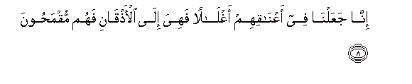
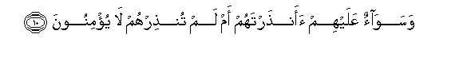
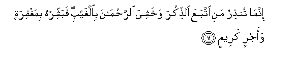

  
[Intangible Textual Heritage](../../index)  [Islam](../index) 
[Index](index)   
[Hypertext Qur'an](../htq/index)  [Unicode](../uq/036.htm#036_001) 
[Palmer](../sbe09/036)  [Pickthall](../pick/036.htm#036_001)  [Yusuf Ali
English](../yaq/yaq036)  [Rodwell](../qr/036)   
  
[Sūra XXXVI.: Yā-Sīn (being Abbreviated Letters). Index](036)  
  [Previous](03505)  [Next](03602) 

------------------------------------------------------------------------

  
*The Holy Quran*, tr. by Yusuf Ali, \[1934\], at Intangible Textual
Heritage

------------------------------------------------------------------------

# Sūra XXXVI.: Yā-Sīn (being Abbreviated Letters).

### Section 1

1. Y<u>a</u>-seen

1\. Yā Sīn.

------------------------------------------------------------------------

2. Wa**a**lqur-<u>a</u>ni al<u>h</u>akeem**i**

2\. By the Qur-ān  
Full of Wisdom,—

------------------------------------------------------------------------

3. Innaka lamina almursaleen**a**

3\. Thou art indeed  
One of the apostles,

------------------------------------------------------------------------

4. AAal<u>a</u> <u>s</u>ir<u>at</u>in mustaqeem**in**

4\. On a Straight Way.

------------------------------------------------------------------------

5. Tanzeela alAAazeezi a**l**rra<u>h</u>eem**i**

5\. It is a Revelation  
Sent down by (Him),  
The Exalted in Might,  
Most Merciful,

------------------------------------------------------------------------

6. Litun<u>th</u>ira qawman m<u>a</u> on<u>th</u>ira
<u>a</u>b<u>a</u>ohum fahum gh<u>a</u>filoon**a**

6\. In order that thou mayest  
Admonish a people,  
Whose fathers had received  
No admonition, and who  
Therefore remain heedless  
(Of the Signs of God).

------------------------------------------------------------------------

7. Laqad <u>h</u>aqqa alqawlu AAal<u>a</u> aktharihim fahum l<u>a</u>
yu/minoon**a**

7\. The Word is proved true  
Against the greater part of them:  
For they do not believe.

------------------------------------------------------------------------

8. Inn<u>a</u> jaAAaln<u>a</u> fee aAAn<u>a</u>qihim aghl<u>a</u>lan
fahiya il<u>a</u> al-a<u>th</u>q<u>a</u>ni fahum muqma<u>h</u>oon**a**

8\. We have put yokes  
Round their necks  
Right up to their chins,  
So that their heads are  
Forced up (and they cannot see).

------------------------------------------------------------------------

9. WajaAAaln<u>a</u> min bayni aydeehim saddan wamin khalfihim saddan
faaghshayn<u>a</u>hum fahum l<u>a</u> yub<u>s</u>iroon**a**

9\. And We have put  
A bar in front of them  
And a bar behind them,  
And further, We have  
Covered them up; so that  
They cannot see.

------------------------------------------------------------------------

10. Wasaw<u>a</u>on AAalayhim aan<u>th</u>artahum am lam
tun<u>th</u>irhum l<u>a</u> yu/minoon**a**

10\. The same is it to them  
Whether thou admonish them  
Or thou do not admonish  
Them: they will not believe.

------------------------------------------------------------------------

11. Innam<u>a</u> tun<u>th</u>iru mani ittabaAAa a**l**<u>thth</u>ikra
wakhashiya a**l**rra<u>h</u>m<u>a</u>na bi**a**lghaybi fabashshirhu
bimaghfiratin waajrin kareem**in**

11\. Thou canst but admonish  
Such a one as follows  
The Message and fears  
The (Lord) Most Gracious, unseen:  
Give such a one, therefore,  
Good tidings, of Forgiveness  
And a reward most generous.

------------------------------------------------------------------------

12. Inn<u>a</u> na<u>h</u>nu nu<u>h</u>yee almawt<u>a</u> wanaktubu
m<u>a</u> qaddamoo wa<u>a</u>th<u>a</u>rahum wakulla shay-in
a<u>hs</u>ayn<u>a</u>hu fee im<u>a</u>min mubeen**in**

12\. Verily We shall give life  
To the dead, and We record  
That which they send before  
And that which they leave  
Behind, and of all things  
Have We taken account  
In a clear Book  
(Of evidence).

------------------------------------------------------------------------

[Next: Section 2 (13-32)](03602)

