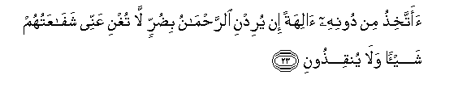

  
[Intangible Textual Heritage](../../index)  [Islam](../index.md) 
[Index](index.md)   
[Hypertext Qur'an](../htq/index)  [Unicode](../uq/036.htm#036_013.md) 
[Palmer](../sbe09/036)  [Pickthall](../pick/036.htm#036_013.md)  [Yusuf Ali
English](../yaq/yaq036)  [Rodwell](../qr/036.md)   
  
[Sūra XXXVI.: Yā-Sīn (being Abbreviated Letters). Index](036.md)  
  [Previous](03601)  [Next](03603.md) 

------------------------------------------------------------------------

  
*The Holy Quran*, tr. by Yusuf Ali, \[1934\], at Intangible Textual
Heritage

------------------------------------------------------------------------

# Sūra XXXVI.: Yā-Sīn (being Abbreviated Letters).

### Section 2

------------------------------------------------------------------------

13. Wa**i**<u>d</u>rib lahum mathalan a<u>s</u>-<u>ha</u>ba alqaryati
i<u>th</u> j<u>a</u>ah<u>a</u> almursaloon**a**

13\. Set forth to them,  
By way of a parable,  
The (story of) the Companions  
Of the City. Behold,  
There came apostles to it.

------------------------------------------------------------------------

14. I<u>th</u> arsaln<u>a</u> ilayhimu ithnayni
faka<u>thth</u>aboohum<u>a</u> faAAazzazn<u>a</u> bith<u>a</u>lithin
faq<u>a</u>loo inn<u>a</u> ilaykum mursaloon**a**

14\. When We (first) sent  
To them two apostles,  
They rejected them:  
But We strengthened them  
With a third: they said,  
"Truly, we have been sent  
On a mission to you."

------------------------------------------------------------------------

15. Q<u>a</u>loo m<u>a</u> antum ill<u>a</u> basharun mithlun<u>a</u>
wam<u>a</u> anzala a**l**rra<u>h</u>m<u>a</u>nu min shay-in in antum
ill<u>a</u> tak<u>th</u>iboon**a**

15\. The (people) said: "Ye are  
Only men like ourselves  
And (God) Most Gracious  
Sends no sort of revelation:  
Ye do nothing but lie."

------------------------------------------------------------------------

16. Q<u>a</u>loo rabbun<u>a</u> yaAAlamu inn<u>a</u> ilaykum
lamursaloon**a**

16\. They said: "Our Lord doth  
Know that we have been sent  
On a mission to you:

------------------------------------------------------------------------

17. Wam<u>a</u> AAalayn<u>a</u> ill<u>a</u> albal<u>a</u>ghu
almubeen**u**

17\. "And our duty is only  
To proclaim the clear Message.

------------------------------------------------------------------------

18. Q<u>a</u>loo inn<u>a</u> ta<u>t</u>ayyarn<u>a</u> bikum la-in lam
tantahoo lanarjumannakum walayamassannakum minn<u>a</u> AAa<u>tha</u>bun
aleem**un**

18\. The (people) said: "For us,  
We augur an evil omen  
From you: if ye desist not,  
We will certainly stone you.  
And a grievous punishment  
Indeed will be inflicted  
On you by us."

------------------------------------------------------------------------

19. Q<u>a</u>loo <u>ta</u>-irukum maAAakum a-in <u>th</u>ukkirtum bal
antum qawmun musrifoon**a**

19\. They said: "Your evil omens  
Are with yourselves:  
(Deem ye this an evil omen).  
If ye are admonished?  
Nay, but ye are a people  
Transgressing all bounds!

------------------------------------------------------------------------

20. Waj<u>a</u>a min aq<u>sa</u> almadeenati rajulun yasAA<u>a</u>
q<u>a</u>la y<u>a</u> qawmi ittabiAAoo almursaleen**a**

20\. Then there came running,  
From the farthest part  
Of the City, a man,  
Saying, "O my People!  
Obey the apostles:

------------------------------------------------------------------------

21. IttabiAAoo man l<u>a</u> yas-alukum ajran wahum muhtadoon**a**

21\. "Obey those who ask  
No reward of you  
(For themselves), and who have  
Themselves received Guidance

------------------------------------------------------------------------

22. Wam<u>a</u> liya l<u>a</u> aAAbudu alla<u>th</u>ee fa<u>t</u>aranee
wa-ilayhi turjaAAoon**a**

22\.

------------------------------------------------------------------------

23. Aattakhi<u>th</u>u min doonihi <u>a</u>lihatan in yuridni
a**l**rra<u>h</u>m<u>a</u>nu bi<u>d</u>urrin l<u>a</u> tughni AAannee
shaf<u>a</u>AAatuhum shay-an wal<u>a</u> yunqi<u>th</u>oon**i**

23\. "Shall I take (other) gods  
Besides Him? If (God)  
Most Gracious should  
Intend some adversity for me,  
Of no use whatever  
Will be their intercession  
For me, nor can they  
Deliver me.

------------------------------------------------------------------------

24. Innee i<u>th</u>an lafee <u>d</u>al<u>a</u>lin mubeen**in**

24\. "I would indeed,  
If I were to do so,  
Be in manifest Error.

------------------------------------------------------------------------

25. Innee <u>a</u>mantu birabbikum fa**i**smaAAoon**i**

25\. "For me, I have faith  
In the Lord of you (all):  
Listen, then, to me!"

------------------------------------------------------------------------

26. Qeela odkhuli aljannata q<u>a</u>la y<u>a</u> layta qawmee
yaAAlamoon**a**

26\. It was said: "Enter thou  
The Garden." He said:  
"Ah me! Would that  
My People knew (what I know)!—

------------------------------------------------------------------------

27. Bim<u>a</u> ghafara lee rabbee wajaAAalanee mina almukrameen**a**

27\. "For that my Lord  
Has granted me Forgiveness  
And has enrolled me  
Among those held in honour!"

------------------------------------------------------------------------

28. Wam<u>a</u> anzaln<u>a</u> AAal<u>a</u> qawmihi min baAAdihi min
jundin mina a**l**ssam<u>a</u>-i wam<u>a</u> kunn<u>a</u> munzileen**a**

28\. And We sent not down  
Against his People, after him,  
Any hosts from heaven,  
Nor was it needful  
For Us so to do.

------------------------------------------------------------------------

29. In k<u>a</u>nat ill<u>a</u> <u>s</u>ay<u>h</u>atan w<u>ah</u>idatan
fa-i<u>tha</u> hum kh<u>a</u>midoon**a**

29\. It was no more than  
A single mighty Blast,  
And behold! they were (like ashes)  
Quenched and silent.

------------------------------------------------------------------------

30. Y<u>a</u> <u>h</u>asratan AAal<u>a</u> alAAib<u>a</u>di m<u>a</u>
ya/teehim min rasoolin ill<u>a</u> k<u>a</u>noo bihi yastahzi-oon**a**

30\. Ah! alas for (My) servants!  
There comes not an apostle  
To them but they mock him!

------------------------------------------------------------------------

31. Alam yaraw kam ahlakn<u>a</u> qablahum mina alqurooni annahum
ilayhim l<u>a</u> yarjiAAoon**a**

31\. See they not how many  
Generations before them  
We destroyed? Not to them  
Will they return:

------------------------------------------------------------------------

32. Wa-in kullun lamm<u>a</u> jameeAAun ladayn<u>a</u>
mu<u>hd</u>aroon**a**

32\. But each one of them  
All—will be brought  
Before Us (for judgment).

------------------------------------------------------------------------

[Next: Section 3 (33-50)](03603.md)

