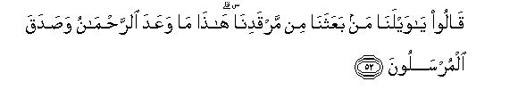
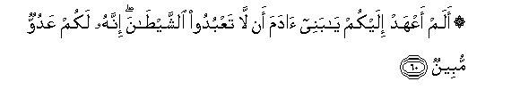
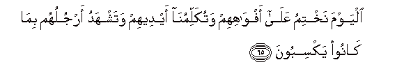
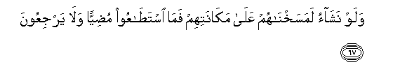

  
[Intangible Textual Heritage](../../index)  [Islam](../index) 
[Index](index)   
[Hypertext Qur'an](../htq/index)  [Unicode](../uq/036.htm#036_051) 
[Palmer](../sbe09/036)  [Pickthall](../pick/036.htm#036_051)  [Yusuf Ali
English](../yaq/yaq036)  [Rodwell](../qr/036)   
  
[Sūra XXXVI.: Yā-Sīn (being Abbreviated Letters). Index](036)  
  [Previous](03603)  [Next](03605) 

------------------------------------------------------------------------

  
*The Holy Quran*, tr. by Yusuf Ali, \[1934\], at Intangible Textual
Heritage

------------------------------------------------------------------------

# Sūra XXXVI.: Yā-Sīn (being Abbreviated Letters).

### Section 4

------------------------------------------------------------------------

51. Wanufikha fee a**l**<u>ss</u>oori fa-i<u>tha</u> hum mina
al-ajd<u>a</u>thi il<u>a</u> rabbihim yansiloon**a**

51\. The trumpet shall be  
Sounded, when behold!  
From the sepulchres (men)  
Will rush forth  
To their Lord!

------------------------------------------------------------------------

52. Q<u>a</u>loo y<u>a</u> waylan<u>a</u> man baAAathan<u>a</u> min
marqadin<u>a</u> h<u>atha</u> m<u>a</u> waAAada
a**l**rra<u>h</u>m<u>a</u>nu wa<u>s</u>adaqa almursaloon**a**

52\. They will say: "Ah!  
Woe unto us! Who  
Hath raised us up  
From our beds of repose?"  
(A voice will say:)  
"This is what (God)  
Most Gracious had promised.  
And true was the word  
Of the apostles!"

------------------------------------------------------------------------

53. In k<u>a</u>nat ill<u>a</u> <u>s</u>ay<u>h</u>atan w<u>ah</u>idatan
fa-i<u>tha</u> hum jameeAAun ladayn<u>a</u> mu<u>hd</u>aroon**a**

53\. It will be no more  
Than a single Blast,  
When to! they will all  
Be brought up before Us!

------------------------------------------------------------------------

54. Fa**a**lyawma l<u>a</u> tu*<u>th</u>*lamu nafsun shay-an wal<u>a</u>
tujzawna ill<u>a</u> m<u>a</u> kuntum taAAmaloon**a**

54\. Then, on that Day,  
Not a soul will be  
Wronged in the least,  
And ye shall but  
Be repaid the meeds  
Of your past Deeds.

------------------------------------------------------------------------

55. Inna a<u>s</u>-<u>ha</u>ba aljannati alyawma fee shughulin
f<u>a</u>kihoon**a**

55\. Verily the Companions  
Of the Garden shall  
That Day have joy  
In all that they do:

------------------------------------------------------------------------

56. Hum waazw<u>a</u>juhum fee *<u>th</u>*il<u>a</u>lin AAal<u>a</u>
al-ar<u>a</u>-iki muttaki-oon**a**

56\. They and their associates  
Will be in groves  
Of (cool) shade, reclining  
On Thrones (of dignity);

------------------------------------------------------------------------

57. Lahum feeh<u>a</u> f<u>a</u>kihatun walahum m<u>a</u>
yaddaAAoon**a**

57\. (Every) fruit (enjoyment)  
Will be there for them;  
They shall have whatever  
They call for;

------------------------------------------------------------------------

58. Sal<u>a</u>mun qawlan min rabbin ra<u>h</u>eem**in**

58\. "Peace!"—a Word  
(Of salutation) from a Lord  
Most Merciful!

------------------------------------------------------------------------

59. Wa**i**mt<u>a</u>zoo alyawma ayyuh<u>a</u> almujrimoon**a**

59\. "And O ye in sin!  
Get ye apart this Day!

------------------------------------------------------------------------

60. Alam aAAhad ilaykum y<u>a</u> banee <u>a</u>dama an l<u>a</u>
taAAbudoo a**l**shshay<u>ta</u>na innahu lakum AAaduwwun mubeen**un**

60\. "Did I not enjoin  
On you, O ye children  
Of Adam, that ye  
Should not worship Satan;  
For that he was to you  
An enemy avowed?—

------------------------------------------------------------------------

61. Waani oAAbudoonee h<u>atha</u> <u>s</u>ir<u>at</u>un mustaqeem**un**

61\. "And that ye should  
Worship Me, (for that) this  
Was the Straight Way?

------------------------------------------------------------------------

62. Walaqad a<u>d</u>alla minkum jibillan katheeran afalam takoonoo
taAAqiloon**a**

62\. "But he did lead astray  
A great multitude of you.  
Did ye not, then, understand?

------------------------------------------------------------------------

63. H<u>ath</u>ihi jahannamu allatee kuntum tooAAadoon**a**

63\. "This is the Hell  
Of which ye were  
(Repeatedly) warned!

------------------------------------------------------------------------

64. I<u>s</u>lawh<u>a</u> alyawma bim<u>a</u> kuntum takfuroon**a**

64\. "Embrace ye the (Fire)  
This Day, for that ye  
(Persistently) rejected (Truth)."

------------------------------------------------------------------------

65. Alyawma nakhtimu AAal<u>a</u> afw<u>a</u>hihim watukallimun<u>a</u>
aydeehim watashhadu arjuluhum bim<u>a</u> k<u>a</u>noo yaksiboon**a**

65\. That Day shall We set  
A seal on their mouths.  
But their hands will speak  
To Us, and their feet  
Bear witness, to all  
That they did.

------------------------------------------------------------------------

66. Walaw nash<u>a</u>o la<u>t</u>amasn<u>a</u> AAal<u>a</u> aAAyunihim
fa**i**stabaqoo a**l**<u>ss</u>ir<u>at</u>a faann<u>a</u>
yub<u>s</u>iroon**a**

66\. If it had been Our Will,  
We could surely have  
Blotted out their eyes;  
Then should they have  
Run about groping for the Path,  
But how could they have seen?

------------------------------------------------------------------------

67. Walaw nash<u>a</u>o lamasakhn<u>a</u>hum AAal<u>a</u>
mak<u>a</u>natihim fam<u>a</u> ista<u>ta</u>AAoo mu<u>d</u>iyyan
wal<u>a</u> yarjiAAoon**a**

67\. And if it had been  
Our Will, We could  
Have transformed them  
(To remain) in their places;  
Then should they have been  
Unable to move about,  
Nor could they have returned  
(After error).

------------------------------------------------------------------------

[Next: Section 5 (68-83)](03605)

