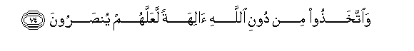
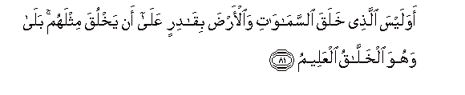
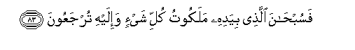

  
[Intangible Textual Heritage](../../index)  [Islam](../index) 
[Index](index)   
[Hypertext Qur'an](../htq/index)  [Unicode](../uq/036.htm#036_068) 
[Palmer](../sbe09/036)  [Pickthall](../pick/036.htm#036_068)  [Yusuf Ali
English](../yaq/yaq036)  [Rodwell](../qr/036)   
  
[Sūra XXXVI.: Yā-Sīn (being Abbreviated Letters). Index](036)  
  [Previous](03604)  [Next](03701) 

------------------------------------------------------------------------

  
*The Holy Quran*, tr. by Yusuf Ali, \[1934\], at Intangible Textual
Heritage

------------------------------------------------------------------------

# Sūra XXXVI.: Yā-Sīn (being Abbreviated Letters).

### Section 5

------------------------------------------------------------------------

68. Waman nuAAammirhu nunakkis-hu fee alkhalqi afal<u>a</u>
yaAAqiloon**a**

68\. If We grant long life  
To any, We cause him  
To be reversed in nature:  
Will they not then understand?

------------------------------------------------------------------------

69. Wam<u>a</u> AAallamn<u>a</u>hu a**l**shshiAAra wam<u>a</u> yanbaghee
lahu in huwa ill<u>a</u> <u>th</u>ikrun waqur-<u>a</u>nun mubeen**un**

69\. We have not instructed  
The (Prophet) in Poetry,  
Nor is it meet for him:  
This is no less than  
A Message and a Qur-ān  
Making things clear:

------------------------------------------------------------------------

70. Liyun<u>th</u>ira man k<u>a</u>na <u>h</u>ayyan waya<u>h</u>iqqa
alqawlu AAal<u>a</u> alk<u>a</u>fireen**a**

70\. That it may give admonition  
To any (who are) alive,  
And that the charge  
May be proved against those  
Who reject (Truth).

------------------------------------------------------------------------

71. Awa lam yaraw ann<u>a</u> khalaqn<u>a</u> lahum mimm<u>a</u>
AAamilat aydeen<u>a</u> anAA<u>a</u>man fahum lah<u>a</u>
m<u>a</u>likoon**a**

71\. See they not that it is  
We Who have created  
For them—among the things  
Which our hands have fashioned—  
Cattle, which are under  
Their dominion?—

------------------------------------------------------------------------

72. Wa<u>th</u>allaln<u>a</u>h<u>a</u> lahum faminh<u>a</u> rakoobuhum
waminh<u>a</u> ya/kuloon**a**

72\. And that We have  
Subjected them to their (use)?  
Of them some do carry them  
And some they eat:

------------------------------------------------------------------------

73. Walahum feeh<u>a</u> man<u>a</u>fiAAu wamash<u>a</u>ribu
afal<u>a</u> yashkuroon**a**

73\. And they have (other) profits  
From them (besides), and they  
Get (milk) to drink.  
Will they not then  
Be grateful?

------------------------------------------------------------------------

74. Wa**i**ttakha<u>th</u>oo min dooni All<u>a</u>hi <u>a</u>lihatan
laAAallahum yun<u>s</u>aroon**a**

74\. Yet they take (for worship)  
Gods other than God,  
(Hoping) that they might  
Be helped!

------------------------------------------------------------------------

75. L<u>a</u> yasta<u>t</u>eeAAoona na<u>s</u>rahum wahum lahum jundun
mu<u>hd</u>aroon**a**

75\. They have not the power  
To help them: but they  
Will be brought up  
(Before Our Judgment-seat)  
As a troop (to be condemned).

------------------------------------------------------------------------

76. Fal<u>a</u> ya<u>h</u>zunka qawluhum inn<u>a</u> naAAlamu m<u>a</u>
yusirroona wam<u>a</u> yuAAlinoon**a**

76\. Let not their speech, then,  
Grieve thee. Verily We know  
What they hide as well as  
What they disclose.

------------------------------------------------------------------------

77. Awa lam yar<u>a</u> al-ins<u>a</u>nu ann<u>a</u> khalaqn<u>a</u>hu
min nu<u>t</u>fatin fa-i<u>tha</u> huwa kha<u>s</u>eemun mubeen**un**

77\. Doth not man see  
That it is We Who  
Created him from sperm?  
Yet behold! he (stands forth)  
As an open adversary!

------------------------------------------------------------------------

78. Wa<u>d</u>araba lan<u>a</u> mathalan wanasiya khalqahu q<u>a</u>la
man yu<u>h</u>yee alAAi*<u>th</u>*<u>a</u>ma wahiya rameem**un**

78\. And he makes comparisons  
For Us, and forgets his own  
(Origin and) Creation:  
He says, "Who can give  
Life to (dry) bones  
And decomposed ones (at that)?"

------------------------------------------------------------------------

79. Qul yu<u>h</u>yeeh<u>a</u> alla<u>th</u>ee anshaah<u>a</u> awwala
marratin wahuwa bikulli khalqin AAaleem**un**

79\. Say, "He will give them  
Life Who created them  
For the first time!  
For He is well-versed  
In every kind of creation!

------------------------------------------------------------------------

80. Alla<u>th</u>ee jaAAala lakum mina a**l**shshajari al-akh<u>d</u>ari
n<u>a</u>ran fa-i<u>tha</u> antum minhu tooqidoon**a**

80\. "The same Who produces  
For you fire out of  
The green tree, when behold!  
Ye kindle therewith  
(Your own fires)!

------------------------------------------------------------------------

81. Awa laysa alla<u>th</u>ee khalaqa a**l**ssam<u>a</u>w<u>a</u>ti
wa**a**l-ar<u>d</u>a biq<u>a</u>dirin AAal<u>a</u> an yakhluqa mithlahum
bal<u>a</u> wahuwa alkhall<u>a</u>qu alAAaleem**u**

81\. "Is not He Who created  
The heavens and the earth  
Able to create the like  
Thereof?"—Yea, indeed!  
For he is the Creator Supreme,  
Of skill and knowledge (infinite)!

------------------------------------------------------------------------

82. Innam<u>a</u> amruhu i<u>tha</u> ar<u>a</u>da shay-an an yaqoola
lahu kun fayakoon**u**

82\. Verily, when He intends  
A thing, His Command is,  
"Be", and it is!

------------------------------------------------------------------------

83. Fasub<u>ha</u>na alla<u>th</u>ee biyadihi malakootu kulli shay-in
wa-ilayhi turjaAAoon**a**

83\. So glory to Him  
In Whose hands is  
The dominion of all things:  
And to Him will  
Be all brought back.

------------------------------------------------------------------------

[Next: Section 1 (1-21)](03701)

