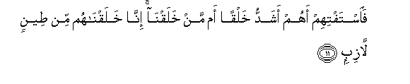

  
[Intangible Textual Heritage](../../index)  [Islam](../index) 
[Index](index)   
[Hypertext Qur'an](../htq/index)  [Unicode](../uq/037.htm#037_001) 
[Palmer](../sbe09/037)  [Pickthall](../pick/037.htm#037_001)  [Yusuf Ali
English](../yaq/yaq037)  [Rodwell](../qr/037)   
  
[Sūra XXXVII.: Ṣāffāt, or Those Ranged in Ranks. Index](037)  
  [Previous](03605)  [Next](03702) 

------------------------------------------------------------------------

  
*The Holy Quran*, tr. by Yusuf Ali, \[1934\], at Intangible Textual
Heritage

------------------------------------------------------------------------

# Sūra XXXVII.: Ṣāffāt, or Those Ranged in Ranks.

### Section 1

1. Wa**al**<u>ssa</u>ff<u>a</u>ti <u>s</u>aff<u>a</u>**n**

1\. By those who range  
Themselves in ranks,

------------------------------------------------------------------------

2. Fa**al**zz<u>a</u>jir<u>a</u>ti zajr<u>a</u>**n**

2\. And so are strong  
In repelling (evil),

------------------------------------------------------------------------

3. Fa**al**tt<u>a</u>liy<u>a</u>ti <u>th</u>ikr<u>a</u>**n**

3\. And thus proclaim  
The Message (of God)!

------------------------------------------------------------------------

4. Inna il<u>a</u>hakum law<u>ah</u>id**un**

4\. Verily, verily, your God  
Is One!—

------------------------------------------------------------------------

5. Rabbu a**l**ssam<u>a</u>w<u>a</u>ti wa**a**l-ar<u>d</u>i wam<u>a</u>
baynahum<u>a</u> warabbu almash<u>a</u>riq**i**

5\. Lord of the heavens  
And of the earth,  
And all between them,  
And Lord of every point  
At the rising of the sun!

------------------------------------------------------------------------

6. Inn<u>a</u> zayyann<u>a</u> a**l**ssam<u>a</u>a a**l**dduny<u>a</u>
bizeenatin alkaw<u>a</u>kib**i**

6\. We have indeed decked  
The lower heaven with beauty  
(In) the stars,—

------------------------------------------------------------------------

7. Wa<u>h</u>if*<u>th</u>*an min kulli shay<u>ta</u>nin
m<u>a</u>rid**in**

7\. (For beauty) and for guard  
Against all obstinate  
Rebellious evil spirits,

------------------------------------------------------------------------

8. L<u>a</u> yassammaAAoona il<u>a</u> almala-i al-aAAl<u>a</u>
wayuq<u>th</u>afoona min kulli j<u>a</u>nib**in**

8\. (So) they should not strain  
Their ears in the direction  
Of the Exalted Assembly  
But be cast away  
From every side,

------------------------------------------------------------------------

9. Du<u>h</u>ooran walahum AAa<u>tha</u>bun w<u>as</u>ib**un**

9\. Repulsed, for they are  
Under a perpetual penalty,

------------------------------------------------------------------------

10. Ill<u>a</u> man kha<u>t</u>ifa alkha<u>t</u>fata faatbaAAahu
shih<u>a</u>bun th<u>a</u>qib**un**

10\. Except such as snatch away  
Something by stealth, and they  
Are pursued by a flaming  
Fire, of piercing brightness.

------------------------------------------------------------------------

11. Fa**i**staftihim ahum ashaddu khalqan am man khalaqn<u>a</u>
inn<u>a</u> khalaqn<u>a</u>hum min <u>t</u>eenin l<u>a</u>zib**in**

11\. Just ask their opinion:  
Are they the more difficult  
To create, or the (other) beings  
We have created?  
Them have We created  
Out of a sticky clay!

------------------------------------------------------------------------

12. Bal AAajibta wayaskharoon**a**

12\. Truly dost thou marvel,  
While they ridicule,

------------------------------------------------------------------------

13. Wa-i<u>tha</u> <u>th</u>ukkiroo l<u>a</u> ya<u>th</u>kuroon**a**

13\. And, when they are  
Admonished, pay no heed,—

------------------------------------------------------------------------

14. Wa-i<u>tha</u> raaw <u>a</u>yatan yastaskhiroon**a**

14\. And, when they see  
A Sign, turn it  
To mockery,

------------------------------------------------------------------------

15. Waq<u>a</u>loo in h<u>atha</u> ill<u>a</u> si<u>h</u>run
mubeen**un**

15\. And say, "This is nothing  
But evident sorcery!

------------------------------------------------------------------------

16. A-i<u>tha</u> mitn<u>a</u> wakunn<u>a</u> tur<u>a</u>ban
waAAi*<u>th</u>*<u>a</u>man a-inn<u>a</u> lamabAAoothoon**a**

16\. "What! when we die,  
And become dust and bones,  
Shall we (then) be  
Raised up (again)?

------------------------------------------------------------------------

17. Awa <u>a</u>b<u>a</u>on<u>a</u> al-awwaloon**a**

17\. "And also our fathers  
Of old?"

------------------------------------------------------------------------

18. Qul naAAam waantum d<u>a</u>khiroon**a**

18\. Say thou: "Yea, and ye shall  
Then be humiliated  
(On account of your evil).

------------------------------------------------------------------------

19. Fa-innam<u>a</u> hiya zajratun w<u>ah</u>idatun fa-i<u>tha</u> hum
yan*<u>th</u>*uroon**a**

19\. Then it will be a single  
(Compelling) cry;  
And behold, they will  
Begin to see!

------------------------------------------------------------------------

20. Waq<u>a</u>loo y<u>a</u> waylan<u>a</u> h<u>atha</u> yawmu
a**l**ddeen**i**

20\. They will say, "Ah!  
Woe to us! this is  
The Day of Judgment!"

------------------------------------------------------------------------

21. H<u>atha</u> yawmu alfa<u>s</u>li alla<u>th</u>ee kuntum bihi
tuka<u>thth</u>iboon**a**

21\. (A voice will say,)  
"This is the Day  
Of Sorting Out, whose  
Truth ye (once) denied!"

------------------------------------------------------------------------

[Next: Section 2 (22-74)](03702)

