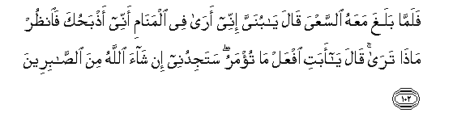
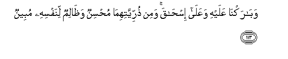

  
[Intangible Textual Heritage](../../index)  [Islam](../index) 
[Index](index)   
[Hypertext Qur'an](../htq/index)  [Unicode](../uq/037.htm#037_075) 
[Palmer](../sbe09/037)  [Pickthall](../pick/037.htm#037_075)  [Yusuf Ali
English](../yaq/yaq037)  [Rodwell](../qr/037)   
  
[Sūra XXXVII.: Ṣāffāt, or Those Ranged in Ranks. Index](037)  
  [Previous](03702)  [Next](03704) 

------------------------------------------------------------------------

  
*The Holy Quran*, tr. by Yusuf Ali, \[1934\], at Intangible Textual
Heritage

------------------------------------------------------------------------

# Sūra XXXVII.: Ṣāffāt, or Those Ranged in Ranks.

### Section 3

------------------------------------------------------------------------

75. Walaqad n<u>a</u>d<u>a</u>n<u>a</u> noo<u>h</u>un falaniAAma
almujeeboon**a**

75\. (In the days of old),  
Noah cried to Us,  
And We are the Best  
To hear prayer.

------------------------------------------------------------------------

76. Wanajjayn<u>a</u>hu waahlahu mina alkarbi alAAa*<u>th</u>*eem**i**

76\. And We delivered him  
And his people from  
The Great Calamity,

------------------------------------------------------------------------

77. WajaAAaln<u>a</u> <u>th</u>urriyyatahu humu alb<u>a</u>qeen**a**

77\. And made his progeny  
To endure (on this earth);

------------------------------------------------------------------------

78. Watarakn<u>a</u> AAalayhi fee al-<u>a</u>khireen**a**

78\. And We left (this blessing)  
For him among generations  
To come in later times:

------------------------------------------------------------------------

79. Sal<u>a</u>mun AAal<u>a</u> noo<u>h</u>in fee
alAA<u>a</u>lameen**a**

79\. "Peace and salutation to Noah  
Among the nations!"

------------------------------------------------------------------------

80. Inn<u>a</u> ka<u>tha</u>lika najzee almu<u>h</u>sineen**a**

80\. Thus indeed do We reward  
Those who do right.

------------------------------------------------------------------------

81. Innahu min AAib<u>a</u>din<u>a</u> almu/mineen**a**

81\. For he was one  
Of Our believing Servants.

------------------------------------------------------------------------

82. Thumma aghraqn<u>a</u> al-<u>a</u>khareen**a**

82\. Then the rest We overwhelmed  
In the Flood.

------------------------------------------------------------------------

83. Wa-inna min sheeAAatihi la-ibr<u>a</u>heem**a**

83\. Verily among those  
Who followed his Way  
Was Abraham.

------------------------------------------------------------------------

84. I<u>th</u> j<u>a</u>a rabbahu biqalbin saleem**in**

84\. Behold, he approached his Lord  
With a sound heart.

------------------------------------------------------------------------

85. I<u>th</u> q<u>a</u>la li-abeehi waqawmihi m<u>atha</u>
taAAbudoon**a**

85\. Behold, he said to his father  
And to his people, "What  
Is that which ye worship?

------------------------------------------------------------------------

86. A-ifkan <u>a</u>lihatan doona All<u>a</u>hi tureedoon**a**

86\. "Is it a Falsehood—  
Gods other than God—  
That ye desire?

------------------------------------------------------------------------

87. Fam<u>a</u> *<u>th</u>*annukum birabbi alAA<u>a</u>lameen**a**

87\. "Then what is your idea  
About the Lord of the  
Worlds?"

------------------------------------------------------------------------

88. Fana*<u>th</u>*ara na*<u>th</u>*ratan fee a**l**nnujoom**i**

88\. Then did he cast  
A glance at the Stars,

------------------------------------------------------------------------

89. Faq<u>a</u>la innee saqeem**un**

89\. And he said, "I am  
Indeed sick (at heart)!"

------------------------------------------------------------------------

90. Fatawallaw AAanhu mudbireen**a**

90\. So they turned away  
From him, and departed.

------------------------------------------------------------------------

91. Far<u>a</u>gha il<u>a</u> <u>a</u>lihatihim faq<u>a</u>la al<u>a</u>
ta/kuloon**a**

91\. When did he turn  
To their gods and said,  
"Will ye not eat  
(Of the offerings before you)?…

------------------------------------------------------------------------

92. M<u>a</u> lakum l<u>a</u> tan<u>t</u>iqoon**a**

92\. "What is the matter  
With you that ye  
Speak not (intelligently)?"

------------------------------------------------------------------------

93. Far<u>a</u>gha AAalayhim <u>d</u>arban bi**a**lyameen**i**

93\. Then did he turn  
Upon them, striking (them)  
With the right hand.

------------------------------------------------------------------------

94. Faaqbaloo ilayhi yaziffoon**a**

94\. Then came (the worshippers)  
With hurried steps,  
And faced (him).

------------------------------------------------------------------------

95. Q<u>a</u>la ataAAbudoona m<u>a</u> tan<u>h</u>itoon**a**

95\. He said: "Worship ye  
That which ye have  
(Yourselves) carved?

------------------------------------------------------------------------

96. Wa**A**ll<u>a</u>hu khalaqakum wam<u>a</u> taAAmaloon**a**

96\. "But God has created you  
And your handiwork!"

------------------------------------------------------------------------

97. Q<u>a</u>loo ibnoo lahu buny<u>a</u>nan faalqoohu fee
alja<u>h</u>eem**i**

97\. They said, "Build him  
A furnace, and throw him  
Into the blazing fire!"

------------------------------------------------------------------------

98. Faar<u>a</u>doo bihi kaydan fajaAAaln<u>a</u>humu al-asfaleen**a**

98\. (This failing), they then  
Sought a stratagem against him,  
But We made them the ones  
Most humiliated!

------------------------------------------------------------------------

99. Waq<u>a</u>la innee <u>tha</u>hibun il<u>a</u> rabbee sayahdeen**i**

99\. He said: "I will go  
To my Lord! He  
Will surely guide me!

------------------------------------------------------------------------

100. Rabbi hab lee mina a**l**<u>ssa</u>li<u>h</u>een**a**

100\. "O my Lord! grant me  
A righteous (son)!"

------------------------------------------------------------------------

101. Fabashsharn<u>a</u>hu bighul<u>a</u>min <u>h</u>aleem**in**

101\. So We gave him  
The good news  
Of a boy ready  
To suffer and forbear.

------------------------------------------------------------------------

102. Falamm<u>a</u> balagha maAAahu a**l**ssaAAya q<u>a</u>la y<u>a</u>
bunayya innee ar<u>a</u> fee alman<u>a</u>mi annee
a<u>th</u>ba<u>h</u>uka fa**o**n*<u>th</u>*ur m<u>atha</u> tar<u>a</u>
q<u>a</u>la y<u>a</u> abati ifAAal m<u>a</u> tu/maru satajidunee in
sh<u>a</u>a All<u>a</u>hu mina a**l**<u>ssa</u>bireen**a**

102\. Then, when (the son)  
Reached (the age of)  
(Serious) work with him,  
He said: "O my son  
I see in vision  
That I offer thee in sacrifice:  
Now see what is  
Thy view!" (The son) said:  
"O my father! Do  
As thou art commanded:  
Thou will find me,  
If God so wills one  
Practising Patience and Constancy!"

------------------------------------------------------------------------

103. Falamm<u>a</u> aslam<u>a</u> watallahu liljabeen**i**

103\. So when they had both  
Submitted their wills (to God),  
And he had laid him  
Prostrate on his forehead  
(For sacrifice),

------------------------------------------------------------------------

104. Wan<u>a</u>dayn<u>a</u>hu an y<u>a</u> ibr<u>a</u>heem**u**

104\. We called out to him,  
"O Abraham!

------------------------------------------------------------------------

105. Qad <u>s</u>addaqta a**l**rru/y<u>a</u> inn<u>a</u>
ka<u>tha</u>lika najzee almu<u>h</u>sineen**a**

105\. "Thou hast already fulfilled  
The vision!"—thus indeed  
Do We reward  
Those who do right.

------------------------------------------------------------------------

106. Inna h<u>atha</u> lahuwa albal<u>a</u>o almubeen**u**

106\. For this was obviously  
A trial—

------------------------------------------------------------------------

107. Wafadayn<u>a</u>hu bi<u>th</u>ib<u>h</u>in AAa*<u>th</u>*eem**in**

107\. And We ransomed him  
With a momentous sacrifice:

------------------------------------------------------------------------

108. Watarakn<u>a</u> AAalayhi fee al-<u>a</u>khireen**a**

108\. And We left (this blessing)  
For him among generations  
(To come) in later times:

------------------------------------------------------------------------

109. Sal<u>a</u>mun AAal<u>a</u> ibr<u>a</u>heem**a**

109\. "Peace and salutation  
To Abraham!"

------------------------------------------------------------------------

110. Ka<u>tha</u>lika najzee almu<u>h</u>sineen**a**

110\. Thus indeed do We reward  
Those who do right

------------------------------------------------------------------------

111. Innahu min AAib<u>a</u>din<u>a</u> almu/mineen**a**

111\. For he was one  
Of Our believing Servants.

------------------------------------------------------------------------

112. Wabashsharn<u>a</u>hu bi-is<u>ha</u>qa nabiyyan mina
a**l**<u>ssa</u>li<u>h</u>een**a**

112\. And We gave him  
The good news  
Of Isaac—a prophet,—  
One of the Righteous.

------------------------------------------------------------------------

113. Wab<u>a</u>rakn<u>a</u> AAalayhi waAAal<u>a</u> is<u>ha</u>qa wamin
<u>th</u>urriyyatihim<u>a</u> mu<u>h</u>sinun wa*<u>th</u>*<u>a</u>limun
linafsihi mubeen**un**

113\. We blessed him and Isaac:  
But of their progeny  
Are (some) that do right,  
And (some) that obviously  
Do wrong, to their own souls.

------------------------------------------------------------------------

[Next: Section 4 (114-138)](03704)

