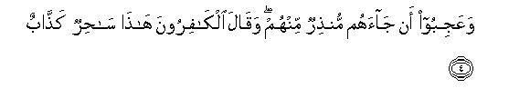
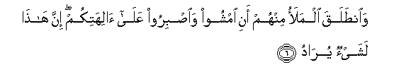
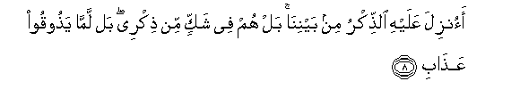
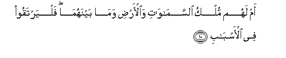

  
[Intangible Textual Heritage](../../index)  [Islam](../index) 
[Index](index)   
[Hypertext Qur'an](../htq/index)  [Unicode](../uq/038.htm#038_001) 
[Palmer](../sbe09/038)  [Pickthall](../pick/038.htm#038_001)  [Yusuf Ali
English](../yaq/yaq038)  [Rodwell](../qr/038)   
  
[Sūra XXXVIII.: Ṣād (being one of the Abbreviated Letters).
Index](038)  
  [Previous](03705)  [Next](03802) 

------------------------------------------------------------------------

  
*The Holy Quran*, tr. by Yusuf Ali, \[1934\], at Intangible Textual
Heritage

------------------------------------------------------------------------

# Sūra XXXVIII.: Ṣād (being one of the Abbreviated Letters).

### Section 1

1. <u>Sa</u>d wa**a**lqur-<u>a</u>ni <u>th</u>ee
a**l**<u>thth</u>ikr**i**

1\. Sād:  
By the Qur-ān,  
Full of Admonition:  
(This is the Truth).

------------------------------------------------------------------------

2. Bali alla<u>th</u>eena kafaroo fee AAizzatin washiq<u>a</u>q**in**

2\. But the Unbelievers  
(Are steeped) in Self-glory  
And Separatism.

------------------------------------------------------------------------

3. Kam ahlakn<u>a</u> min qablihim min qarnin fan<u>a</u>daw
wal<u>a</u>ta <u>h</u>eena man<u>as</u>**in**

3\. How many generations  
Before them did We destroy?  
In the end they cried  
(For mercy)—when  
There was no longer time  
For being saved!

------------------------------------------------------------------------

4. WaAAajiboo an j<u>a</u>ahum mun<u>th</u>irun minhum waq<u>a</u>la
alk<u>a</u>firoona h<u>atha</u> s<u>ah</u>irun ka<u>ththa</u>b**un**

4\. So they wonder  
That a Warner has come  
To them from among themselves!  
And the Unbelievers say,  
"This is a sorcerer  
Telling lies!

------------------------------------------------------------------------

5. AjaAAala al-<u>a</u>lihata il<u>a</u>han w<u>ah</u>idan inna
h<u>atha</u> lashay-on AAuj<u>a</u>b**un**

5\. "Has he made the gods  
(All) into one God?  
Truly this is  
A wonderful thing!"

------------------------------------------------------------------------

6. Wa**i**n<u>t</u>alaqa almalao minhum ani imshoo wa**i**<u>s</u>biroo
AAal<u>a</u> <u>a</u>lihatikum inna h<u>atha</u> lashay-on
yur<u>a</u>d**u**

6\. And the leaders among them  
Go away (impatiently), (saying),  
"Walk ye away, and remain  
Constant to your gods!  
For this is truly  
A thing designed (against you)!

------------------------------------------------------------------------

7. M<u>a</u> samiAAn<u>a</u> bih<u>atha</u> fee almillati
al-<u>a</u>khirati in h<u>atha</u> ill<u>a</u> ikhtil<u>a</u>q**un**

7\. "We never heard (the like)  
Of this among the people  
Of these latter days:  
This is nothing but  
A made-up tale!"

------------------------------------------------------------------------

8. Aonzila AAalayhi a**l**<u>thth</u>ikru min baynin<u>a</u> bal hum fee
shakkin min <u>th</u>ikree bal lamm<u>a</u> ya<u>th</u>ooqoo
AAa<u>tha</u>b**i**

8\. "What! Has the Message  
Been sent to him—  
(Of all persons) among us?"…  
But they are in doubt  
Concerning My (own) Message!  
Nay, they have not yet  
Tasted My Punishment!

------------------------------------------------------------------------

9. Am AAindahum khaz<u>a</u>-inu ra<u>h</u>mati rabbika alAAazeezi
alwahh<u>a</u>b**i**

9\. Or have they the Treasures  
Of the Mercy of thy Lord,—  
The Exalted in Power,  
The Grantor of Bounties  
Without measure?

------------------------------------------------------------------------

10. Am lahum mulku a**l**ssam<u>a</u>w<u>a</u>ti wa**a**l-ar<u>d</u>i
wam<u>a</u> baynahum<u>a</u> falyartaqoo fee al-asb<u>a</u>b**i**

10\. Or have they the dominion  
Of the heavens and the earth  
And all between? If so,  
Let them mount up  
With the ropes and means  
(To reach that end)!

------------------------------------------------------------------------

11. Jundun m<u>a</u> hun<u>a</u>lika mahzoomun mina
al-a<u>h</u>z<u>a</u>b**i**

11\. But there—will be  
Put to flight even a host  
Of confederates.

------------------------------------------------------------------------

12. Ka<u>thth</u>abat qablahum qawmu noo<u>h</u>in waAA<u>a</u>dun
wafirAAawnu <u>th</u>oo al-awt<u>a</u>d**i**

12\. Before them (were many  
Who) rejected apostles,—  
The People of Noah,  
And ‘Ād, and Pharaoh  
The Lord of Stakes,

------------------------------------------------------------------------

13. Wathamoodu waqawmu loo<u>t</u>in waa<u>s</u>-<u>ha</u>bu al-aykati
ol<u>a</u>-ika al-a<u>h</u>z<u>a</u>b**u**

13\. And <u>Th</u>amūd, and the People  
Of Lūṭ, and the Companions  
Of the Wood;—such were  
The Confederates.

------------------------------------------------------------------------

14. In kullun ill<u>a</u> ka<u>thth</u>aba a**l**rrusula fa<u>h</u>aqqa
AAiq<u>a</u>b**i**

14\. Not one (of them) but  
Rejected the apostles,  
But My Punishment  
Came justly and inevitably  
(On them).

------------------------------------------------------------------------

[Next: Section 2 (15-26)](03802)

