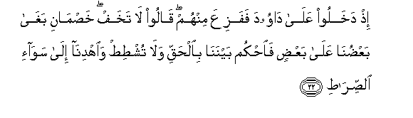
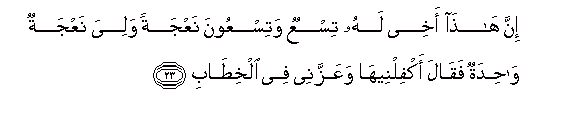
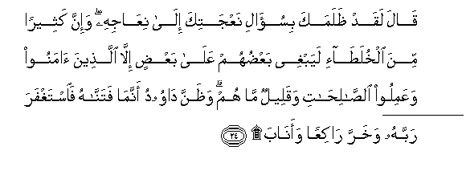
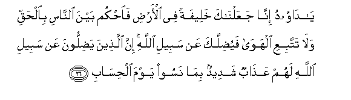

  
[Intangible Textual Heritage](../../index)  [Islam](../index) 
[Index](index)   
[Hypertext Qur'an](../htq/index)  [Unicode](../uq/038.htm#038_015) 
[Palmer](../sbe09/038)  [Pickthall](../pick/038.htm#038_015)  [Yusuf Ali
English](../yaq/yaq038)  [Rodwell](../qr/038)   
  
[Sūra XXXVIII.: Ṣād (being one of the Abbreviated Letters).
Index](038)  
  [Previous](03801)  [Next](03803) 

------------------------------------------------------------------------

  
*The Holy Quran*, tr. by Yusuf Ali, \[1934\], at Intangible Textual
Heritage

------------------------------------------------------------------------

# Sūra XXXVIII.: Ṣād (being one of the Abbreviated Letters).

### Section 2

------------------------------------------------------------------------

15. Wam<u>a</u> yan*<u>th</u>*uru h<u>a</u>ol<u>a</u>-i ill<u>a</u>
<u>s</u>ay<u>h</u>atan w<u>ah</u>idatan m<u>a</u> lah<u>a</u> min
faw<u>a</u>q**in**

15\. These (to-day) only wait  
For a single mighty Blast,  
Which (when it comes)  
Will brook no delay.

------------------------------------------------------------------------

16. Waq<u>a</u>loo rabban<u>a</u> AAajjil lan<u>a</u>
qi<u>tt</u>an<u>a</u> qabla yawmi al<u>h</u>is<u>a</u>b**i**

16\. They say: "Our Lord!  
Hasten to us our sentence  
(Even) before the Day  
Of Account!"

------------------------------------------------------------------------

17. I<u>s</u>bir AAal<u>a</u> m<u>a</u> yaqooloona wa**o**<u>th</u>kur
AAabdan<u>a</u> d<u>a</u>wooda <u>tha</u> al-aydi innahu
aww<u>a</u>b**un**

17\. Have patience at what they  
Say, and remember Our Servant  
David, the man of strength:  
For he ever turned (to God).

------------------------------------------------------------------------

18. Inn<u>a</u> sakhkharn<u>a</u> aljib<u>a</u>la maAAahu
yusabbi<u>h</u>na bi**a**lAAashiyyi wa**a**l-ishr<u>a</u>q**i**

18\. It was We that made  
The hills declare,  
In unison with him,  
Our Praises, at eventide  
And at break of day,

------------------------------------------------------------------------

19. Wa**al**<u>tt</u>ayra ma<u>h</u>shooratan kullun lahu
aww<u>a</u>b**un**

19\. And the birds gathered  
(In assemblies): all with him  
Did turn (to God).

------------------------------------------------------------------------

20. Washadadn<u>a</u> mulkahu wa<u>a</u>tayn<u>a</u>hu al<u>h</u>ikmata
wafa<u>s</u>la alkhi<u>ta</u>b**i**

20\. We strengthened his kingdom,  
And gave him wisdom  
And sound judgment  
In speech and decision.

------------------------------------------------------------------------

21. Wahal at<u>a</u>ka nabao alkha<u>s</u>mi i<u>th</u> tasawwaroo
almi<u>h</u>r<u>a</u>b**a**

21\. Has the Story of  
The Disputants reached thee?  
Behold, they climbed over  
The wall of the private chamber;

------------------------------------------------------------------------

22. Ith dakhaloo AAal<u>a</u> d<u>a</u>wooda fafaziAAa minhum
q<u>a</u>loo l<u>a</u> takhaf kha<u>s</u>m<u>a</u>ni bagh<u>a</u>
baAA<u>d</u>un<u>a</u> AAal<u>a</u> baAA<u>d</u>in fa**o**<u>h</u>kum
baynan<u>a</u> bi**a**l<u>h</u>aqqi wal<u>a</u> tush<u>t</u>i<u>t</u>
wa**i**hdin<u>a</u> il<u>a</u> saw<u>a</u>-i
a**l**<u>ss</u>ir<u>at</u>**i**

22\. When they entered  
The presence of David,  
And he was terrified  
Of them, they said:  
"Fear not: we are two  
Disputants, one of whom  
Has wronged the other:  
Decide now between us  
With truth, and treat us not  
With unjustice, but guide us  
To the even Path.

------------------------------------------------------------------------

23. Inna h<u>atha</u> akhee lahu tisAAun watisAAoona naAAjatan waliya
naAAjatun w<u>ah</u>idatun faq<u>a</u>la akfilneeh<u>a</u> waAAazzanee
fee alkhi<u>ta</u>b**i**

23\. "This man is my brother:  
He has nine and ninety  
Ewes, and I have (but) one:  
Yet he says, "Commit her  
To my care," and is (moreover)  
Harsh to me in speech."

------------------------------------------------------------------------

24. Q<u>a</u>la laqad *<u>th</u>*alamaka bisu-<u>a</u>li naAAjatika
il<u>a</u> niAA<u>a</u>jihi wa-inna katheeran mina alkhula<u>ta</u>-i
layabghee baAA<u>d</u>uhum AAal<u>a</u> baAA<u>d</u>in ill<u>a</u>
alla<u>th</u>eena <u>a</u>manoo waAAamiloo a**l**<u>ssa</u>li<u>ha</u>ti
waqaleelun m<u>a</u> hum wa*<u>th</u>*anna d<u>a</u>woodu annam<u>a</u>
fatann<u>a</u>hu fa**i**staghfara rabbahu wakharra r<u>a</u>kiAAan
waan<u>a</u>b**a**

24\. (David) said: "He has  
Undoubtedly wronged thee  
In demanding thy (single) ewe  
To be added to his (flock  
Of) ewes: truly many  
Are the Partners (in business)  
Who wrong each other:  
Not so do those who believe  
And work deeds of righteousness,  
And how few are they?"…  
And David gathered that we  
Had tried him: he asked  
Forgiveness of his Lord,  
Fell down, bowing  
(In prostration), and turned  
(To God in repentance).

------------------------------------------------------------------------

25. Faghafarn<u>a</u> lahu <u>tha</u>lika wa-inna lahu AAindan<u>a</u>
lazulf<u>a</u> wa<u>h</u>usna ma<u>a</u>b**in**

25\. So We forgave him  
This (lapse): he enjoyed,  
Indeed, a Near Approach to Us,  
And a beautiful Place  
Of (final) Return.

------------------------------------------------------------------------

26. Y<u>a</u> d<u>a</u>woodu inn<u>a</u> jaAAaln<u>a</u>ka khaleefatan
fee al-ar<u>d</u>i fa**o**<u>h</u>kum bayna a**l**nn<u>a</u>si
bi**a**l<u>h</u>aqqi wal<u>a</u> tattabiAAi alhaw<u>a</u>
fayu<u>d</u>illaka AAan sabeeli All<u>a</u>hi inna alla<u>th</u>eena
ya<u>d</u>illoona AAan sabeeli All<u>a</u>hi lahum AAa<u>tha</u>bun
shadeedun bim<u>a</u> nasoo yawma al<u>h</u>is<u>a</u>b**i**

26\.

------------------------------------------------------------------------

[Next: Section 3 (27-40)](03803)

