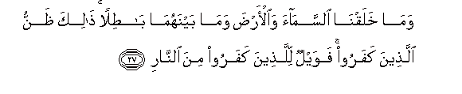
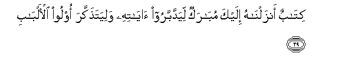
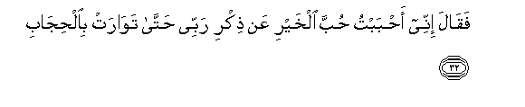
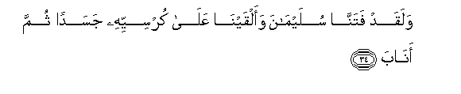
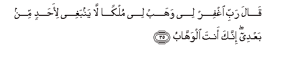

  
[Intangible Textual Heritage](../../index)  [Islam](../index.md) 
[Index](index.md)   
[Hypertext Qur'an](../htq/index)  [Unicode](../uq/038.htm#038_027.md) 
[Palmer](../sbe09/038)  [Pickthall](../pick/038.htm#038_027.md)  [Yusuf Ali
English](../yaq/yaq038)  [Rodwell](../qr/038.md)   
  
[Sūra XXXVIII.: Ṣād (being one of the Abbreviated Letters).
Index](038.md)  
  [Previous](03802)  [Next](03804.md) 

------------------------------------------------------------------------

  
*The Holy Quran*, tr. by Yusuf Ali, \[1934\], at Intangible Textual
Heritage

------------------------------------------------------------------------

# Sūra XXXVIII.: Ṣād (being one of the Abbreviated Letters).

### Section 3

------------------------------------------------------------------------

27. Wam<u>a</u> khalaqn<u>a</u> a**l**ssam<u>a</u>a wa**a**l-ar<u>d</u>a
wam<u>a</u> baynahum<u>a</u> b<u>at</u>ilan <u>tha</u>lika
*<u>th</u>*annu alla<u>th</u>eena kafaroo fawaylun lilla<u>th</u>eena
kafaroo mina a**l**nn<u>a</u>r**i**

27\. Not without purpose did We  
Create heaven and earth  
And all between! That  
Were the thought of Unbelievers!  
But woe to the Unbelievers  
Because of the Fire (of Hell)!

------------------------------------------------------------------------

28. Am najAAalu alla<u>th</u>eena <u>a</u>manoo waAAamiloo
a**l**<u>ssa</u>li<u>ha</u>ti ka**a**lmufsideena fee al-ar<u>d</u>i am
najAAalu almuttaqeena ka**a**lfujj<u>a</u>r**i**

28\. Shall We treat those  
Who believe and work deeds  
Of righteousness, the same  
As those who do mischief  
On earth? Shall We treat  
Those who guard against evil,  
The same as those who  
Turn aside from the right?

------------------------------------------------------------------------

29. Kit<u>a</u>bun anzaln<u>a</u>hu ilayka mub<u>a</u>rakun
liyaddabbaroo <u>a</u>y<u>a</u>tihi waliyata<u>th</u>akkara oloo
al-alb<u>a</u>b**i**

29\. (Here is) a Book which  
We have sent down  
Unto thee, full of blessings,  
That they may meditate  
On its Signs, and that  
Men of understanding may  
Receive admonition.

------------------------------------------------------------------------

30. Wawahabn<u>a</u> lid<u>a</u>wooda sulaym<u>a</u>na niAAma alAAabdu
innahu aww<u>a</u>b**un**

30\. To David We gave  
Solomon (for a son),—  
How excellent in Our service!  
Ever did he turn (to Us)!

------------------------------------------------------------------------

31. I<u>th</u> AAuri<u>d</u>a AAalayhi bi**a**lAAashiyyi
a**l**<u>ssa</u>fin<u>a</u>tu aljiy<u>a</u>d**u**

31\. Behold, there were brought  
Before him, at eventide,  
Coursers of the highest breeding,  
And swift of foot;

------------------------------------------------------------------------

32. Faq<u>a</u>la innee a<u>h</u>babtu <u>h</u>ubba alkhayri AAan
<u>th</u>ikri rabbee <u>h</u>att<u>a</u> taw<u>a</u>rat
bi**a**l<u>h</u>ij<u>a</u>b**i**

32\. And he said, "Truly  
Do I love the love  
Of Good, with a view  
To the glory of my Lord,"—  
Until (the sun) was hidden  
In the veil (of Night):

------------------------------------------------------------------------

33. Ruddooh<u>a</u> AAalayya fa<u>t</u>afiqa mas<u>h</u>an
bi**al**ssooqi wa**a**l-aAAn<u>a</u>q**i**

33\. "Bring them back to me."  
Then began he to pass  
His hand over (their) legs  
And their necks.

------------------------------------------------------------------------

34. Walaqad fatann<u>a</u> sulaym<u>a</u>na waalqayn<u>a</u>
AAal<u>a</u> kursiyyihi jasadan thumma an<u>a</u>b**a**

34\. And We did try  
Solomon: We placed  
On his throne a body  
(Without life): but he did turn  
(To Us in true devotion):

------------------------------------------------------------------------

35. Q<u>a</u>la rabbi ighfir lee wahab lee mulkan l<u>a</u> yanbaghee
li-a<u>h</u>adin min baAAdee innaka anta alwahh<u>a</u>b**u**

35\. He said, "O my Lord!  
Forgive me, and grant me  
A Kingdom which,  
(It may be), suits not  
Another after me:  
For Thou art the Grantor  
Of Bounties (without measure).

------------------------------------------------------------------------

36. Fasakhkharn<u>a</u> lahu a**l**rree<u>h</u>a tajree bi-amrihi
rukh<u>a</u>an <u>h</u>aythu a<u>sa</u>b**a**

36\. Then We subjected the Wind  
To his power, to flow  
Gently to his order,  
Whithersoever he willed,—

------------------------------------------------------------------------

37. Wa**al**shshay<u>at</u>eena kulla bann<u>a</u>-in
waghaww<u>as</u>**in**

37\. As also the evil ones,  
(Including) every kind  
Of builder and diver,—

------------------------------------------------------------------------

38. Wa<u>a</u>khareena muqarraneena fee al-a<u>s</u>f<u>a</u>d**i**

38\. As also others bound  
Together in fetters.

------------------------------------------------------------------------

39. H<u>atha</u> AAa<u>ta</u>on<u>a</u> fa**o**mnun aw amsik bighayri
<u>h</u>is<u>a</u>b**in**

39\. "Such are Our Bounties:  
Whether thou bestow them  
(On others) or withhold them,  
No account will be asked."

------------------------------------------------------------------------

40. Wa-inna lahu AAindan<u>a</u> lazulf<u>a</u> wa<u>h</u>usna
ma<u>a</u>b**in**

40\. And he enjoyed, indeed,  
A Near Approach to Us,  
And a beautiful Place  
Of (final) Return.

------------------------------------------------------------------------

[Next: Section 4 (41-64)](03804.md)

