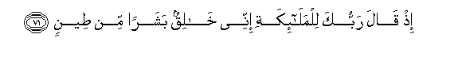
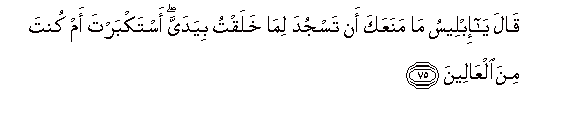
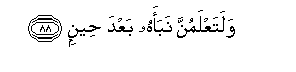

  
[Intangible Textual Heritage](../../index)  [Islam](../index) 
[Index](index)   
[Hypertext Qur'an](../htq/index)  [Unicode](../uq/038.htm#038_065) 
[Palmer](../sbe09/038)  [Pickthall](../pick/038.htm#038_065)  [Yusuf Ali
English](../yaq/yaq038)  [Rodwell](../qr/038)   
  
[Sūra XXXVIII.: Ṣād (being one of the Abbreviated Letters).
Index](038)  
  [Previous](03804)  [Next](03901) 

------------------------------------------------------------------------

  
*The Holy Quran*, tr. by Yusuf Ali, \[1934\], at Intangible Textual
Heritage

------------------------------------------------------------------------

# Sūra XXXVIII.: Ṣād (being one of the Abbreviated Letters).

### Section 5

------------------------------------------------------------------------

65. Qul innam<u>a</u> an<u>a</u> mun<u>th</u>irun wam<u>a</u> min
il<u>a</u>hin ill<u>a</u> All<u>a</u>hu alw<u>ah</u>idu
alqahh<u>a</u>r**u**

65\. Say: "Truly am I  
A Warner: no god  
Is there but the One  
God, Supreme and Irresistible,—

------------------------------------------------------------------------

66. Rabbu a**l**ssam<u>a</u>w<u>a</u>ti wa**a**l-ar<u>d</u>i wam<u>a</u>
baynahum<u>a</u> alAAazeezu alghaff<u>a</u>r**u**

66\. "The Lord of the heavens  
And the earth, and all  
Between,—Exalted in Might,  
Able to enforce His Will,  
Forgiving again and again."

------------------------------------------------------------------------

67. Qul huwa nabaon AAa*<u>th</u>*eem**un**

67\. Say: "That is a Message  
Supreme (above all),—

------------------------------------------------------------------------

68. Antum AAanhu muAAri<u>d</u>oon**a**

68\. "From which ye  
Do turn away!

------------------------------------------------------------------------

69. M<u>a</u> k<u>a</u>na liya min AAilmin bi**a**lmala-i
al-aAAl<u>a</u> i<u>th</u> yakhta<u>s</u>imoon**a**

69\. "No knowledge have I  
Of the Chiefs on high,  
When they discuss  
(Matters) among themselves.

------------------------------------------------------------------------

70. In yoo<u>ha</u> ilayya ill<u>a</u> annam<u>a</u> an<u>a</u>
na<u>th</u>eerun mubeen**un**

70\. "Only this has been revealed  
To me: that I am  
To give warning  
Plainly and publicly."

------------------------------------------------------------------------

71. I<u>th</u> q<u>a</u>la rabbuka lilmal<u>a</u>-ikati innee
kh<u>a</u>liqun basharan min <u>t</u>een**in**

71\. Behold, thy Lord said  
To the angels: "I am  
About to create man  
From clay:

------------------------------------------------------------------------

72. Fa-i<u>tha</u> sawwaytuhu wanafakhtu feehi min roo<u>h</u>ee
faqaAAoo lahu s<u>a</u>jideen**a**

72\. "When I have fashioned him  
(In due proportion) and breathed  
Into him of My spirit,  
Fall ye down in obeisance  
Unto him."

------------------------------------------------------------------------

73. Fasajada almal<u>a</u>-ikatu kulluhum ajmaAAoon**a**

73\. So the angels prostrated themselves,  
All of them together:

------------------------------------------------------------------------

74. Ill<u>a</u> ibleesa istakbara wak<u>a</u>na mina
alk<u>a</u>fireen**a**

74\. Not so Iblīs: he  
Was haughty, and became  
One of those who reject Faith.

------------------------------------------------------------------------

75. Q<u>a</u>la y<u>a</u> ibleesu m<u>a</u> manaAAaka an tasjuda
lim<u>a</u> khalaqtu biyadayya astakbarta am kunta mina
alAA<u>a</u>leen**a**

75\. (God) said: "O Iblīs!  
What prevents thee from  
Prostrating thyself to one  
Whom I have created  
With My hands?  
Art thou haughty?  
Or art thou one  
Of the high (and mighty) ones?"

------------------------------------------------------------------------

76. Q<u>a</u>la an<u>a</u> khayrun minhu khalaqtanee min n<u>a</u>rin
wakhalaqtahu min <u>t</u>een**in**

76\. (Iblīs) said: "I am better  
Than he: Thou createdst  
Me from fire, and him  
Thou createdst from clay."

------------------------------------------------------------------------

77. Q<u>a</u>la fa**o**khruj minh<u>a</u> fa-innaka rajeem**un**

77\. (God) said: "Then get thee  
Out from here: for thou  
Art rejected, accursed.

------------------------------------------------------------------------

78. Wa-inna AAalayka laAAnatee il<u>a</u> yawmi a**l**ddeen**i**

78\. "And My Curse shall be  
On thee till the Day  
Of Judgment."

------------------------------------------------------------------------

79. Q<u>a</u>la rabbi faan*<u>th</u>*irnee il<u>a</u> yawmi
yubAAathoon**a**

79\. (Iblīs) said: "O my Lord!  
Give me then respite  
Till the Day  
The (dead) are raised."

------------------------------------------------------------------------

80. Q<u>a</u>la fa-innaka mina almun*<u>th</u>*areen**a**

80\. (God) said: "Respite then  
Is granted thee—

------------------------------------------------------------------------

81. Il<u>a</u> yawmi alwaqti almaAAloom**i**

81\. "Till the Day  
Of the Time Appointed."

------------------------------------------------------------------------

82. Q<u>a</u>la fabiAAizzatika laoghwiyannahum ajmaAAeen**a**

82\. (Iblīs) said: "Then,  
By Thy Power, I will  
Put them all in the wrong,—

------------------------------------------------------------------------

83. Ill<u>a</u> AAib<u>a</u>daka minhumu almukhla<u>s</u>een**a**

83\. "Except Thy Servants  
Amongst them, sincere  
And purified (by Thy grace)."

------------------------------------------------------------------------

84. Q<u>a</u>la fa**a**l<u>h</u>aqqu wa**a**l<u>h</u>aqqa aqool**u**

84\. (God) said: "Then  
It is just and fitting—  
And I say what is  
Just and fitting—

------------------------------------------------------------------------

85. Laamlaanna jahannama minka wamimman tabiAAaka minhum ajmaAAeen**a**

85\. "That I will certainly fill  
Hell with thee  
And those that follow thee,—  
Every one."

------------------------------------------------------------------------

86. Qul m<u>a</u> as-alukum AAalayhi min ajrin wam<u>a</u> an<u>a</u>
mina almutakallifeen**a**

86\. Say: "No reward do I ask  
Of you for this (Qur-ān),  
Nor am I a pretender.

------------------------------------------------------------------------

87. In huwa ill<u>a</u> <u>th</u>ikrun lilAA<u>a</u>lameen**a**

87\. "This is no less than  
A Message to (all)  
The Worlds.

------------------------------------------------------------------------

88. WalataAAlamunna nabaahu baAAda <u>h</u>een**in**

88\. "And ye shall certainly  
Know the truth of it (all)  
After a while."

------------------------------------------------------------------------

[Next: Section 1 (1-9)](03901)

