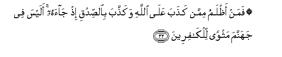
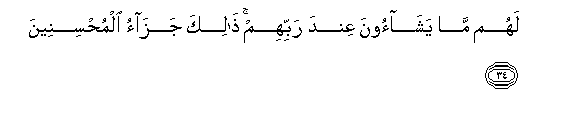
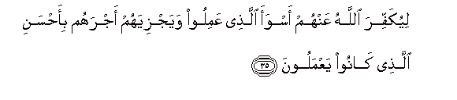

  
[Intangible Textual Heritage](../../index)  [Islam](../index.md) 
[Index](index.md)   
[Hypertext Qur'an](../htq/index)  [Unicode](../uq/039.htm#039_032.md) 
[Palmer](../sbe09/039)  [Pickthall](../pick/039.htm#039_032.md)  [Yusuf Ali
English](../yaq/yaq039)  [Rodwell](../qr/039.md)   
  
[Sūra XXXIX.: Zumar, or the Crowds. Index](039.md)  
  [Previous](03903)  [Next](03905.md) 

------------------------------------------------------------------------

  
*The Holy Quran*, tr. by Yusuf Ali, \[1934\], at Intangible Textual
Heritage

------------------------------------------------------------------------

# Sūra XXXIX.: Zumar, or the Crowds.

### Section 4

------------------------------------------------------------------------

32. Faman a*<u>th</u>*lamu mimman ka<u>th</u>aba AAal<u>a</u>
All<u>a</u>hi waka<u>thth</u>aba bi**al**<u>ss</u>idqi i<u>th</u>
j<u>a</u>ahu alaysa fee jahannama mathwan lilk<u>a</u>fireen**a**

32\. Who, then, doth more wrong  
Than one who utters  
A lie concerning God,  
And rejects the Truth  
When it comes to him  
Is there not in Hell  
An abode for blasphemers?

------------------------------------------------------------------------

33. Wa**a**lla<u>th</u>ee j<u>a</u>a bi**al**<u>ss</u>idqi
wa<u>s</u>addaqa bihi ol<u>a</u>-ika humu almuttaqoon**a**

33\. And he who brings the Truth  
And he who confirms  
(And supports) it—such are  
The men who do right.

------------------------------------------------------------------------

34. Lahum m<u>a</u> yash<u>a</u>oona AAinda rabbihim <u>tha</u>lika
jaz<u>a</u>o almu<u>h</u>sineen**a**

34\. They shall have all  
That they wish for,  
In the presence of their Lord:  
Such is the reward  
Of those who do good:

------------------------------------------------------------------------

35. Liyukaffira All<u>a</u>hu AAanhum aswaa alla<u>th</u>ee AAamiloo
wayajziyahum ajrahum bi-a<u>h</u>sani alla<u>th</u>ee k<u>a</u>noo
yaAAmaloon**a**

35\. So that God will  
Turn off from them  
(Even) the worst in their deeds  
And give them their reward  
According to the best  
Of what they have done.

------------------------------------------------------------------------

36. Alaysa All<u>a</u>hu bik<u>a</u>fin AAabdahu wayukhawwifoonaka
bi**a**lla<u>th</u>eena min doonihi waman yu<u>d</u>lili All<u>a</u>hu
fam<u>a</u> lahu min h<u>a</u>d**in**

36\. Is not God enough  
For His servant? But  
They try to frighten thee  
With other (gods) besides Him!  
For such as God leaves  
To stray, there can be  
No guide.

------------------------------------------------------------------------

37. Waman yahdi All<u>a</u>hu fam<u>a</u> lahu min mu<u>d</u>illin
alaysa All<u>a</u>hu biAAazeezin <u>th</u>ee intiq<u>a</u>m**in**

37\. And such as God doth  
Guide there can be  
None to lead astray.  
Is not God Exalted  
In Power, (Able to enforce  
His Will), Lord of Retribution?

------------------------------------------------------------------------

38. Wala-in saaltahum man khalaqa a**l**ssam<u>a</u>w<u>a</u>ti
wa**a**l-ar<u>d</u>a layaqoolunna All<u>a</u>hu qul afaraaytum m<u>a</u>
tadAAoona min dooni All<u>a</u>hi in ar<u>a</u>daniya All<u>a</u>hu
bi<u>d</u>urrin hal hunna k<u>a</u>shif<u>a</u>tu <u>d</u>urrihi aw
ar<u>a</u>danee bira<u>h</u>matin hal hunna mumsik<u>a</u>tu
ra<u>h</u>matihi qul <u>h</u>asbiya All<u>a</u>hu AAalayhi yatawakkalu
almutawakkiloon**a**

38\. If indeed thou ask them  
Who it is that created  
The heavens and the earth,  
They would be sure to say.  
"God ". Say: "See ye then?  
The things that ye invoke  
Besides God,—can they,  
If God wills some Penalty  
For me, remove His Penalty?—  
Or if He wills some Grace  
For me, can they keep back  
His Grace?" Say: "Sufficient  
Is God for me!  
In Him trust those  
Who put their trust."

------------------------------------------------------------------------

39. Qul y<u>a</u> qawmi iAAmaloo AAal<u>a</u> mak<u>a</u>natikum innee
AA<u>a</u>milun fasawfa taAAlamoon**a**

39\. Say: "O my people!  
Do whatever ye can:  
I will do (my part):  
But soon will ye know—

------------------------------------------------------------------------

40. Man ya/teehi AAa<u>tha</u>bun yukhzeehi waya<u>h</u>illu AAalayhi
AAa<u>tha</u>bun muqeem**un**

40\. "Who it is to whom  
Comes a Penalty  
Of ignominy, and on whom  
Descends a Penalty that abides."

------------------------------------------------------------------------

41. Inn<u>a</u> anzaln<u>a</u> AAalayka alkit<u>a</u>ba
li**l**nn<u>a</u>si bi**a**l<u>h</u>aqqi famani ihtad<u>a</u>
falinafsihi waman <u>d</u>alla fa-innam<u>a</u> ya<u>d</u>illu
AAalayh<u>a</u> wam<u>a</u> anta AAalayhim biwakeel**in**

41\. Verily We have revealed  
The Book to thee  
In Truth, for (instructing)  
mankind.  
He, then, that receives guidance  
Benefits his own soul:  
But he that strays  
Injures his own soul.  
Nor art thou set  
Over them to dispose  
Of their affairs.

------------------------------------------------------------------------

[Next: Section 5 (42-52)](03905.md)

