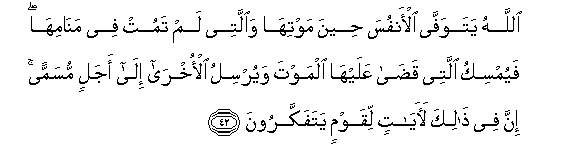
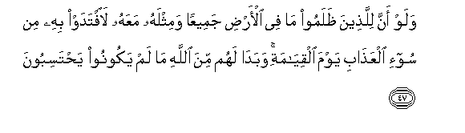
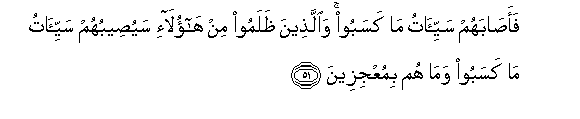

  
[Intangible Textual Heritage](../../index)  [Islam](../index.md) 
[Index](index.md)   
[Hypertext Qur'an](../htq/index)  [Unicode](../uq/039.htm#039_042.md) 
[Palmer](../sbe09/039)  [Pickthall](../pick/039.htm#039_042.md)  [Yusuf Ali
English](../yaq/yaq039)  [Rodwell](../qr/039.md)   
  
[Sūra XXXIX.: Zumar, or the Crowds. Index](039.md)  
  [Previous](03904)  [Next](03906.md) 

------------------------------------------------------------------------

  
*The Holy Quran*, tr. by Yusuf Ali, \[1934\], at Intangible Textual
Heritage

------------------------------------------------------------------------

# Sūra XXXIX.: Zumar, or the Crowds.

### Section 5

------------------------------------------------------------------------

42. All<u>a</u>hu yatawaff<u>a</u> al-anfusa <u>h</u>eena mawtih<u>a</u>
wa**a**llatee lam tamut fee man<u>a</u>mih<u>a</u> fayumsiku allatee
qa<u>da</u> AAalayh<u>a</u> almawta wayursilu al-okhr<u>a</u> il<u>a</u>
ajalin musamman inna fee <u>tha</u>lika la<u>a</u>y<u>a</u>tin liqawmin
yatafakkaroon**a**

42\. It is God that takes  
The souls (of men) at death;  
And those that die not  
(He takes) during their sleep:  
Those on whom He  
Has passed the decree  
Of death, He keeps back  
(From returning to life),  
But the rest He sends  
(To their bodies)  
For a term appointed.  
Verily in this are Signs  
For those who reflect.

------------------------------------------------------------------------

43. Ami ittakha<u>th</u>oo min dooni All<u>a</u>hi shufaAA<u>a</u>a qul
awa law k<u>a</u>noo l<u>a</u> yamlikoona shay-an wal<u>a</u>
yaAAqiloon**a**

43\. What! Do they take  
For intercessors others  
Besides God? Say: "Even if  
They have no power whatever  
And no intelligence?"

------------------------------------------------------------------------

44. Qul lill<u>a</u>hi a**l**shshaf<u>a</u>AAatu jameeAAan lahu mulku
a**l**ssam<u>a</u>w<u>a</u>ti wa**a**l-ar<u>d</u>i thumma ilayhi
turjaAAoon**a**

44\. Say: "To God belongs  
Exclusively (the right  
To grant) Intercession:  
To Him belongs the dominion  
Of the heavens and the earth:  
In the End, it is to Him  
That ye shall be  
Brought back."

------------------------------------------------------------------------

45. Wa-i<u>tha</u> <u>th</u>ukira All<u>a</u>hu wa<u>h</u>dahu
ishmaazzat quloobu alla<u>th</u>eena l<u>a</u> yu/minoona
bi**a**l-<u>a</u>khirati wa-i<u>tha</u> <u>th</u>ukira alla<u>th</u>eena
min doonihi i<u>tha</u> hum yastabshiroon**a**

45\. When God, the One and Only,  
Is mentioned, the hearts  
Of those who believe not  
In the Hereafter are filled  
With disgust and horror;  
But when (gods) other than He  
Are mentioned, behold,  
They are filled with joy!

------------------------------------------------------------------------

46. Quli all<u>a</u>humma f<u>at</u>ira a**l**ssam<u>a</u>w<u>a</u>ti
wa**a**l-ar<u>d</u>i AA<u>a</u>lima alghaybi wa**al**shshah<u>a</u>dati
anta ta<u>h</u>kumu bayna AAib<u>a</u>dika fee m<u>a</u> k<u>a</u>noo
feehi yakhtalifoon**a**

46\. Say: "O God!  
Creator of the heavens  
And the earth!  
Knower of all that is  
Hidden and open!  
It is Thou that wilt  
Judge between Thy Servants  
In those matters about which  
They have differed."

------------------------------------------------------------------------

47. Walaw anna lilla<u>th</u>eena *<u>th</u>*alamoo m<u>a</u> fee
al-ar<u>d</u>i jameeAAan wamithlahu maAAahu la**i**ftadaw bihi min soo-i
alAAa<u>tha</u>bi yawma alqiy<u>a</u>mati wabad<u>a</u> lahum mina
All<u>a</u>hi m<u>a</u> lam yakoonoo ya<u>h</u>tasiboon**a**

47\. Even if the wrong-doers  
Had all that there is  
On earth, and as much more,  
(In vain) would they offer it  
For ransom from the pain  
Of the Penalty on the Day  
Of Judgment: but something  
Will confront them from God,  
Which they could never  
Have counted upon!

------------------------------------------------------------------------

48. Wabad<u>a</u> lahum sayyi-<u>a</u>tu m<u>a</u> kasaboo wa<u>ha</u>qa
bihim m<u>a</u> k<u>a</u>noo bihi yastahzi-oon**a**

48\. For the evils of their Deeds  
Will confront them,  
And they will be (completely)  
Encircled by that which  
They used to mock at!

------------------------------------------------------------------------

49. Fa-i<u>tha</u> massa al-ins<u>a</u>na <u>d</u>urrun
daAA<u>a</u>n<u>a</u> thumma i<u>tha</u> khawwaln<u>a</u>hu niAAmatan
minn<u>a</u> q<u>a</u>la innam<u>a</u> ooteetuhu AAal<u>a</u> AAilmin
bal hiya fitnatun wal<u>a</u>kinna aktharahum l<u>a</u> yaAAlamoon**a**

49\. Now, when trouble touches man,  
He cries to Us:  
But when We bestow  
A favour upon him  
As from Ourselves,  
He says, "This has been  
Given to me because of  
A certain knowledge (I have)!"  
Nay, but this is  
But a trial, but most  
Of them understand not!

------------------------------------------------------------------------

50. Qad q<u>a</u>lah<u>a</u> alla<u>th</u>eena min qablihim fam<u>a</u>
aghn<u>a</u> AAanhum m<u>a</u> k<u>a</u>noo yaksiboon**a**

50\. Thus did the (generations)  
Before them say! But  
All that they did  
Was of no profit to them.

------------------------------------------------------------------------

51. Faa<u>sa</u>bahum sayyi-<u>a</u>tu m<u>a</u> kasaboo
wa**a**lla<u>th</u>eena *<u>th</u>*alamoo min h<u>a</u>ol<u>a</u>-i
sayu<u>s</u>eebuhum sayyi-<u>a</u>tu m<u>a</u> kasaboo wam<u>a</u> hum
bimuAAjizeen**a**

51\. Nay, the evil results  
Of their deeds overtook them.  
And the wrong-doers  
Of this (generation)  
The evil results of their deeds  
Will soon overtake them (too),  
And they will never be  
Able to frustrate (Our Plan)!

------------------------------------------------------------------------

52. Awa lam yaAAlamoo anna All<u>a</u>ha yabsu<u>t</u>u a**l**rrizqa
liman yash<u>a</u>o wayaqdiru inna fee <u>tha</u>lika
la<u>a</u>y<u>a</u>tin liqawmin yu/minoon**a**

52\. Know they not that  
God enlarges the provision  
Or restricts it, for any  
He pleases? Verily, in this are  
Signs for those who believe!

------------------------------------------------------------------------

[Next: Section 6 (53-63)](03906.md)

