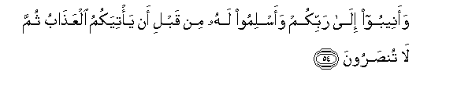
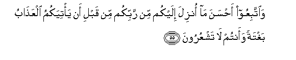
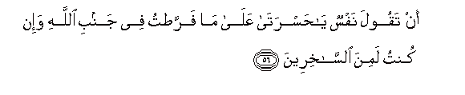
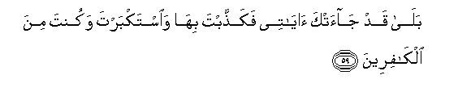
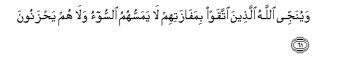
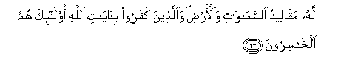

  
[Intangible Textual Heritage](../../index)  [Islam](../index) 
[Index](index)   
[Hypertext Qur'an](../htq/index)  [Unicode](../uq/039.htm#039_053) 
[Palmer](../sbe09/039)  [Pickthall](../pick/039.htm#039_053)  [Yusuf Ali
English](../yaq/yaq039)  [Rodwell](../qr/039)   
  
[Sūra XXXIX.: Zumar, or the Crowds. Index](039)  
  [Previous](03905)  [Next](03907) 

------------------------------------------------------------------------

  
*The Holy Quran*, tr. by Yusuf Ali, \[1934\], at Intangible Textual
Heritage

------------------------------------------------------------------------

# Sūra XXXIX.: Zumar, or the Crowds.

### Section 6

------------------------------------------------------------------------

53. Qul y<u>a</u> AAib<u>a</u>diya alla<u>th</u>eena asrafoo
AAal<u>a</u> anfusihim l<u>a</u> taqna<u>t</u>oo min ra<u>h</u>mati
All<u>a</u>hi inna All<u>a</u>ha yaghfiru a**l**<u>thth</u>unooba
jameeAAan innahu huwa alghafooru a**l**rra<u>h</u>eem**u**

53\. Say: "O my Servants who  
Have transgressed against their souls  
Despair not of the Mercy  
Of God: for God forgives  
All sins: for He is  
Oft-Forgiving, Most Merciful.

------------------------------------------------------------------------

54. Waaneeboo il<u>a</u> rabbikum waaslimoo lahu min qabli an
ya/tiyakumu alAAa<u>tha</u>bu thumma l<u>a</u> tun<u>s</u>aroon**a**

54\. "Turn ye to your Lord  
(In repentance) and bow  
To His (Will), before  
The Penalty comes on you:  
After that ye shall not  
Be helped.

------------------------------------------------------------------------

55. Wa**i**ttabiAAoo a<u>h</u>sana m<u>a</u> onzila ilaykum min rabbikum
min qabli an ya/tiyakumu alAAa<u>tha</u>bu baghtatan waantum l<u>a</u>
tashAAuroon**a**

55\. "And follow the Best  
Of (the courses) revealed  
To you from your Lord,  
Before the Penalty comes  
On you—of a sudden,  
While ye perceive not!—

------------------------------------------------------------------------

56. An taqoola nafsun y<u>a</u> <u>h</u>asrat<u>a</u> AAal<u>a</u>
m<u>a</u> farra<u>t</u>tu fee janbi All<u>a</u>hi wa-in kuntu lamina
a**l**ss<u>a</u>khireen**a**

56\. "Lest the soul should (then)  
Say: "Ah! woe is me!—  
In that I neglected  
(My Duty) towards God,  
And was but among those  
Who mocked!"—

------------------------------------------------------------------------

57. Aw taqoola law anna All<u>a</u>ha had<u>a</u>nee lakuntu mina
almuttaqeen**a**

57\. "Or (lest) it should say:  
"If only God had guided  
Me, I should certainly  
Have been among the righteous!"—

------------------------------------------------------------------------

58. Aw taqoola <u>h</u>eena tar<u>a</u> alAAa<u>tha</u>ba law anna lee
karratan faakoona mina almu<u>h</u>sineen**a**

58\. "Or (lest) it should say  
When it (actually) sees  
The Penalty, "If only  
I had another chance,  
I should certainly be  
Among those who do good!"

------------------------------------------------------------------------

59. Bal<u>a</u> qad j<u>a</u>atka <u>a</u>y<u>a</u>tee
faka<u>thth</u>abta bih<u>a</u> wa**i**stakbarta wakunta mina
alk<u>a</u>fireen**a**

59\. "(The reply will be:) "Nay,  
But there came to thee  
My Signs, and thou didst  
Reject them: thou vast  
Haughty, and became one  
Of those who reject Faith!

------------------------------------------------------------------------

60. Wayawma alqiy<u>a</u>mati tar<u>a</u> alla<u>th</u>eena
ka<u>th</u>aboo AAal<u>a</u> All<u>a</u>hi wujoohuhum muswaddatun alaysa
fee jahannama mathwan lilmutakabbireen**a**

60\. (On the Day of Judgment  
Wilt thou see those  
Who told lies against God;—  
Their faces will be turned  
Black; is there not  
In Hell an abode  
For the Haughty?

------------------------------------------------------------------------

61. Wayunajjee All<u>a</u>hu alla<u>th</u>eena ittaqaw
bimaf<u>a</u>zatihim l<u>a</u> yamassuhumu a**l**ssoo-o wal<u>a</u> hum
ya<u>h</u>zanoon**a**

61\. But God will deliver  
The righteous to their place  
Of salvation: no evil  
Shall touch them,  
Nor shall they grieve.

------------------------------------------------------------------------

62. All<u>a</u>hu kh<u>a</u>liqu kulli shay-in wahuwa AAal<u>a</u> kulli
shay-in wakeel**un**

62\. God is the Creator  
Of all things, and He  
Is the Guardian and Disposer  
Of all affairs.

------------------------------------------------------------------------

63. Lahu maq<u>a</u>leedu a**l**ssam<u>a</u>w<u>a</u>ti
wa**a**l-ar<u>d</u>i wa**a**lla<u>th</u>eena kafaroo
bi-<u>a</u>y<u>a</u>ti All<u>a</u>hi ol<u>a</u>-ika humu
alkh<u>a</u>siroon**a**

63\. To Him belong the keys  
Of the heavens  
And the earth:  
And those who reject  
The Signs of God,—  
It is they who will  
Be in loss.

------------------------------------------------------------------------

[Next: Section 7 (64-70)](03907)

