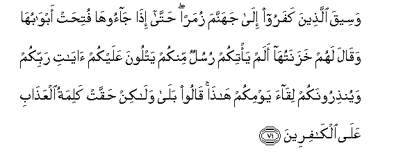
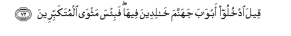
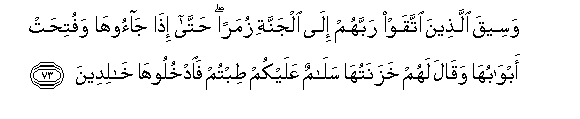
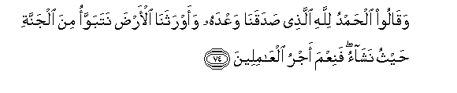
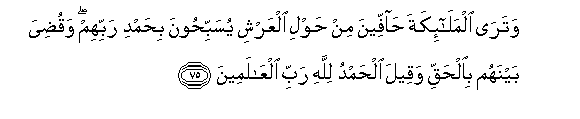

  
[Intangible Textual Heritage](../../index)  [Islam](../index) 
[Index](index)   
[Hypertext Qur'an](../htq/index)  [Unicode](../uq/039.htm#039_071) 
[Palmer](../sbe09/039)  [Pickthall](../pick/039.htm#039_071)  [Yusuf Ali
English](../yaq/yaq039)  [Rodwell](../qr/039)   
  
[Sūra XXXIX.: Zumar, or the Crowds. Index](039)  
  [Previous](03907)  [Next](04001) 

------------------------------------------------------------------------

  
*The Holy Quran*, tr. by Yusuf Ali, \[1934\], at Intangible Textual
Heritage

------------------------------------------------------------------------

# Sūra XXXIX.: Zumar, or the Crowds.

### Section 8

------------------------------------------------------------------------

71. Waseeqa alla<u>th</u>eena kafaroo il<u>a</u> jahannama zumaran
<u>h</u>att<u>a</u> i<u>tha</u> j<u>a</u>ooh<u>a</u> futi<u>h</u>at
abw<u>a</u>buh<u>a</u> waq<u>a</u>la lahum khazanatuh<u>a</u> alam
ya/tikum rusulun minkum yatloona AAalaykum <u>a</u>y<u>a</u>ti rabbikum
wayun<u>th</u>iroonakum liq<u>a</u>a yawmikum h<u>atha</u> q<u>a</u>loo
bal<u>a</u> wal<u>a</u>kin <u>h</u>aqqat kalimatu alAAa<u>tha</u>bi
AAal<u>a</u> alk<u>a</u>fireen**a**

71\. The Unbelievers will be  
Led to Hell in crowd:  
Until, when they arrive there,  
Its gates will be opened.  
And its Keepers will say,  
"Did not apostles come  
To you from among yourselves,  
Rehearsing to you the Signs  
Of your Lord, and warning you  
Of the Meeting of this Day  
Of yours?" The answer  
Will be: "True: but  
The Decree of Punishment  
Has been proved true  
Against the Unbelievers!"

------------------------------------------------------------------------

72. Qeela odkhuloo abw<u>a</u>ba jahannama kh<u>a</u>lideena
feeh<u>a</u> fabi/sa mathw<u>a</u> almutakabbireen**a**

72\. (To them) will be said:  
"Enter ye the gates of Hell,  
To dwell therein:  
And evil is (this)  
Abode of the arrogant!"

------------------------------------------------------------------------

73. Waseeqa alla<u>th</u>eena ittaqaw rabbahum il<u>a</u> aljannati
zumaran <u>h</u>att<u>a</u> i<u>tha</u> j<u>a</u>ooh<u>a</u>
wafuti<u>h</u>at abw<u>a</u>buh<u>a</u> waq<u>a</u>la lahum
khazanatuh<u>a</u> sal<u>a</u>mun AAalaykum <u>t</u>ibtum
fa**o**dkhulooh<u>a</u> kh<u>a</u>lideen**a**

73\. And those who feared  
Their Lord will be led  
To the Garden in crowds:  
Until behold, they arrive there;  
Its gates will be opened;  
And its Keepers will say:  
"Peace be upon you!  
Well have ye done!"  
Enter ye here,  
To dwell therein."

------------------------------------------------------------------------

74. Waq<u>a</u>loo al<u>h</u>amdu lill<u>a</u>hi alla<u>th</u>ee
<u>s</u>adaqan<u>a</u> waAAdahu waawrathan<u>a</u> al-ar<u>d</u>a
natabawwao mina aljannati <u>h</u>aythu nash<u>a</u>o faniAAma ajru
alAA<u>a</u>mileen**a**

74\. They will say: "Praise be  
To God, Who has  
Truly fulfilled His promise  
To us, and has given us  
(This) land in heritage:  
We can dwell in the Garden  
As we will: how excellent  
A reward for those  
Who work (righteousness)!"

------------------------------------------------------------------------

75. Watar<u>a</u> almal<u>a</u>-ikata <u>ha</u>ffeena min <u>h</u>awli
alAAarshi yusabbi<u>h</u>oona bi<u>h</u>amdi rabbihim waqu<u>d</u>iya
baynahum bi**a**l<u>h</u>aqqi waqeela al<u>h</u>amdu lill<u>a</u>hi
rabbi alAA<u>a</u>lameen**a**

75\. And thou wilt see  
The angels surrounding  
The Throne (Divine)  
On all sides, singing Glory  
And Praise to their Lord.  
The Decision between them  
(At Judgment) will be  
In (perfect) justice,  
And the cry (on all sides)  
Will be, "Praise be to God,  
The Lord of the Worlds!"

------------------------------------------------------------------------

[Next: Section 1 (1-9)](04001)

