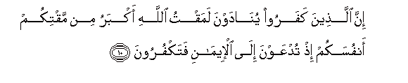
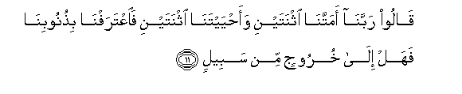
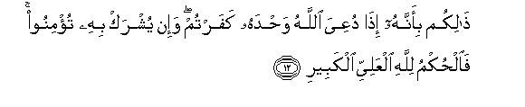
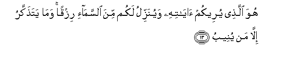
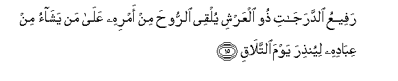
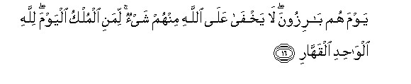
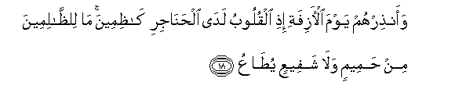

  
[Intangible Textual Heritage](../../index)  [Islam](../index) 
[Index](index)   
[Hypertext Qur'an](../htq/index)  [Unicode](../uq/040.htm#040_010) 
[Palmer](../sbe09/040)  [Pickthall](../pick/040.htm#040_010)  [Yusuf Ali
English](../yaq/yaq040)  [Rodwell](../qr/040)   
  
[Sūra XL.: Mū-min, or The Believer. Index](040)  
  [Previous](04001)  [Next](04003) 

------------------------------------------------------------------------

  
*The Holy Quran*, tr. by Yusuf Ali, \[1934\], at Intangible Textual
Heritage

------------------------------------------------------------------------

# Sūra XL.: Mū-min, or The Believer.

### Section 2

------------------------------------------------------------------------

10. Inna alla<u>th</u>eena kafaroo yun<u>a</u>dawna lamaqtu
All<u>a</u>hi akbaru min maqtikum anfusakum i<u>th</u> tudAAawna
il<u>a</u> al-eem<u>a</u>ni fatakfuroon**a**

10\. The Unbelievers will be  
Addressed: "Greater was  
The aversion of God to you  
Than (is), your aversion  
To yourselves, seeing that ye  
Were called to the Faith  
And ye used to refuse."

------------------------------------------------------------------------

11. Q<u>a</u>loo rabban<u>a</u> amattan<u>a</u> ithnatayni
waa<u>h</u>yaytan<u>a</u> ithnatayni fa**i**AAtarafn<u>a</u>
bi<u>th</u>unoobin<u>a</u> fahal il<u>a</u> khuroojin min sabeel**in**

11\. They will say: "Our Lord!  
Twice hast Thou made us  
Without life, and twice  
Hast Thou given us Life!  
Now have we recognised  
Our sins: is there  
Any way out (of this)?"

------------------------------------------------------------------------

12. <u>Tha</u>likum bi-annahu i<u>tha</u> duAAiya All<u>a</u>hu
wa<u>h</u>dahu kafartum wa-in yushrak bihi tu/minoo fa**a**l<u>h</u>ukmu
lill<u>a</u>hi alAAaliyyi alkabeer**i**

12\. (The answer will be:)  
"This is because, when  
God was invoked as  
The Only (object of worship),  
Ye did reject Faith,  
But when partners were  
Joined to Him, ye believed!  
The Command is with God,  
Most High, Most Great!"

------------------------------------------------------------------------

13. Huwa alla<u>th</u>ee yureekum <u>a</u>y<u>a</u>tihi wayunazzilu
lakum mina a**l**ssam<u>a</u>-i rizqan wam<u>a</u> yata<u>th</u>akkaru
ill<u>a</u> man yuneeb**u**

13\. He it is Who showeth  
You His Signs, and sendeth  
Down Sustenance for you  
From the sky: but only  
Those receive admonition  
Who turn (to God).

------------------------------------------------------------------------

14. Fa**o**dAAoo All<u>a</u>ha mukhli<u>s</u>eena lahu a**l**ddeena
walaw kariha alk<u>a</u>firoon**a**

14\. Call ye, then, upon God  
With sincere devotion to Him,  
Even though the Unbelievers  
May detest it.

------------------------------------------------------------------------

15. RafeeAAu a**l**ddaraj<u>a</u>ti <u>th</u>oo alAAarshi yulqee
a**l**rroo<u>h</u>a min amrihi AAal<u>a</u> man yash<u>a</u>o min
AAib<u>a</u>dihi liyun<u>th</u>ira yawma a**l**ttal<u>a</u>q**i**

15\. Raised high above ranks  
(Or degrees),  
(He is) the Lord  
Of the Throne (of authority):  
By His Command doth He  
Send the spirit (of inspiration)  
To any of His servants  
He pleases, that it may  
Warn (men) of the Day  
Of Mutual Meeting,—

------------------------------------------------------------------------

16. Yawma hum b<u>a</u>rizoona l<u>a</u> yakhf<u>a</u> AAal<u>a</u>
All<u>a</u>hi minhum shay-on limani almulku alyawma lill<u>a</u>hi
alw<u>ah</u>idi alqahh<u>a</u>r**i**

16\. The Day whereon  
They will (all) come forth:  
Not a single thing  
Concerning them is hidden  
From God. Whose will be  
The Dominion that Day?  
That of God, the One,  
The Irresistible!

------------------------------------------------------------------------

17. Alyawma tujz<u>a</u> kullu nafsin bim<u>a</u> kasabat l<u>a</u>
*<u>th</u>*ulma alyawma inna All<u>a</u>ha sareeAAu
al<u>h</u>is<u>a</u>b**i**

17\. That Day will every soul  
Be requited for what  
It earned; no injustice  
Will there be that Day,  
For God is Swift  
In taking account.

------------------------------------------------------------------------

18. Waan<u>th</u>irhum yawma al-<u>a</u>zifati i<u>th</u>i alquloobu
lad<u>a</u> al<u>h</u>an<u>a</u>jiri k<u>a</u>*<u>th</u>*imeena
m<u>a</u> li**l***<u>thth</u>*<u>a</u>limeena min <u>h</u>ameemin
wal<u>a</u> shafeeAAin yu<u>ta</u>AA**u**

18\. Warn them of the Day  
That is (ever) drawing near,  
When the Hearts will  
(Come) right up to the Throats  
To choke (them);  
No intimate friend  
Nor intercessor will the  
wrong-doers  
Have, who could be  
Listened to.

------------------------------------------------------------------------

19. YaAAlamu kh<u>a</u>-inata al-aAAyuni wam<u>a</u> tukhfee
a**l**<u>ss</u>udoor**u**

19\. (God) knows of (the tricks)  
That deceive with the eyes,  
And all that the hearts  
(Of men) conceal.

------------------------------------------------------------------------

20. Wa**A**ll<u>a</u>hu yaq<u>d</u>ee bi**a**l<u>h</u>aqqi
wa**a**lla<u>th</u>eena yadAAoona min doonihi l<u>a</u> yaq<u>d</u>oona
bishay-in inna All<u>a</u>ha huwa a**l**ssameeAAu alba<u>s</u>eer**u**

20\. And God will judge  
With (Justice and) Truth:  
But those whom (men)  
Invoke besides Him, will  
Not (be in a position)  
To judge at all.  
Verily it is God (alone)  
Who hears and sees  
(All things).

------------------------------------------------------------------------

[Next: Section 3 (21-27)](04003)

