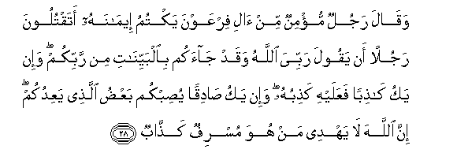
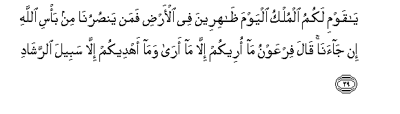
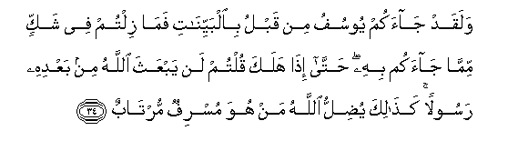

  
[Intangible Textual Heritage](../../index)  [Islam](../index.md) 
[Index](index.md)   
[Hypertext Qur'an](../htq/index)  [Unicode](../uq/040.htm#040_028.md) 
[Palmer](../sbe09/040)  [Pickthall](../pick/040.htm#040_028.md)  [Yusuf Ali
English](../yaq/yaq040)  [Rodwell](../qr/040.md)   
  
[Sūra XL.: Mū-min, or The Believer. Index](040.md)  
  [Previous](04003)  [Next](04005.md) 

------------------------------------------------------------------------

  
*The Holy Quran*, tr. by Yusuf Ali, \[1934\], at Intangible Textual
Heritage

------------------------------------------------------------------------

# Sūra XL.: Mū-min, or The Believer.

### Section 4

------------------------------------------------------------------------

28. Waq<u>a</u>la rajulun mu/minun min <u>a</u>li firAAawna yaktumu
eem<u>a</u>nahu ataqtuloona rajulan an yaqoola rabbiyya All<u>a</u>hu
waqad j<u>a</u>akum bi**a**lbayyin<u>a</u>ti min rabbikum wa-in yaku
k<u>ath</u>iban faAAalayhi ka<u>th</u>ibuhu wa-in yaku <u>sa</u>diqan
yu<u>s</u>ibkum baAA<u>d</u>u alla<u>th</u>ee yaAAidukum inna
All<u>a</u>ha l<u>a</u> yahdee man huwa musrifun ka<u>ththa</u>b**un**

28\. A Believer, a man  
From among the people  
Of Pharaoh, who had concealed  
His faith, said: "Will ye  
Slay a man because he  
Says, "My Lord is God"?—  
When he has indeed come  
To you with Clear (Signs)  
From your Lord? And if  
He be a liar, on him  
Is (the sin of) his lie;  
But, if he is telling  
The Truth, then will  
Fall on you something  
Of the (calamity) of which  
He warns you: truly  
God guides not one  
Who transgresses and lies!

------------------------------------------------------------------------

29. Y<u>a</u> qawmi lakumu almulku alyawma *<u>th</u>*<u>a</u>hireena
fee al-ar<u>d</u>i faman yan<u>s</u>urun<u>a</u> min ba/si All<u>a</u>hi
in j<u>a</u>an<u>a</u> q<u>a</u>la firAAawnu m<u>a</u> oreekum
ill<u>a</u> m<u>a</u> ar<u>a</u> wam<u>a</u> ahdeekum ill<u>a</u>
sabeela a**l**rrash<u>a</u>d**i**

29\. "O my People! yours  
Is the dominion this day:  
Ye have the upper hand  
In the land: but who  
Will help us from  
The Punishment of God,  
Should it befall us?"  
Pharaoh said: "I but  
Point out to you that  
Which I see (myself);  
Nor do I guide you  
But to the Path of Right!"

------------------------------------------------------------------------

30. Waq<u>a</u>la alla<u>th</u>ee <u>a</u>mana y<u>a</u> qawmi innee
akh<u>a</u>fu AAalaykum mithla yawmi al-a<u>h</u>z<u>a</u>b**i**

30\. Then said the man  
Who believed: "O my People!  
Truly I do fear  
For you something like  
The Day (of disaster)  
Of the Confederates (in sin)!—

------------------------------------------------------------------------

31. Mithla da/bi qawmi noo<u>h</u>in waAA<u>a</u>din wathamooda
wa**a**lla<u>th</u>eena min baAAdihim wam<u>a</u> All<u>a</u>hu yureedu
*<u>th</u>*ulman lilAAib<u>a</u>d**i**

31\. "Something like the fate  
Of the People of Noah,  
The ‘Ād, and the <u>Th</u>amūd,  
And those who came  
After them: but God  
Never wishes injustice  
To His Servants.

------------------------------------------------------------------------

32. Way<u>a</u> qawmi innee akh<u>a</u>fu AAalaykum yawma
a**l**ttan<u>a</u>d**i**

32\. "And O my People!  
I fear for you a Day  
When there will be  
Mutual calling (and wailing),—

------------------------------------------------------------------------

33. Yawma tuwalloona mudbireena m<u>a</u> lakum mina All<u>a</u>hi min
AA<u>as</u>imin waman yu<u>d</u>lili All<u>a</u>hu fam<u>a</u> lahu min
h<u>a</u>d**in**

33\. "A Day when ye  
Shall turn your backs  
And flee: no defender  
Shall ye have from God:  
Any whom God leaves  
To stray, there is none  
To guide…

------------------------------------------------------------------------

34. Walaqad j<u>a</u>akum yoosufu min qablu bi**a**lbayyin<u>a</u>ti
fam<u>a</u> ziltum fee shakkin mimm<u>a</u> j<u>a</u>akum bihi
<u>h</u>att<u>a</u> i<u>tha</u> halaka qultum lan yabAAatha
All<u>a</u>hu min baAAdihi rasoolan ka<u>tha</u>lika yu<u>d</u>illu
All<u>a</u>hu man huwa musrifun murt<u>a</u>b**un**

34\. "And to you there came  
Joseph in times gone by,  
With Clear Signs, but  
Ye ceased not to doubt  
Of the (mission) for which  
He had come: at length,  
When he died, ye said:  
"No apostle will God send  
After him." Thus doth God  
Leave to stray such as  
Transgress and live in doubt,—

------------------------------------------------------------------------

35. Alla<u>th</u>eena yuj<u>a</u>diloona fee <u>a</u>y<u>a</u>ti
All<u>a</u>hi bighayri sul<u>ta</u>nin at<u>a</u>hum kabura maqtan
AAinda All<u>a</u>hi waAAinda alla<u>th</u>eena <u>a</u>manoo
ka<u>tha</u>lika ya<u>t</u>baAAu All<u>a</u>hu AAal<u>a</u> kulli qalbi
mutakabbirin jabb<u>a</u>r**in**

35\. "(Such) as dispute about  
The Signs of God,  
Without any authority  
That hath reached them.  
Grievous and odious  
(Is such conduct)  
In the sight of God  
And of the Believers.  
Thus doth God seal up  
Every heart—of arrogant  
And obstinate transgressors."

------------------------------------------------------------------------

36. Waq<u>a</u>la firAAawnu y<u>a</u> h<u>a</u>m<u>a</u>nu ibni lee
<u>s</u>ar<u>h</u>an laAAallee ablughu al-asb<u>a</u>b**a**

36\. Pharaoh said: "O Hāmān!  
Build me a lofty palace,  
That I may attain  
The ways and means—

------------------------------------------------------------------------

37. Asb<u>a</u>ba a**l**ssam<u>a</u>w<u>a</u>ti faa<u>tt</u>aliAAa
il<u>a</u> il<u>a</u>hi moos<u>a</u> wa-innee laa*<u>th</u>*unnuhu
k<u>ath</u>iban waka<u>tha</u>lika zuyyina lifirAAawna soo-o AAamalihi
wa<u>s</u>udda AAani a**l**ssabeeli wam<u>a</u> kaydu firAAawna
ill<u>a</u> fee tab<u>a</u>b**in**

37\. "The ways and means  
Of (reaching) the heavens,  
And that I may mount up  
To the God of Moses:  
But as far as I am concerned,  
I think (Moses) is a liar!"  
Thus was made alluring,  
In Pharaoh's eyes,  
The evil of his deeds,  
And he was hindered  
From the Path; and the plot  
Of Pharaoh led to nothing  
But perdition (for him).

------------------------------------------------------------------------

[Next: Section 5 (37-50)](04005.md)

