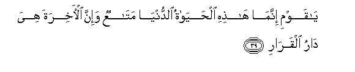
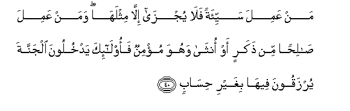
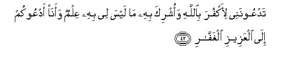
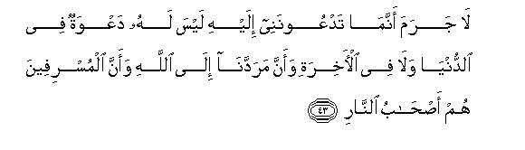
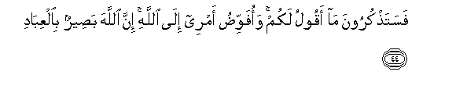
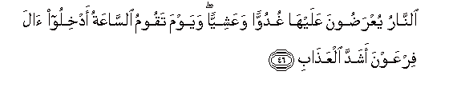
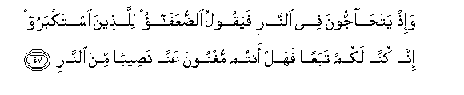
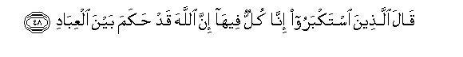
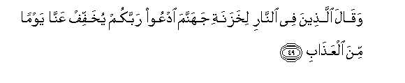
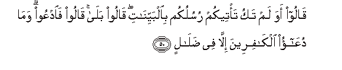

  
[Intangible Textual Heritage](../../index)  [Islam](../index.md) 
[Index](index.md)   
[Hypertext Qur'an](../htq/index)  [Unicode](../uq/040.htm#040_037.md) 
[Palmer](../sbe09/040)  [Pickthall](../pick/040.htm#040_037.md)  [Yusuf Ali
English](../yaq/yaq040)  [Rodwell](../qr/040.md)   
  
[Sūra XL.: Mū-min, or The Believer. Index](040.md)  
  [Previous](04004)  [Next](04006.md) 

------------------------------------------------------------------------

  
*The Holy Quran*, tr. by Yusuf Ali, \[1934\], at Intangible Textual
Heritage

------------------------------------------------------------------------

# Sūra XL.: Mū-min, or The Believer.

### Section 5

------------------------------------------------------------------------

38. Waq<u>a</u>la alla<u>th</u>ee <u>a</u>mana y<u>a</u> qawmi
ittabiAAooni ahdikum sabeela a**l**rrash<u>a</u>d**i**

38\. The man who believed said  
Further: "O my People!  
Follow me: I will lead  
You to the Path of Right.

------------------------------------------------------------------------

39. Y<u>a</u> qawmi innam<u>a</u> h<u>ath</u>ihi al<u>h</u>ay<u>a</u>tu
a**l**dduny<u>a</u> mat<u>a</u>AAun wa-inna al-<u>a</u>khirata hiya
d<u>a</u>ru alqar<u>a</u>r**i**

39\. "O my People! This life  
Of the present is nothing  
But (temporary) convenience:  
It is the Hereafter  
That is the Home  
That will last.

------------------------------------------------------------------------

40. Man AAamila sayyi-atan fal<u>a</u> yujz<u>a</u> ill<u>a</u>
mithlah<u>a</u> waman AAamila <u>sa</u>li<u>h</u>an min <u>th</u>akarin
aw onth<u>a</u> wahuwa mu/minun faol<u>a</u>-ika yadkhuloona aljannata
yurzaqoona feeh<u>a</u> bighayri <u>h</u>is<u>a</u>b**in**

40\. "He that works evil  
Will not be requited  
But by the like thereof:  
And he that works  
A righteous deed—whether  
Man or woman—and is  
A Believer—such will enter  
The Garden (of Bliss): therein  
Will they have abundance  
Without measure.

------------------------------------------------------------------------

41. Way<u>a</u> qawmi m<u>a</u>lee adAAookum il<u>a</u>
a**l**nnaj<u>a</u>ti watadAAoonanee il<u>a</u> a**l**nn<u>a</u>r**i**

41\. "And O my People!  
How (strange) it is  
For me to call you  
To Salvation while ye  
Call me to the Fire!

------------------------------------------------------------------------

42. TadAAoonanee li-akfura bi**A**ll<u>a</u>hi waoshrika bihi m<u>a</u>
laysa lee bihi AAilmun waan<u>a</u> adAAookum il<u>a</u> alAAazeezi
alghaff<u>a</u>r**i**

42\. "Ye do call upon me  
To blaspheme against God,  
And to join with Him  
Partners of whom I have  
No knowledge; and I  
Call you to the Exalted  
In Power, Who forgives  
Again and again!"

------------------------------------------------------------------------

43. L<u>a</u> jarama annam<u>a</u> tadAAoonanee ilayhi laysa lahu
daAAwatun fee a**l**dduny<u>a</u> wal<u>a</u> fee al-<u>a</u>khirati
waanna maraddan<u>a</u> il<u>a</u> All<u>a</u>hi waanna almusrifeena hum
a<u>s</u>-<u>ha</u>bu a**l**nn<u>a</u>r**i**

43\. "Without doubt ye do call  
Me to one who is not  
Fit to be called to,  
Whether in this world,  
Or in the Hereafter;  
Our Return will be  
To God; and the Transgressors  
Will be Companions  
Of the Fire!

------------------------------------------------------------------------

44. Fasata<u>th</u>kuroona m<u>a</u> aqoolu lakum waofawwi<u>d</u>u
amree il<u>a</u> All<u>a</u>hi inna All<u>a</u>ha ba<u>s</u>eerun
bi**a**lAAib<u>a</u>d**i**

44\. "Soon will ye remember  
What I say to you (now).  
My (own) affair I commit  
To God: for God (ever)  
Watches over His Servants."

------------------------------------------------------------------------

45. Fawaq<u>a</u>hu All<u>a</u>hu sayyi-<u>a</u>ti m<u>a</u> makaroo
wa<u>ha</u>qa bi-<u>a</u>li firAAawna soo-o alAAa<u>tha</u>b**i**

45\. Then God saved him  
From (every) ill that they  
Plotted (against him),  
But the brunt of the Penalty  
Encompassed on all sides  
The People of Pharaoh.

------------------------------------------------------------------------

46. A**l**nn<u>a</u>ru yuAAra<u>d</u>oona AAalayh<u>a</u> ghuduwwan
waAAashiyyan wayawma taqoomu a**l**ss<u>a</u>AAatu adkhiloo <u>a</u>la
firAAawna ashadda alAAa<u>tha</u>b**i**

46\. In front of the Fire  
Will they be brought,  
Morning and evening:  
And (the Sentence will be)  
On the Day that  
Judgment will be established:  
"Cast ye the People  
Of Pharaoh into  
The severest Penalty!"

------------------------------------------------------------------------

47. Wa-i<u>th</u> yata<u>ha</u>jjoona fee a**l**nn<u>a</u>ri fayaqoolu
a**l**<u>dd</u>uAAaf<u>a</u>o lilla<u>th</u>eena istakbaroo inn<u>a</u>
kunn<u>a</u> lakum tabaAAan fahal antum mughnoona AAann<u>a</u>
na<u>s</u>eeban mina a**l**nn<u>a</u>r**i**

47\. Behold, they will dispute  
With each other in the Fire!  
The weak ones (who followed)  
Will say to those who  
Had been arrogant, "We but  
Followed you: can ye then  
Take (on yourselves) from us  
Some share of the Fire?"

------------------------------------------------------------------------

48. Q<u>a</u>la alla<u>th</u>eena istakbaroo inn<u>a</u> kullun
feeh<u>a</u> inna All<u>a</u>ha qad <u>h</u>akama bayna
alAAib<u>a</u>d**i**

48\. Those who had been arrogant  
Will say: "We are all  
In this (Fire)! Truly,  
God has judged  
Between (His) Servants!"

------------------------------------------------------------------------

49. Waq<u>a</u>la alla<u>th</u>eena fee a**l**nn<u>a</u>ri likhazanati
jahannama odAAoo rabbakum yukhaffif AAann<u>a</u> yawman mina
alAAa<u>tha</u>b**i**

49\. Those in the Fire will say  
To the Keepers of Hell:  
"Pray to your Lord  
To lighten us the Penalty  
For a Day (at least)!"

------------------------------------------------------------------------

50. Q<u>a</u>loo awa lam taku ta/teekum rusulukum
bi**a**lbayyin<u>a</u>ti q<u>a</u>loo bal<u>a</u> q<u>a</u>loo
fa**o**dAAoo wam<u>a</u> duAA<u>a</u>o alk<u>a</u>fireena ill<u>a</u>
fee <u>d</u>al<u>a</u>l**in**

50\. They will say: "Did there  
Not come to you  
Your apostles with Clear Signs?"  
They will say, "Yes".  
They will reply, "Then  
Pray (as ye like)! But  
The Prayer of those  
Without Faith is nothing  
But (futile wandering)  
In (mazes of) error!"

------------------------------------------------------------------------

[Next: Section 6 (51-60)](04006.md)

