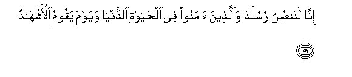
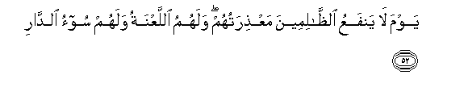
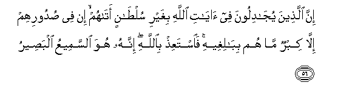
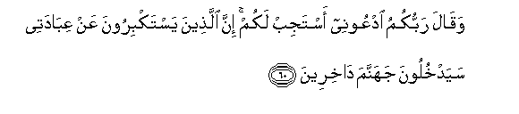

  
[Intangible Textual Heritage](../../index)  [Islam](../index.md) 
[Index](index.md)   
[Hypertext Qur'an](../htq/index)  [Unicode](../uq/040.htm#040_051.md) 
[Palmer](../sbe09/040)  [Pickthall](../pick/040.htm#040_051.md)  [Yusuf Ali
English](../yaq/yaq040)  [Rodwell](../qr/040.md)   
  
[Sūra XL.: Mū-min, or The Believer. Index](040.md)  
  [Previous](04005)  [Next](04007.md) 

------------------------------------------------------------------------

  
*The Holy Quran*, tr. by Yusuf Ali, \[1934\], at Intangible Textual
Heritage

------------------------------------------------------------------------

# Sūra XL.: Mū-min, or The Believer.

### Section 6

------------------------------------------------------------------------

51. Inn<u>a</u> lanan<u>s</u>uru rusulan<u>a</u> wa**a**lla<u>th</u>eena
<u>a</u>manoo fee al<u>h</u>ay<u>a</u>ti a**l**dduny<u>a</u> wayawma
yaqoomu al-ashh<u>a</u>d**u**

51\. We will, without doubt,  
Help Our apostles and those  
Who believe, (both)  
In this world's life  
And on the Day  
When the Witnesses  
Will stand forth,—

------------------------------------------------------------------------

52. Yawma l<u>a</u> yanfaAAu a**l***<u>thth</u>*<u>a</u>limeena
maAA<u>th</u>iratuhum walahumu allaAAnatu walahum soo-o
a**l**dd<u>a</u>r**i**

52\. The Day when no profit  
Will it be to Wrong-doers  
To present their excuses,  
But they will (only) have  
The Curse and the Home  
Of Misery.

------------------------------------------------------------------------

53. Walaqad <u>a</u>tayn<u>a</u> moos<u>a</u> alhud<u>a</u>
waawrathn<u>a</u> banee isr<u>a</u>-eela alkit<u>a</u>b**a**

53\. We did aforetime give Moses  
The (Book of) Guidance,  
And We gave the Book  
In inheritance to the Children  
Of Israel,—

------------------------------------------------------------------------

54. Hudan wa<u>th</u>ikr<u>a</u> li-olee al-alb<u>a</u>b**i**

54\. A Guide and a Message  
To men of understanding.

------------------------------------------------------------------------

55. Fa**i**<u>s</u>bir inna waAAda All<u>a</u>hi <u>h</u>aqqun
wa**i**staghfir li<u>th</u>anbika wasabbi<u>h</u> bi<u>h</u>amdi rabbika
bi**a**lAAashiyyi wa**a**l-ibk<u>a</u>r**i**

55\. Patiently, then, persevere:  
For the Promise of God  
Is true: and ask forgiveness  
For thy fault, and celebrate  
The Praises of thy Lord  
In the evening  
And in the morning.

------------------------------------------------------------------------

56. Inna alla<u>th</u>eena yuj<u>a</u>diloona fee <u>a</u>y<u>a</u>ti
All<u>a</u>hi bighayri sul<u>ta</u>nin at<u>a</u>hum in fee
<u>s</u>udoorihim ill<u>a</u> kibrun m<u>a</u> hum bib<u>a</u>ligheehi
fa**i**staAAi<u>th</u> bi**A**ll<u>a</u>hi innahu huwa a**l**ssameeAAu
alba<u>s</u>eer**u**

56\. Those who dispute  
About the Signs of God  
Without any authority  
Bestowed on them,—there is  
Nothing in their breasts  
But (the quest of) greatness,  
Which they shall never  
Attain to: seek refuge,  
Then, in God: it is He  
Who hears and sees (all things).

------------------------------------------------------------------------

57. Lakhalqu a**l**ssam<u>a</u>w<u>a</u>ti wa**a**l-ar<u>d</u>i akbaru
min khalqi a**l**nn<u>a</u>si wal<u>a</u>kinna akthara
a**l**nn<u>a</u>si l<u>a</u> yaAAlamoon**a**

57\. Assuredly the creation  
Of the heavens  
And the earth  
Is a greater (matter)  
Than the creation of men:  
Yet most men understand not.

------------------------------------------------------------------------

58. Wam<u>a</u> yastawee al-aAAm<u>a</u> wa**a**lba<u>s</u>eeru
wa**a**lla<u>th</u>eena <u>a</u>manoo waAAamiloo
a**l**<u>ssa</u>li<u>ha</u>ti wal<u>a</u> almusee-o qaleelan m<u>a</u>
tata<u>th</u>akkaroon**a**

58\. Not equal are the blind  
And those who (clearly) see:  
Nor are (equal) those  
Who believe and work  
Deeds of righteousness, and  
Those who do evil.  
Little do ye learn  
By admonition!

------------------------------------------------------------------------

59. Inna a**l**ss<u>a</u>AAata la<u>a</u>tiyatun l<u>a</u> rayba
feeh<u>a</u> wal<u>a</u>kinna akthara a**l**nn<u>a</u>si l<u>a</u>
yu/minoon**a**

59\. The Hour will certainly come:  
Therein is no doubt:  
Yet most men believe not.

------------------------------------------------------------------------

60. Waq<u>a</u>la rabbukumu odAAoonee astajib lakum inna
alla<u>th</u>eena yastakbiroona AAan AAib<u>a</u>datee sayadkhuloona
jahannama d<u>a</u>khireen**a**

60\. And your Lord says:  
"Call on Me; I  
Will answer your (Prayer):  
But those who are  
Too arrogant to serve Me  
Will surely find themselves  
In Hell—in humiliation!"

------------------------------------------------------------------------

[Next: Section 7 (61-68)](04007.md)

