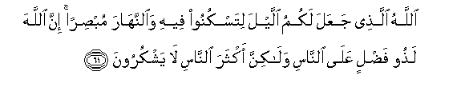
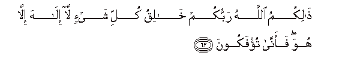
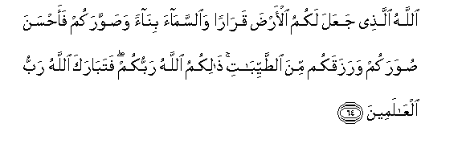
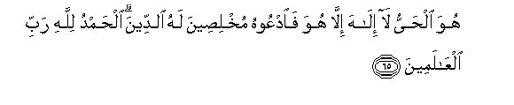
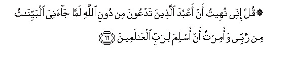
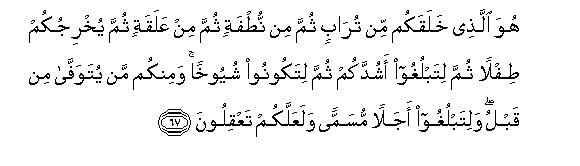
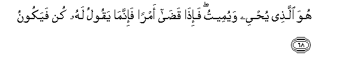

  
[Intangible Textual Heritage](../../index)  [Islam](../index) 
[Index](index)   
[Hypertext Qur'an](../htq/index)  [Unicode](../uq/040.htm#040_061) 
[Palmer](../sbe09/040)  [Pickthall](../pick/040.htm#040_061)  [Yusuf Ali
English](../yaq/yaq040)  [Rodwell](../qr/040)   
  
[Sūra XL.: Mū-min, or The Believer. Index](040)  
  [Previous](04006)  [Next](04008) 

------------------------------------------------------------------------

  
*The Holy Quran*, tr. by Yusuf Ali, \[1934\], at Intangible Textual
Heritage

------------------------------------------------------------------------

# Sūra XL.: Mū-min, or The Believer.

### Section 7

------------------------------------------------------------------------

61. All<u>a</u>hu alla<u>th</u>ee jaAAala lakumu allayla litaskunoo
feehi wa**al**nnah<u>a</u>ra mub<u>s</u>iran inna All<u>a</u>ha
la<u>th</u>oo fa<u>d</u>lin AAal<u>a</u> a**l**nn<u>a</u>si
wal<u>a</u>kinna akthara a**l**nn<u>a</u>si l<u>a</u> yashkuroon**a**

61\. It is God Who has  
Made the Night for you,  
That ye may rest therein,  
And the Day, as that  
Which helps (you) to see.  
Verily God is Full of  
Grace and Bounty to men:  
Yet most men give  
No thanks.

------------------------------------------------------------------------

62. <u>Tha</u>likumu All<u>a</u>hu rabbukum kh<u>a</u>liqu kulli shay-in
l<u>a</u> il<u>a</u>ha ill<u>a</u> huwa faann<u>a</u> tu/fakoon**a**

62\. Such is God, your Lord,  
The Creator of all things.  
There is no god but He:  
Then how ye are delude  
Away from the Truth!

------------------------------------------------------------------------

63. Ka<u>tha</u>lika yu/faku alla<u>th</u>eena k<u>a</u>noo
bi-<u>a</u>y<u>a</u>ti All<u>a</u>hi yaj<u>h</u>adoon**a**

63\. Thus are deluded those  
Who are wont to reject  
The Signs of God.

------------------------------------------------------------------------

64. All<u>a</u>hu alla<u>th</u>ee jaAAala lakumu al-ar<u>d</u>a
qar<u>a</u>ran wa**al**ssam<u>a</u>a bin<u>a</u>an wa<u>s</u>awwarakum
faa<u>h</u>sana <u>s</u>uwarakum warazaqakum mina
a**l**<u>tt</u>ayyib<u>a</u>ti <u>tha</u>likumu All<u>a</u>hu rabbukum
fatab<u>a</u>raka All<u>a</u>hu rabbu alAA<u>a</u>lameen**a**

64\. It is God Who has  
Made for you the earth  
As a resting place,  
And the sky as a canopy,  
And has given you shape—  
And made your shapes  
Beautiful,—and has provided  
For you Sustenance,  
Of things pure and good;—  
Such is God your Lord.  
So Glory to God,  
The Lord of the Worlds!

------------------------------------------------------------------------

65. Huwa al<u>h</u>ayyu l<u>a</u> il<u>a</u>ha ill<u>a</u> huwa
fa**o**dAAoohu mukhli<u>s</u>eena lahu a**l**ddeena al<u>h</u>amdu
lill<u>a</u>hi rabbi alAA<u>a</u>lameen**a**

65\. He is the Living (One):  
There is no god but He:  
Call upon Him, giving Him  
Sincere devotion. Praise he  
To God, Lord of the Worlds!

------------------------------------------------------------------------

66. Qul innee nuheetu an aAAbuda alla<u>th</u>eena tadAAoona min dooni
All<u>a</u>hi lamm<u>a</u> j<u>a</u>aniya albayyin<u>a</u>tu min rabbee
waomirtu an oslima lirabbi alAA<u>a</u>lameen**a**

66\. Say: "I have been forbidden  
To invoke those whom ye  
Invoke besides God,—seeing that  
The Clear Signs have come  
To me from my Lord;  
And I have been commanded  
To bow (in Islām)  
To the Lord of the Worlds."

------------------------------------------------------------------------

67. Huwa alla<u>th</u>ee khalaqakum min tur<u>a</u>bin thumma min
nu<u>t</u>fatin thumma min AAalaqatin thumma yukhrijukum <u>t</u>iflan
thumma litablughoo ashuddakum thumma litakoonoo shuyookhan waminkum man
yutawaff<u>a</u> min qablu walitablughoo ajalan musamman walaAAallakum
taAAqiloon**a**

67\. It is He Who has  
Created you from dust,  
Then from a sperm-drop,  
Then from a leech-like clot;  
Then does He get you  
Out (into the light)  
As a child: then lets you  
(Grow and) reach your age  
Of full strength; then  
Lets you become old,—  
Though of you there are  
Some who die before;—  
And lets you reach  
A Term appointed;  
In order that ye  
May learn wisdom.

------------------------------------------------------------------------

68. Huwa alla<u>th</u>ee yu<u>h</u>yee wayumeetu fa-i<u>tha</u>
qa<u>da</u> amran fa-innam<u>a</u> yaqoolu lahu kun fayakoon**u**

68\. It is He Who gives Life  
And Death; and when He  
Decides upon an affair,  
He says to it, "Be",  
And it is.

------------------------------------------------------------------------

[Next: Section 8 (69-78)](04008)

