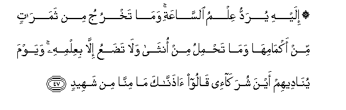
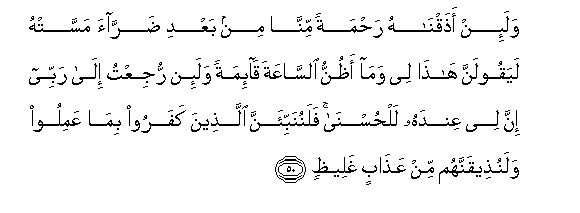
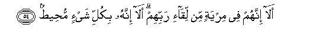

  
[Intangible Textual Heritage](../../index)  [Islam](../index) 
[Index](index)   
[Hypertext Qur'an](../htq/index)  [Unicode](../uq/041.htm#041_045) 
[Palmer](../sbe09/041)  [Pickthall](../pick/041.htm#041_045)  [Yusuf Ali
English](../yaq/yaq041)  [Rodwell](../qr/041)   
  
[Sūra XLI.: Ḥā-mīm (Abbreviated Letters), or Ḥā-Mīm Sajda, or Fuṣṣilat
Index](041)  
  [Previous](04105)  [Next](04201) 

------------------------------------------------------------------------

  
*The Holy Quran*, tr. by Yusuf Ali, \[1934\], at Intangible Textual
Heritage

------------------------------------------------------------------------

# Sūra XLI.: Ḥā-mīm (Abbreviated Letters), or Ḥā-Mīm Sajda, or Fuṣṣilat

### Section 6

------------------------------------------------------------------------

45. Walaqad <u>a</u>tayn<u>a</u> moos<u>a</u> alkit<u>a</u>ba
fa**i**khtulifa feehi walawl<u>a</u> kalimatun sabaqat min rabbika
laqu<u>d</u>iya baynahum wa-innahum lafee shakkin minhu mureeb**in**

45\. We certainly gave Moses  
The Book aforetime: but disputes  
Arose therein. Had it not  
Been for a Word  
That went forth before  
From thy Lord, (their differences)  
Would have been settled  
Between them: but they  
Remained in suspicious  
Disquieting doubt thereon.

------------------------------------------------------------------------

46. Man AAamila <u>sa</u>li<u>h</u>an falinafsihi waman as<u>a</u>a
faAAalayh<u>a</u> wam<u>a</u> rabbuka bi*<u>th</u>*all<u>a</u>min
lilAAabeed**i**

46\. Whoever works righteousness  
Benefits his own soul;  
Whoever works evil, it is  
Against his own soul:  
Nor is thy Lord ever  
Unjust (in the least)  
To His servants.

------------------------------------------------------------------------

47. Ilayhi yuraddu AAilmu a**l**ss<u>a</u>AAati wam<u>a</u> takhruju min
thamar<u>a</u>tin min akm<u>a</u>mih<u>a</u> wam<u>a</u> ta<u>h</u>milu
min onth<u>a</u> wal<u>a</u> ta<u>d</u>aAAu ill<u>a</u> biAAilmihi
wayawma yun<u>a</u>deehim ayna shurak<u>a</u>-ee q<u>a</u>loo
<u>ath</u>ann<u>a</u>ka m<u>a</u> minn<u>a</u> min shaheed**in**

47\. To Him is referred  
The Knowledge of the Hour  
(Of Judgment: He knows all):  
No date-fruit comes out  
Of its sheath, nor does  
A female conceive (within  
Her womb) nor bring forth  
(Young), but by His Knowledge.  
The Day that (God) will propound  
To them the (question),  
"Where are the Partners  
(Ye attributed) to Me?"  
They will say, "We do  
Assure Thee not one  
Of us can bear witness!"

------------------------------------------------------------------------

48. Wa<u>d</u>alla AAanhum m<u>a</u> k<u>a</u>noo yadAAoona min qablu
wa*<u>th</u>*annoo m<u>a</u> lahum min ma<u>h</u>ee<u>s</u>**in**

48\. The (deities) they used to invoke  
Aforetime will leave them  
In the lurch, and they  
Will perceive that they  
Have no way of escape.

------------------------------------------------------------------------

49. L<u>a</u> yas-amu al-ins<u>a</u>nu min duAA<u>a</u>-i alkhayri wa-in
massahu a**l**shsharru fayaoosun qanoo<u>t</u>**un**

49\. Man does not weary  
Of asking for good (things),  
But if ill touches him,  
He gives up all hope  
(And) is lost in despair.

------------------------------------------------------------------------

50. Wala-in a<u>th</u>aqn<u>a</u>hu ra<u>h</u>matan minn<u>a</u> min
baAAdi <u>d</u>arr<u>a</u>a massat-hu layaqoolanna h<u>atha</u> lee
wam<u>a</u> a*<u>th</u>*unnu a**l**ss<u>a</u>AAata q<u>a</u>-imatan
wala-in rujiAAtu il<u>a</u> rabbee inna lee AAindahu
lal<u>h</u>usn<u>a</u> falanunabbi-anna alla<u>th</u>eena kafaroo
bim<u>a</u> AAamiloo walanu<u>th</u>eeqannahum min AAa<u>tha</u>bin
ghalee*<u>th</u>***in**

50\. When We give him a taste  
Of some mercy from Ourselves.  
After some adversity has  
Touched him, he is sure  
To say, "This is due  
To my (merit): I think not  
That the Hour (of Judgment)  
Will (ever) be established;  
But if I am brought back  
To my Lord, I have  
(Much) good (stored) in His sight!"  
But We will show  
The Unbelievers the truth  
Of all that they did,  
And We shall give them  
The taste of a severe  
Penalty.

------------------------------------------------------------------------

51. Wa-i<u>tha</u> anAAamn<u>a</u> AAal<u>a</u> al-ins<u>a</u>ni
aAAra<u>d</u>a wana<u>a</u> bij<u>a</u>nibihi wa-i<u>tha</u> massahu
a**l**shsharru fa<u>th</u>oo duAA<u>a</u>-in AAaree<u>d</u>**in**

51\. When We bestow favours  
On man, he turns away,  
And gets himself remote  
On his side (instead of'  
Coming to Us); and when  
Evil seizes him, (he comes)  
Full of prolonged prayer!

------------------------------------------------------------------------

52. Qul araaytum in k<u>a</u>na min AAindi All<u>a</u>hi thumma kafartum
bihi man a<u>d</u>allu mimman huwa fee shiq<u>a</u>qin baAAeed**in**

52\. Say: "See ye if  
The (Revelation) is (really)  
From God, and yet do ye  
Reject it? Who is more  
Astray than one who  
Is in a schism  
Far (from any purpose)?"

------------------------------------------------------------------------

53. Sanureehim <u>a</u>y<u>a</u>tin<u>a</u> fee al-<u>a</u>f<u>a</u>qi
wafee anfusihim <u>h</u>att<u>a</u> yatabayyana lahum annahu
al<u>h</u>aqqu awa lam yakfi birabbika annahu AAal<u>a</u> kulli shay-in
shaheed**un**

53\. Soon will We show them  
Our Signs in the (furthest)  
Regions (of the earth), and  
In their own souls, until  
It becomes manifest to them  
That this is the Truth.  
Is it not enough that  
Thy Lord doth witness  
All things?

------------------------------------------------------------------------

54. Al<u>a</u> innahum fee miryatin min liq<u>a</u>-i rabbihim
al<u>a</u> innahu bikulli shay-in mu<u>h</u>ee<u>t</u>**un**

54\. Ah indeed! are they  
In doubt concerning  
The Meeting with their Lord?  
Ah indeed! it is He  
That doth encompass  
All things!

------------------------------------------------------------------------

[Next: Section 1 (1-9)](04201)

