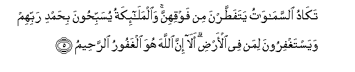
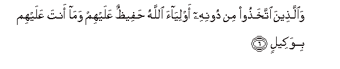
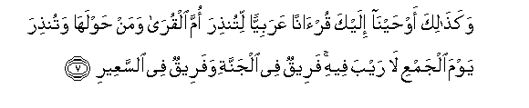
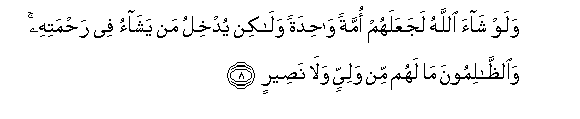
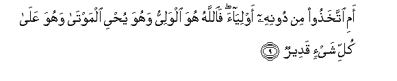

  
[Intangible Textual Heritage](../../index)  [Islam](../index) 
[Index](index)   
[Hypertext Qur'an](../htq/index)  [Unicode](../uq/042.htm#042_001) 
[Palmer](../sbe09/042)  [Pickthall](../pick/042.htm#042_001)  [Yusuf Ali
English](../yaq/yaq042)  [Rodwell](../qr/042)   
  
[Sūra XLII.: Shūrā, or Consultation. Index](042)  
  [Previous](04106)  [Next](04202) 

------------------------------------------------------------------------

  
*The Holy Quran*, tr. by Yusuf Ali, \[1934\], at Intangible Textual
Heritage

------------------------------------------------------------------------

# Sūra XLII.: Shūrā, or Consultation.

### Section 1

1. <u>Ha</u>-meem

1\. Hā-Mīm;

------------------------------------------------------------------------

2. AAayn-seen-q<u>a</u>f

2\. ‘Ain. Sīn. Kāf.

------------------------------------------------------------------------

3. Ka<u>tha</u>lika yoo<u>h</u>ee ilayka wa-il<u>a</u> alla<u>th</u>eena
min qablika All<u>a</u>hu alAAazeezu al<u>h</u>akeem**u**

3\. Thus doth (He) send  
Inspiration to thee  
As (He did) to those before thee,—  
God, Exalted in Power,  
Full of Wisdom.

------------------------------------------------------------------------

4. Lahu m<u>a</u> fee a**l**ssam<u>a</u>w<u>a</u>ti wam<u>a</u> fee
al-ar<u>d</u>i wahuwa alAAaliyyu alAAa*<u>th</u>*eem**u**

4\. To Him belongs all  
That is in the heavens  
And on earth: and He  
Is Most High, Most Great.

------------------------------------------------------------------------

5. Tak<u>a</u>du a**l**ssam<u>a</u>w<u>a</u>tu yatafa<u>tt</u>arna min
fawqihinna wa**a**lmal<u>a</u>-ikatu yusabbi<u>h</u>oona bi<u>h</u>amdi
rabbihim wayastaghfiroona liman fee al-ar<u>d</u>i al<u>a</u> inna
All<u>a</u>ha huwa alghafooru a**l**rra<u>h</u>eem**u**

5\. The heavens are almost  
Rent asunder from above them  
(By His Glory):  
And the angels celebrate  
The Praises of their Lord,  
And pray for forgiveness  
For (all) beings on earth:  
Behold! Verily God is He,  
The Oft-Forgiving,  
Most Merciful.

------------------------------------------------------------------------

6. Wa**a**lla<u>th</u>eena ittakha<u>th</u>oo min doonihi awliy<u>a</u>a
All<u>a</u>hu <u>h</u>afee*<u>th</u>*un AAalayhim wam<u>a</u> anta
AAalayhim biwakeel**in**

6\. And those who take  
As protectors others besides  
Him,—  
God doth watch over them;  
And thou art not  
The disposer of their affairs.

------------------------------------------------------------------------

7. Waka<u>tha</u>lika aw<u>h</u>ayn<u>a</u> ilayka qur-<u>a</u>nan
AAarabiyyan litun<u>th</u>ira omma alqur<u>a</u> waman
<u>h</u>awlah<u>a</u> watun<u>th</u>ira yawma aljamAAi l<u>a</u> rayba
feehi fareequn fee aljannati wafareequn fee a**l**ssaAAeer**i**

7\. Thus have We sent  
By inspiration to thee  
An Arabic Qur-ān:  
That thou mayest warn  
The Mother of Cities  
And all around her,—  
And warn (them) of  
The Day of Assembly,  
Of which there is no doubt:  
(When) some will be  
In the Garden, and some  
In the Blazing Fire.

------------------------------------------------------------------------

8. Walaw sh<u>a</u>a All<u>a</u>hu lajaAAalahum ommatan w<u>ah</u>idatan
wal<u>a</u>kin yudkhilu man yash<u>a</u>o fee ra<u>h</u>matihi
wa**al***<u>thth</u>*<u>a</u>limoona m<u>a</u> lahum min waliyyin
wal<u>a</u> na<u>s</u>eer**in**

8\. If God had so willed,  
He could have made them  
A single people; but He  
Admits whom He will  
To His Mercy;  
And the wrong-doers  
Will have no protector  
Nor helper.

------------------------------------------------------------------------

9. Ami ittakha<u>th</u>oo min doonihi awliy<u>a</u>a fa**A**ll<u>a</u>hu
huwa alwaliyyu wahuwa yu<u>h</u>yee almawt<u>a</u> wahuwa AAal<u>a</u>
kulli shay-in qadeer**un**

9\. What! Have they taken  
(For worship) protectors  
Besides Him? But it is  
God,—He is the Protector,  
And it is He Who  
Gives life to the dead:  
It is He Who has power  
Over all things.

------------------------------------------------------------------------

[Next: Section 2 (10-19)](04202)

