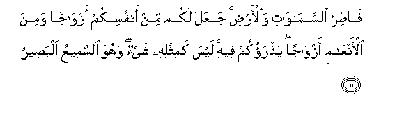
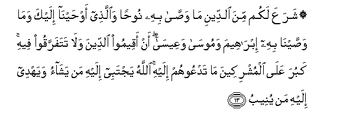
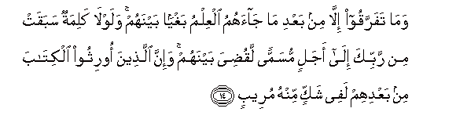
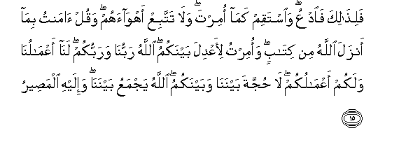

  
[Intangible Textual Heritage](../../index)  [Islam](../index.md) 
[Index](index.md)   
[Hypertext Qur'an](../htq/index)  [Unicode](../uq/042.htm#042_010.md) 
[Palmer](../sbe09/042)  [Pickthall](../pick/042.htm#042_010.md)  [Yusuf Ali
English](../yaq/yaq042)  [Rodwell](../qr/042.md)   
  
[Sūra XLII.: Shūrā, or Consultation. Index](042.md)  
  [Previous](04201)  [Next](04203.md) 

------------------------------------------------------------------------

  
*The Holy Quran*, tr. by Yusuf Ali, \[1934\], at Intangible Textual
Heritage

------------------------------------------------------------------------

# Sūra XLII.: Shūrā, or Consultation.

### Section 2

------------------------------------------------------------------------

10. Wam<u>a</u> ikhtalaftum feehi min shay-in fa<u>h</u>ukmuhu
il<u>a</u> All<u>a</u>hi <u>tha</u>likumu All<u>a</u>hu rabbee AAalayhi
tawakkaltu wa-ilayhi oneeb**u**

10\. Whatever it be wherein  
Ye differ, the decision  
Thereof is with God:  
Such is God my Lord:  
In Him I trust,  
And to Him I turn.

------------------------------------------------------------------------

11. F<u>at</u>iru a**l**ssam<u>a</u>w<u>a</u>ti wa**a**l-ar<u>d</u>i
jaAAala lakum min anfusikum azw<u>a</u>jan wamina al-anAA<u>a</u>mi
azw<u>a</u>jan ya<u>th</u>raokum feehi laysa kamithlihi shay-on wahuwa
a**l**ssameeAAu alba<u>s</u>eer**u**

11\. (He is) the Creator  
Of the heavens and  
The earth: He has made  
For you pairs  
From among yourselves,  
And pairs among cattle:  
By this means does He  
Multiply you: there is nothing  
Whatever like unto Him,  
And He is the One  
That hears and sees (all things).

------------------------------------------------------------------------

12. Lahu maq<u>a</u>leedu a**l**ssam<u>a</u>w<u>a</u>ti
wa**a**l-ar<u>d</u>i yabsu<u>t</u>u a**l**rrizqa liman yash<u>a</u>o
wayaqdiru innahu bikulli shay-in AAaleem**un**

12\. To Him belong the keys  
Of the heavens and the earth:  
He enlarges and restricts.  
The Sustenance to whom  
He will: for He knows  
Full well all things.

------------------------------------------------------------------------

13. SharaAAa lakum mina a**l**ddeeni m<u>a</u> wa<u>ssa</u> bihi
noo<u>h</u>an wa**a**lla<u>th</u>ee aw<u>h</u>ayn<u>a</u> ilayka
wam<u>a</u> wa<u>ss</u>ayn<u>a</u> bihi ibr<u>a</u>heema wamoos<u>a</u>
waAAees<u>a</u> an aqeemoo a**l**ddeena wal<u>a</u> tatafarraqoo feehi
kabura AAal<u>a</u> almushrikeena m<u>a</u> tadAAoohum ilayhi
All<u>a</u>hu yajtabee ilayhi man yash<u>a</u>o wayahdee ilayhi man
yuneeb**u**

13\. The same religion has He  
Established for you as that  
Which He enjoined on Noah—  
The which We have sent  
By inspiration to thee—  
And that which We enjoined  
On Abraham, Moses, and Jesus:  
Namely, that ye should remain  
Steadfast in Religion, and make  
No divisions therein:  
To those who worship  
Other things than God,  
Hard is the (way)  
To which thou callest them,  
God chooses to Himself  
Those whom He pleases,  
And guides to Himself  
Those who turn (to Him).

------------------------------------------------------------------------

14. Wam<u>a</u> tafarraqoo ill<u>a</u> min baAAdi m<u>a</u>
j<u>a</u>ahumu alAAilmu baghyan baynahum walawl<u>a</u> kalimatun
sabaqat min rabbika il<u>a</u> ajalin musamman laqu<u>d</u>iya baynahum
wa-inna alla<u>th</u>eena oorithoo alkit<u>a</u>ba min baAAdihim lafee
shakkin minhu mureeb**in**

14\. And they became divided  
Only after knowledge  
Reached them,—through selfish  
Envy as between themselves.  
Had it not been  
For a Word that  
Went forth before  
From thy Lord,  
(Tending) to a Term appointed,  
The matter would have  
Been settled between them:  
But truly those who have  
Inherited the Book after them  
Are in suspicious (disquieting)  
Doubt concerning it.

------------------------------------------------------------------------

15. Fali<u>tha</u>lika fa**o**dAAu wa**i**staqim kam<u>a</u> omirta
wal<u>a</u> tattabiAA ahw<u>a</u>ahum waqul <u>a</u>mantu bim<u>a</u>
anzala All<u>a</u>hu min kit<u>a</u>bin waomirtu li-aAAdila baynakum
All<u>a</u>hu rabbun<u>a</u> warabbukum lan<u>a</u>
aAAm<u>a</u>lun<u>a</u> walakum aAAm<u>a</u>lukum l<u>a</u>
<u>h</u>ujjata baynan<u>a</u> wabaynakumu All<u>a</u>hu yajmaAAu
baynan<u>a</u> wa-ilayhi alma<u>s</u>eer**u**

15\. Now then, for that (reason),  
Call (them to the Faith),  
And stand steadfast  
As thou art commanded,  
Nor follow thou their vain  
Desires; but say: "I believe  
In the Book which  
God has sent down;  
And I am commanded  
To judge justly between you.  
God is our Lord  
And your Lord. For us  
(Is the responsibility for)  
Our deeds, and for you  
For your deeds. There is  
No contention between us  
And you. God will  
Bring us together,  
And to Him is  
(Our) final goal.

------------------------------------------------------------------------

16. Wa**a**lla<u>th</u>eena yu<u>ha</u>jjoona fee All<u>a</u>hi min
baAAdi m<u>a</u> istujeeba lahu <u>h</u>ujjatuhum
d<u>ah</u>i<u>d</u>atun AAinda rabbihim waAAalayhim gha<u>d</u>abun
walahum AAa<u>tha</u>bun shadeed**un**

16\. But those who dispute  
Concerning God after He  
Has been accepted,—  
Futile is their dispute  
In the sight of  
Their Lord: on them  
Is Wrath, and for them  
Will be a Penalty  
Terrible.

------------------------------------------------------------------------

17. All<u>a</u>hu alla<u>th</u>ee anzala alkit<u>a</u>ba
bi**a**l<u>h</u>aqqi wa**a**lmeez<u>a</u>ni wam<u>a</u> yudreeka
laAAalla a**l**ss<u>a</u>AAata qareeb**un**

17\. It is God Who has  
Sent down the Book in truth,  
And the Balance  
(By which to weigh conduct).  
And what will make thee  
Realise that perhaps the Hour  
Is close at hand?

------------------------------------------------------------------------

18. YastaAAjilu bih<u>a</u> alla<u>th</u>eena l<u>a</u> yu/minoona
bih<u>a</u> wa**a**lla<u>th</u>eena <u>a</u>manoo mushfiqoona
minh<u>a</u> wayaAAlamoona annah<u>a</u> al<u>h</u>aqqu al<u>a</u> inna
alla<u>th</u>eena yum<u>a</u>roona fee a**l**ss<u>a</u>AAati lafee
<u>d</u>al<u>a</u>lin baAAeed**in**

18\. Only those wish to  
Hasten it who believe not  
In it: those who believe  
Hold it in awe,  
And know that it is  
The Truth. Behold, verily  
Those that dispute concerning  
The Hour are far astray.

------------------------------------------------------------------------

19. All<u>a</u>hu la<u>t</u>eefun biAAib<u>a</u>dihi yarzuqu man
yash<u>a</u>o wahuwa alqawiyyu alAAazeez**u**

19\. Gracious is God  
To His servants:  
He gives Sustenance  
To whom He pleases:  
And He has Power  
And can carry out  
His Will.

------------------------------------------------------------------------

[Next: Section 3 (20-29)](04203.md)

