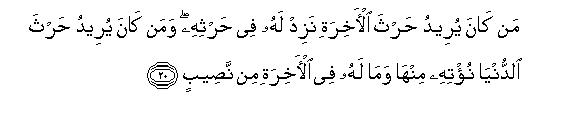
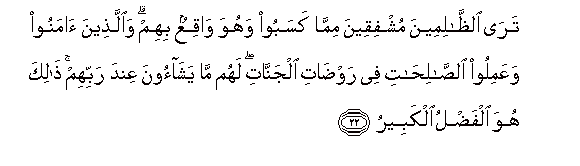
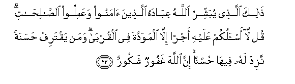
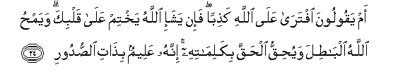
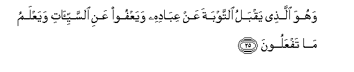
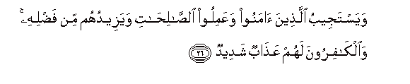
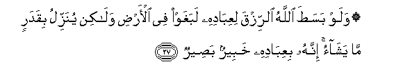
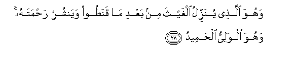
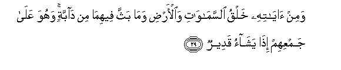

  
[Intangible Textual Heritage](../../index)  [Islam](../index) 
[Index](index)   
[Hypertext Qur'an](../htq/index)  [Unicode](../uq/042.htm#042_020) 
[Palmer](../sbe09/042)  [Pickthall](../pick/042.htm#042_020)  [Yusuf Ali
English](../yaq/yaq042)  [Rodwell](../qr/042)   
  
[Sūra XLII.: Shūrā, or Consultation. Index](042)  
  [Previous](04202)  [Next](04204) 

------------------------------------------------------------------------

  
*The Holy Quran*, tr. by Yusuf Ali, \[1934\], at Intangible Textual
Heritage

------------------------------------------------------------------------

# Sūra XLII.: Shūrā, or Consultation.

### Section 3

------------------------------------------------------------------------

20. Man k<u>a</u>na yureedu <u>h</u>artha al-<u>a</u>khirati nazid lahu
fee <u>h</u>arthihi waman k<u>a</u>na yureedu <u>h</u>artha
a**l**dduny<u>a</u> nu/tihi minh<u>a</u> wam<u>a</u> lahu fee
al-<u>a</u>khirati min na<u>s</u>eeb**in**

20\. To any that desires  
The tilth of the Hereafter,  
We give increase  
In his tilth; and to any  
That desires the tilth  
Of this world, We grant  
Somewhat thereof, but he  
Has no share or lot  
In the Hereafter.

------------------------------------------------------------------------

21. Am lahum shurak<u>a</u>o sharaAAoo lahum mina a**l**ddeeni m<u>a</u>
lam ya/<u>th</u>an bihi All<u>a</u>hu walawl<u>a</u> kalimatu
alfa<u>s</u>li laqu<u>d</u>iya baynahum wa-inna
a**l***<u>thth</u>*<u>a</u>limeena lahum AAa<u>tha</u>bun aleem**un**

21\. What! Have they partners  
(In godhead), who have  
Established for them some  
Religion without the permission  
Of God? Had it not  
Been for the Decree  
Of Judgment, the matter  
Would have been decided  
Between them (at once).  
But verily the wrong-doers  
Will have a grievous Penalty.

------------------------------------------------------------------------

22. Tar<u>a</u> a**l***<u>thth</u>*<u>a</u>limeena mushfiqeena
mimm<u>a</u> kasaboo wahuwa w<u>a</u>qiAAun bihim
wa**a**lla<u>th</u>eena <u>a</u>manoo waAAamiloo
a**l**<u>ssa</u>li<u>ha</u>ti fee raw<u>da</u>ti aljann<u>a</u>ti lahum
m<u>a</u> yash<u>a</u>oona AAinda rabbihim <u>tha</u>lika huwa
alfa<u>d</u>lu alkabeer**u**

22\. Thou wilt see the wrong-doers  
In fear on account of what  
They have earned, and (the burden  
Of) that must (necessarily)  
Fall on them. But those  
Who believe and work  
Righteous deeds will be  
In the luxuriant meads  
Of the Gardens: they shall  
Have, before their Lord,  
All that they wish for.  
That will indeed be  
The magnificent Bounty  
(Of God).

------------------------------------------------------------------------

23. <u>Tha</u>lika alla<u>th</u>ee yubashshiru All<u>a</u>hu
AAib<u>a</u>dahu alla<u>th</u>eena <u>a</u>manoo waAAamiloo
a**l**<u>ssa</u>li<u>ha</u>ti qul l<u>a</u> as-alukum AAalayhi ajran
ill<u>a</u> almawaddata fee alqurb<u>a</u> waman yaqtarif
<u>h</u>asanatan nazid lahu feeh<u>a</u> <u>h</u>usnan inna
All<u>a</u>ha ghafoorun shakoor**un**

23\. That is (the Bounty) whereof  
God gives Glad Tidings  
To His Servants who  
Believe and do righteous deeds.  
Say: "No reward do I  
Ask of you for this  
Except the love  
Of those near of kin."  
And if any one earns  
Any good, We shall give  
Him an increase of good  
In respect thereof: for God  
Is Oft-Forgiving, Most Ready  
To appreciate (service).

------------------------------------------------------------------------

24. Am yaqooloona iftar<u>a</u> AAal<u>a</u> All<u>a</u>hi
ka<u>th</u>iban fa-in yasha-i All<u>a</u>hu yakhtim AAal<u>a</u> qalbika
wayam<u>h</u>u All<u>a</u>hu alb<u>at</u>ila wayu<u>h</u>iqqu
al<u>h</u>aqqa bikalim<u>a</u>tihi innahu AAaleemun bi<u>tha</u>ti
a**l**<u>ss</u>udoor**i**

24\. What! Do they say,  
"He has forged a falsehood  
Against God"? But if God  
Willed, He could seal up  
Thy heart. And God  
Blots out Vanity, and proves  
The Truth by His Words.  
For He knows well  
The secrets of all hearts.

------------------------------------------------------------------------

25. Wahuwa alla<u>th</u>ee yaqbalu a**l**ttawbata AAan AAib<u>a</u>dihi
wayaAAfoo AAani a**l**ssayyi-ati wayaAAlamu m<u>a</u> tafAAaloon**a**

25\. He is the One that accepts  
Repentance from His Servants  
And forgives sins:  
And He knows all  
That ye do.

------------------------------------------------------------------------

26. Wayastajeebu alla<u>th</u>eena <u>a</u>manoo waAAamiloo
a**l**<u>ssa</u>li<u>ha</u>ti wayazeeduhum min fa<u>d</u>lihi
wa**a**lk<u>a</u>firoona lahum AAa<u>tha</u>bun shadeed**un**

26\. And He listens to  
Those who believe and  
Do deeds of righteousness,  
And gives them increase  
Of His Bounty: but  
For the Unbelievers there is  
A terrible Penalty.

------------------------------------------------------------------------

27. Walaw basa<u>t</u>a All<u>a</u>hu a**l**rrizqa liAAib<u>a</u>dihi
labaghaw fee al-ar<u>d</u>i wal<u>a</u>kin yunazzilu biqadarin m<u>a</u>
yash<u>a</u>o innahu biAAib<u>a</u>dihi khabeerun ba<u>s</u>eer**un**

27\. If God were to enlarge  
The provision for His Servants,  
They would indeed transgress  
Beyond all bounds  
Through the earth;  
But He sends (it) down  
In due measure  
As He pleases.  
For He is with His Servants  
Well-acquainted, Watchful.

------------------------------------------------------------------------

28. Wahuwa alla<u>th</u>ee yunazzilu alghaytha min baAAdi m<u>a</u>
qana<u>t</u>oo wayanshuru ra<u>h</u>matahu wahuwa alwaliyyu
al<u>h</u>ameed**u**

28\. He is the One that sends down  
Rain (even) after (men) have  
Given up all hope,  
And scatters His Mercy  
(Far and wide). And He  
Is the Protector, Worthy  
Of all Praise.

------------------------------------------------------------------------

29. Wamin <u>a</u>y<u>a</u>tihi khalqu a**l**ssam<u>a</u>w<u>a</u>ti
wa**a**l-ar<u>d</u>i wam<u>a</u> baththa feehim<u>a</u> min
d<u>a</u>bbatin wahuwa AAal<u>a</u> jamAAihim i<u>tha</u> yash<u>a</u>o
qadeer**un**

29\. And among His Signs  
Is the creation of  
The heavens and the earth,  
And the living creatures  
That He has scattered  
Through them: and He  
Has power to gather them  
Together when He wills.

------------------------------------------------------------------------

[Next: Section 4 (30-43)](04204)

