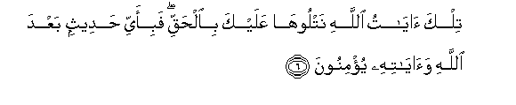
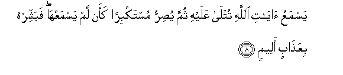
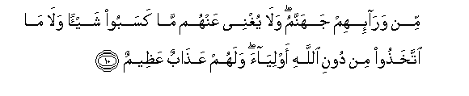
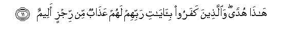

  
[Intangible Textual Heritage](../../index)  [Islam](../index.md) 
[Index](index.md)   
[Hypertext Qur'an](../htq/index)  [Unicode](../uq/045.htm#045_001.md) 
[Palmer](../sbe09/045)  [Pickthall](../pick/045.htm#045_001.md)  [Yusuf Ali
English](../yaq/yaq045)  [Rodwell](../qr/045.md)   
  
[Sūra XLV.: Ja&lt;u&gt;th&lt;/u&gt;iya, or Bowing the Knee.
Index](045.md)  
  [Previous](04403)  [Next](04502.md) 

------------------------------------------------------------------------

  
*The Holy Quran*, tr. by Yusuf Ali, \[1934\], at Intangible Textual
Heritage

------------------------------------------------------------------------

# Sūra XLV.: Ja<u>th</u>iya, or Bowing the Knee.

### Section 1

1. <u>Ha</u>-meem

1\. Hā-Mīm.

------------------------------------------------------------------------

2. Tanzeelu alkit<u>a</u>bi mina All<u>a</u>hi alAAazeezi
al<u>h</u>akeem**i**

2\. The revelation  
Of the Book  
Is from God  
The Exalted in Power,  
Full of Wisdom.

------------------------------------------------------------------------

3. Inna fee a**l**ssam<u>a</u>w<u>a</u>ti wa**a**l-ar<u>d</u>i
la<u>a</u>y<u>a</u>tin lilmu/mineen**a**

3\. Verily in the heavens  
And the earth, are Signs  
For those who believe.

------------------------------------------------------------------------

4. Wafee khalqikum wam<u>a</u> yabuththu min d<u>a</u>bbatin
<u>a</u>y<u>a</u>tun liqawmin yooqinoon**a**

4\. And in the creation  
Of yourselves and the fact  
That animals are scattered  
(Through the earth), are Signs  
For those of assured Faith.

------------------------------------------------------------------------

5. Wa**i**khtil<u>a</u>fi allayli wa**al**nnah<u>a</u>ri wam<u>a</u>
anzala All<u>a</u>hu mina a**l**ssam<u>a</u>-i min rizqin
faa<u>h</u>y<u>a</u> bihi al-ar<u>d</u>a baAAda mawtih<u>a</u>
wata<u>s</u>reefi a**l**rriy<u>ah</u>i <u>a</u>y<u>a</u>tun liqawmin
yaAAqiloon**a**

5\. And in the alternation  
Of Night and Day,  
And the fact that God  
Sends down Sustenance from  
The sky, and revives therewith  
The earth after its death,  
And in the change  
Of the winds,—are Signs  
For those that are wise.

------------------------------------------------------------------------

6. Tilka <u>a</u>y<u>a</u>tu All<u>a</u>hi natlooh<u>a</u> AAalayka
bi**a**l<u>h</u>aqqi fabi-ayyi <u>h</u>adeethin baAAda All<u>a</u>hi
wa<u>a</u>y<u>a</u>tihi yu/minoon**a**

6\. Such are the Signs  
Of God, which We rehearse to thee  
In truth: then in what  
Exposition will they believe  
After (rejecting) God  
And His Signs?

------------------------------------------------------------------------

7. Waylun likulli aff<u>a</u>kin atheem**in**

7\. Woe to each sinful  
Dealer in Falsehoods:

------------------------------------------------------------------------

8. YasmaAAu <u>a</u>y<u>a</u>ti All<u>a</u>hi tutl<u>a</u> AAalayhi
thumma yu<u>s</u>irru mustakbiran kaan lam yasmaAAh<u>a</u> fabashshirhu
biAAa<u>tha</u>bin aleem**in**

8\. He hears the Signs  
Of God rehearsed to him,  
Yet is obstinate and lofty,  
As if he had not  
Heard them: then announce  
To him a Penalty Grievous!

------------------------------------------------------------------------

9. Wa-i<u>tha</u> AAalima min <u>a</u>y<u>a</u>tin<u>a</u> shay-an
ittakha<u>th</u>ah<u>a</u> huzuwan ol<u>a</u>-ika lahum AAa<u>tha</u>bun
muheen**un**

9\. And when he learns  
Something of Our Signs,  
He takes them in jest:  
For such there will be  
A humiliating Penalty.

------------------------------------------------------------------------

10. Min war<u>a</u>-ihim jahannamu wal<u>a</u> yughnee AAanhum m<u>a</u>
kasaboo shay-an wal<u>a</u> m<u>a</u> ittakha<u>th</u>oo min dooni
All<u>a</u>hi awliy<u>a</u>a walahum AAa<u>tha</u>bun
AAa*<u>th</u>*eem**un**

10\. In front of them is  
Hell: and of no profit  
To them is anything  
They may have earned,  
Nor any protectors they  
May have taken to themselves  
Besides God: for them  
Is a tremendous Penalty.

------------------------------------------------------------------------

11. H<u>atha</u> hudan wa**a**lla<u>th</u>eena kafaroo
bi-<u>a</u>y<u>a</u>ti rabbihim lahum AAa<u>tha</u>bun min rijzin
aleem**in**

11\. This is (true) Guidance:  
And for those who reject  
The Signs of their Lord,  
Is a grievous Penalty  
Of abomination.

------------------------------------------------------------------------

[Next: Section 2 (12-21)](04502.md)

