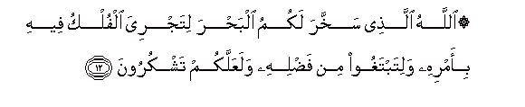

  
[Intangible Textual Heritage](../../index)  [Islam](../index) 
[Index](index)   
[Hypertext Qur'an](../htq/index)  [Unicode](../uq/045.htm#045_012) 
[Palmer](../sbe09/045)  [Pickthall](../pick/045.htm#045_012)  [Yusuf Ali
English](../yaq/yaq045)  [Rodwell](../qr/045)   
  
[Sūra XLV.: Ja&lt;u&gt;th&lt;/u&gt;iya, or Bowing the Knee.
Index](045)  
  [Previous](04501)  [Next](04503) 

------------------------------------------------------------------------

  
*The Holy Quran*, tr. by Yusuf Ali, \[1934\], at Intangible Textual
Heritage

------------------------------------------------------------------------

# Sūra XLV.: Ja<u>th</u>iya, or Bowing the Knee.

### Section 2

------------------------------------------------------------------------

12. All<u>a</u>hu alla<u>th</u>ee sakhkhara lakumu alba<u>h</u>ra
litajriya alfulku feehi bi-amrihi walitabtaghoo min fa<u>d</u>lihi
walaAAallakum tashkuroon**a**

12\. It is God Who has  
Subjected the sea to you,  
That ships may sail  
Through it by His command,  
That ye may seek  
Of His Bounty, and that  
Ye may be grateful.

------------------------------------------------------------------------

13. Wasakhkhara lakum m<u>a</u> fee a**l**ssam<u>a</u>w<u>a</u>ti
wam<u>a</u> fee al-ar<u>d</u>i jameeAAan minhu inna fee <u>tha</u>lika
la<u>a</u>y<u>a</u>tin liqawmin yatafakkaroon**a**

13\. And He has subjected  
To you, as from Him,  
All that is in the heavens  
And on earth: behold,  
In that are Signs indeed  
For those who reflect.

------------------------------------------------------------------------

14. Qul lilla<u>th</u>eena <u>a</u>manoo yaghfiroo lilla<u>th</u>eena
l<u>a</u> yarjoona ayy<u>a</u>ma All<u>a</u>hi liyajziya qawman
bim<u>a</u> k<u>a</u>noo yaksiboon**a**

14\. Tell those who believe,  
To forgive those who  
Do not look forward  
To the Days of God:  
It is for Him to recompense  
(For good or ill) each People  
According to what  
They have earned.

------------------------------------------------------------------------

15. Man AAamila <u>sa</u>li<u>h</u>an falinafsihi waman as<u>a</u>a
faAAalayh<u>a</u> thumma il<u>a</u> rabbikum turjaAAoon**a**

15\. If any one does  
A righteous deed,  
It enures to the benefit  
Of his own soul;  
If he does evil,  
It works against  
(His own soul).  
In the end will ye  
(All) be brought back  
To your Lord.

------------------------------------------------------------------------

16. Walaqad <u>a</u>tayn<u>a</u> banee isr<u>a</u>-eela alkit<u>a</u>ba
wa**a**l<u>h</u>ukma wa**al**nnubuwwata warazaqn<u>a</u>hum mina
a**l**<u>tt</u>ayyib<u>a</u>ti wafa<u>dd</u>aln<u>a</u>hum AAal<u>a</u>
alAA<u>a</u>lameen**a**

16\. We did aforetime  
Grant to the Children  
Of Israel the Book,  
The Power of Command,  
And Prophethood; We gave  
Them, for Sustenance, things  
Good and pure; and We  
Favoured them above the nations.

------------------------------------------------------------------------

17. Wa<u>a</u>tayn<u>a</u>hum bayyin<u>a</u>tin mina al-amri fam<u>a</u>
ikhtalafoo ill<u>a</u> min baAAdi m<u>a</u> j<u>a</u>ahumu alAAilmu
baghyan baynahum inna rabbaka yaq<u>d</u>ee baynahum yawma
alqiy<u>a</u>mati feem<u>a</u> k<u>a</u>noo feehi yakhtalifoon**a**

17\. And We granted them  
Clear Signs in affairs  
(Of Religion): it was only  
After knowledge had been  
Granted to them that they  
Fell into schisms, through  
Insolent envy among themselves  
Verily thy Lord will judge  
Between them on the Day  
Of Judgment as to those  
Matters in which they  
Set up differences.

------------------------------------------------------------------------

18. Thumma jaAAaln<u>a</u>ka AAal<u>a</u> shareeAAatin mina al-amri
fa**i**ttabiAAh<u>a</u> wal<u>a</u> tattabiAA ahw<u>a</u>a
alla<u>th</u>eena l<u>a</u> yaAAlamoon**a**

18\. Then we put thee  
On the (right) Way  
Of Religion: so follow  
Thou that (Way),  
And follow not the desires  
Of those who know not.

------------------------------------------------------------------------

19. Innahum lan yughnoo AAanka mina All<u>a</u>hi shay-an wa-inna
a**l***<u>thth</u>*<u>a</u>limeena baAA<u>d</u>uhum awliy<u>a</u>o
baAA<u>d</u>in wa**A**ll<u>a</u>hu waliyyu almuttaqeen**a**

19\. They will be of no  
Use to thee in the sight  
Of God: it is only  
Wrong-doers (that stand as)  
Protectors, one to another:  
But God is the Protector  
Of the Righteous.

------------------------------------------------------------------------

20. H<u>atha</u> ba<u>sa</u>-iru li**l**nn<u>a</u>si wahudan
wara<u>h</u>matun liqawmin yooqinoon**a**

20\. These are clear evidences  
To men, and a Guidance  
And Mercy to those  
Of assured Faith.

------------------------------------------------------------------------

21. Am <u>h</u>asiba alla<u>th</u>eena ijtara<u>h</u>oo
a**l**ssayyi-<u>a</u>ti an najAAalahum ka**a**lla<u>th</u>eena
<u>a</u>manoo waAAamiloo a**l**<u>ssa</u>li<u>ha</u>ti saw<u>a</u>an
ma<u>h</u>y<u>a</u>hum wamam<u>a</u>tuhum s<u>a</u>a m<u>a</u>
ya<u>h</u>kumoon**a**

21\. What! do those who  
Seek after evil ways  
Think that We shall  
Hold them equal with  
Those who believe and  
Do righteous deeds,—that  
Equal will be their  
Life and their death?  
Ill is the judgment  
That they make.

------------------------------------------------------------------------

[Next: Section 3 (22-26)](04503)

