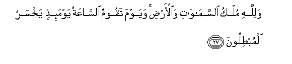
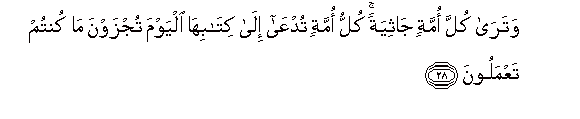
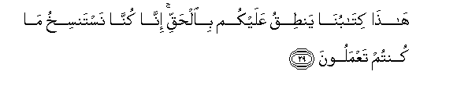
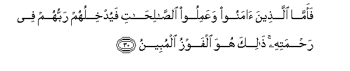
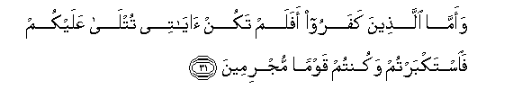
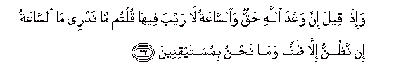
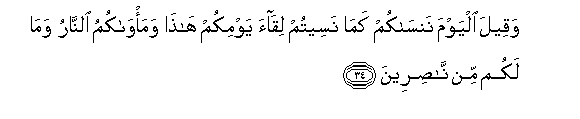
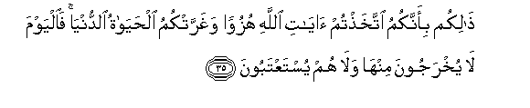
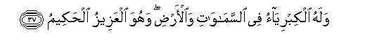

  
[Intangible Textual Heritage](../../index)  [Islam](../index.md) 
[Index](index.md)   
[Hypertext Qur'an](../htq/index)  [Unicode](../uq/045.htm#045_027.md) 
[Palmer](../sbe09/045)  [Pickthall](../pick/045.htm#045_027.md)  [Yusuf Ali
English](../yaq/yaq045)  [Rodwell](../qr/045.md)   
  
[Sūra XLV.: Ja&lt;u&gt;th&lt;/u&gt;iya, or Bowing the Knee.
Index](045.md)  
  [Previous](04503)  [Next](04601.md) 

------------------------------------------------------------------------

  
*The Holy Quran*, tr. by Yusuf Ali, \[1934\], at Intangible Textual
Heritage

------------------------------------------------------------------------

# Sūra XLV.: Ja<u>th</u>iya, or Bowing the Knee.

### Section 4

------------------------------------------------------------------------

27. Walill<u>a</u>hi mulku a**l**ssam<u>a</u>w<u>a</u>ti
wa**a**l-ar<u>d</u>i wayawma taqoomu a**l**ss<u>a</u>AAatu
yawma-i<u>th</u>in yakhsaru almub<u>t</u>iloon**a**

27\. To God belongs  
The dominion of the heavens  
And the earth, and  
The Day that the Hour  
Of Judgment is established,—  
That Day will the dealers  
In Falsehood perish!

------------------------------------------------------------------------

28. Watar<u>a</u> kulla ommatin j<u>a</u>thiyatan kullu ommatin
tudAA<u>a</u> il<u>a</u> kit<u>a</u>bih<u>a</u> alyawma tujzawna
m<u>a</u> kuntum taAAmaloon**a**

28\. And thou wilt see  
Every sect bowing the knee:  
Every sect will be called  
To its Record: "This Day  
Shall ye be recompensed  
For all that ye did!

------------------------------------------------------------------------

29. H<u>atha</u> kit<u>a</u>bun<u>a</u> yan<u>t</u>iqu AAalaykum
bi**a**l<u>h</u>aqqi inn<u>a</u> kunn<u>a</u> nastansikhu m<u>a</u>
kuntum taAAmaloon**a**

29\. "This Our Record speaks  
About you with truth:  
For We were wont  
To put on record  
All that ye did."

------------------------------------------------------------------------

30. Faamm<u>a</u> alla<u>th</u>eena <u>a</u>manoo waAAamiloo
a**l**<u>ssa</u>li<u>ha</u>ti fayudkhiluhum rabbuhum fee
ra<u>h</u>matihi <u>tha</u>lika huwa alfawzu almubeen**u**

30\. Then, as to those who  
Believed and did righteous  
Deeds, their Lord will  
Admit them to His Mercy:  
That will be the Achievement's  
For all to see.

------------------------------------------------------------------------

31. Waamm<u>a</u> alla<u>th</u>eena kafaroo afalam takun
<u>a</u>y<u>a</u>tee tutl<u>a</u> AAalaykum fa**i**stakbartum wakuntum
qawman mujrimeen**a**

31\. But as to those who  
Rejected God, (to them  
Will be said): "Were not  
Our Signs rehearsed to you?  
But ye were arrogant,  
And were a people  
Given to sin!

------------------------------------------------------------------------

32. Wa-i<u>tha</u> qeela inna waAAda All<u>a</u>hi <u>h</u>aqqun
wa**al**ss<u>a</u>AAatu l<u>a</u> rayba feeh<u>a</u> qultum m<u>a</u>
nadree m<u>a</u> a**l**ss<u>a</u>AAatu in na*<u>th</u>*unnu ill<u>a</u>
*<u>th</u>*annan wam<u>a</u> na<u>h</u>nu bimustayqineen**a**

32\. "And when it was said  
That the promise of God  
Was true, and that the Hour—  
There was no doubt  
About its (coming), ye  
Used to say, "We  
Know not what is  
The Hour: we only think  
It is an idea, and we  
Have no firm assurance."

------------------------------------------------------------------------

33. Wabad<u>a</u> lahum sayyi-<u>a</u>tu m<u>a</u> AAamiloo
wa<u>ha</u>qa bihim m<u>a</u> k<u>a</u>noo bihi yastahzi-oon**a**

33\. Then will appear to them  
The evil (fruits) of what  
They did, and they will be  
Completely encircled by that  
Which they used to mock at!

------------------------------------------------------------------------

34. Waqeela alyawma nans<u>a</u>kum kam<u>a</u> naseetum liq<u>a</u>a
yawmikum h<u>atha</u> wama/w<u>a</u>kumu a**l**nn<u>a</u>ru wam<u>a</u>
lakum min n<u>as</u>ireen**a**

34\. It will also be said:  
"This Day We will forget  
You as ye forgot  
The meeting of this Day  
Of yours! And your  
Abode is the Fire, and  
No helpers have ye!

------------------------------------------------------------------------

35. <u>Tha</u>likum bi-annakumu ittakha<u>th</u>tum <u>a</u>y<u>a</u>ti
All<u>a</u>hi huzuwan wagharratkumu al<u>h</u>ay<u>a</u>tu
a**l**dduny<u>a</u> fa**a**lyawma l<u>a</u> yukhrajoona minh<u>a</u>
wal<u>a</u> hum yustaAAtaboon**a**

35\. "This, because ye used  
To take the Signs of God  
In jest, and the life  
Of the world deceived you:  
(From) that Day, therefore,  
They shall not be taken out  
Thence, nor shall they be  
Received into Grace.

------------------------------------------------------------------------

36. Falill<u>a</u>hi al<u>h</u>amdu rabbi a**l**ssam<u>a</u>w<u>a</u>ti
warabbi al-ar<u>d</u>i rabbi alAA<u>a</u>lameen**a**

36\. Then Praise be to God,  
Lord of the heavens  
And Lord of the earth,—  
Lord and Cherisher  
Of all the worlds!

------------------------------------------------------------------------

37. Walahu alkibriy<u>a</u>o fee a**l**ssam<u>a</u>w<u>a</u>ti
wa**a**l-ar<u>d</u>i wahuwa alAAazeezu al<u>h</u>akeem**u**

37\. To Him be Glory  
Throughout the heavens  
And the earth: and He  
Is Exalted in Power,  
Full of Wisdom!

------------------------------------------------------------------------

[Next: Section 1 (1-10)](04601.md)

