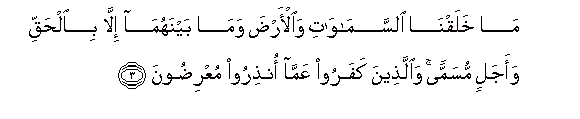
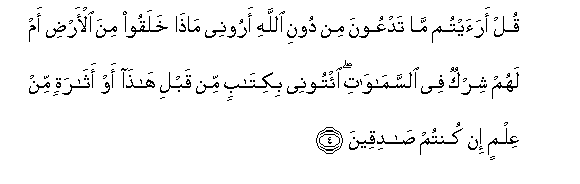
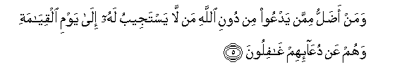
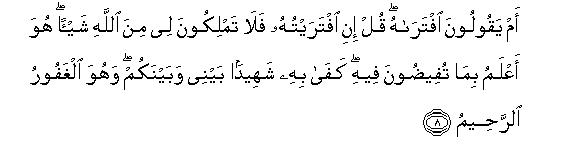
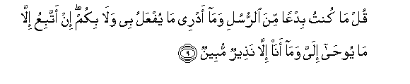
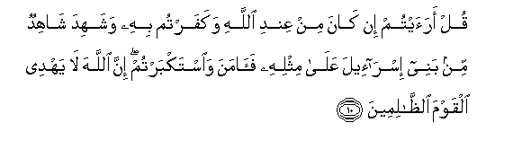

  
[Intangible Textual Heritage](../../index)  [Islam](../index.md) 
[Index](index.md)   
[Hypertext Qur'an](../htq/index)  [Unicode](../uq/046.htm#046_001.md) 
[Palmer](../sbe09/046)  [Pickthall](../pick/046.htm#046_001.md)  [Yusuf Ali
English](../yaq/yaq046)  [Rodwell](../qr/046.md)   
  
[Sūra XLVI.: Aḥqāf, or Winding Sand-tracts. Index](046.md)  
  [Previous](04504)  [Next](04602.md) 

------------------------------------------------------------------------

  
*The Holy Quran*, tr. by Yusuf Ali, \[1934\], at Intangible Textual
Heritage

------------------------------------------------------------------------

# Sūra XLVI.: Aḥqāf, or Winding Sand-tracts.

### Section 1

1. <u>Ha</u>-meem

1\. Hā-Mīm.

------------------------------------------------------------------------

2. Tanzeelu alkit<u>a</u>bi mina All<u>a</u>hi alAAazeezi
al<u>h</u>akeem**i**

2\. The revelation  
Of the Book  
Is from God  
The Exalted in Power,  
Full of Wisdom.

------------------------------------------------------------------------

3. M<u>a</u> khalaqn<u>a</u> a**l**ssam<u>a</u>w<u>a</u>ti
wa**a**l-ar<u>d</u>a wam<u>a</u> baynahum<u>a</u> ill<u>a</u>
bi**a**l<u>h</u>aqqi waajalin musamman wa**a**lla<u>th</u>eena kafaroo
AAamm<u>a</u> on<u>th</u>iroo muAAri<u>d</u>oon**a**

3\. We created not  
The heavens and the earth  
And all between them  
But for just ends, and  
For a term appointed:  
But those who reject Faith  
Turn away from that  
Whereof they are warned.

------------------------------------------------------------------------

4. Qul araaytum m<u>a</u> tadAAoona min dooni All<u>a</u>hi aroonee
m<u>atha</u> khalaqoo mina al-ar<u>d</u>i am lahum shirkun fee
a**l**ssam<u>a</u>w<u>a</u>ti eetoonee bikit<u>a</u>bin min qabli
h<u>atha</u> aw ath<u>a</u>ratin min AAilmin in kuntum
<u>sa</u>diqeen**a**

4\. Say: "Do ye see  
What it is ye invoke  
Besides God? Show me  
What it is they  
Have created on earth,  
Or have they a share  
In the heavens?  
Bring me a Book  
(Revealed) before this,  
Or any remnant of knowledge  
(Ye may have), if ye  
Are telling the truth!

------------------------------------------------------------------------

5. Waman a<u>d</u>allu mimman yadAAoo min dooni All<u>a</u>hi man
l<u>a</u> yastajeebu lahu il<u>a</u> yawmi alqiy<u>a</u>mati wahum AAan
duAA<u>a</u>-ihim gh<u>a</u>filoon**a**

5\. And who is more astray  
Than one who invokes,  
Besides God, such as will  
Not answer him to the Day  
Of Judgment, and who  
(In fact) are unconscious  
Of their call (to them)?

------------------------------------------------------------------------

6. Wa-i<u>tha</u> <u>h</u>ushira a**l**nn<u>a</u>su k<u>a</u>noo lahum
aAAd<u>a</u>an wak<u>a</u>noo biAAib<u>a</u>datihim k<u>a</u>fireen**a**

6\. And when mankind  
Are gathered together  
(At the Resurrection),  
They will be hostile  
To them and reject  
Their worship (altogether)!

------------------------------------------------------------------------

7. Wa-i<u>tha</u> tutl<u>a</u> AAalayhim <u>a</u>y<u>a</u>tun<u>a</u>
bayyin<u>a</u>tin q<u>a</u>la alla<u>th</u>eena kafaroo lil<u>h</u>aqqi
lamm<u>a</u> j<u>a</u>ahum h<u>atha</u> si<u>h</u>run mubeen**un**

7\. When Our Clear Signs  
Are rehearsed to them,  
The Unbelievers say,  
Of the Truth  
When it comes to them:  
"This is evident sorcery!"

------------------------------------------------------------------------

8. Am yaqooloona iftar<u>a</u>hu qul ini iftaraytuhu fal<u>a</u>
tamlikoona lee mina All<u>a</u>hi shay-an huwa aAAlamu bim<u>a</u>
tufee<u>d</u>oona feehi kaf<u>a</u> bihi shaheedan baynee wabaynakum
wahuwa alghafooru a**l**rra<u>h</u>eem**u**

8\. Or do they say,  
"He has forged it"?  
Say: "Had I forged it,  
Then can ye obtain  
No single (blessing) for me  
From God. He knows best  
Of that whereof ye talk  
(So glibly)! Enough is He  
For a witness between me  
And you! And He is  
Oft-Forgiving, Most Merciful."

------------------------------------------------------------------------

9. Qul m<u>a</u> kuntu bidAAan mina a**l**rrusuli wam<u>a</u> adree
m<u>a</u> yufAAalu bee wal<u>a</u> bikum in attabiAAu ill<u>a</u>
m<u>a</u> yoo<u>ha</u> ilayya wam<u>a</u> an<u>a</u> ill<u>a</u>
na<u>th</u>eerun mubeen**un**

9\. Say: "I am no bringer  
Of new-fangled doctrine  
Among the apostles, nor  
Do I know what will  
Be done with me or  
With you. I follow  
But that which is revealed  
To me by inspiration;  
I am but a Warner  
Open and clear."

------------------------------------------------------------------------

10. Qul araaytum in k<u>a</u>na min AAindi All<u>a</u>hi wakafartum bihi
washahida sh<u>a</u>hidun min banee isr<u>a</u>-eela AAal<u>a</u>
mithlihi fa<u>a</u>mana wa**i**stakbartum inna All<u>a</u>ha l<u>a</u>
yahdee alqawma a**l***<u>thth</u>*<u>a</u>limeen**a**

10\. Say: "See ye?  
If (this teaching) be  
From God, and ye reject it,  
And a witness from among  
The Children of Israel testifies  
To its similarity  
(With earlier scripture),  
And has believed  
While ye are arrogant,  
(How unjust ye are!)  
Truly, God guides not  
A people unjust."

------------------------------------------------------------------------

[Next: Section 2 (11-20)](04602.md)

