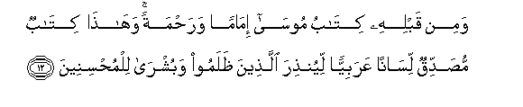
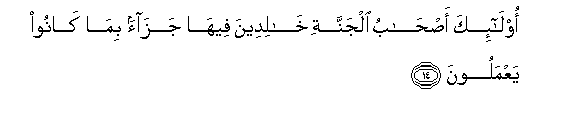
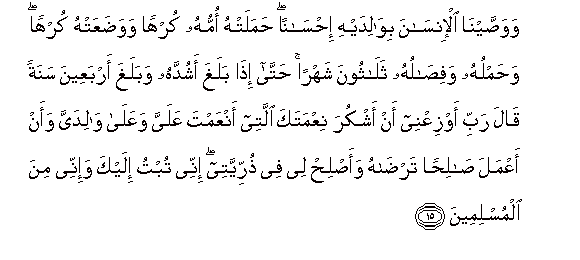
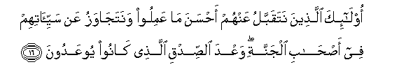
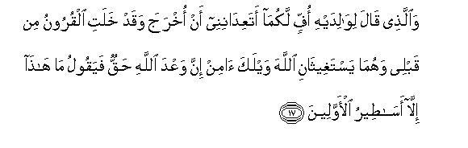
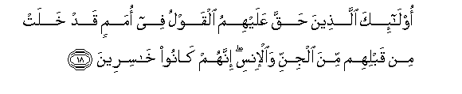
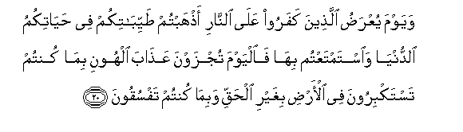

  
[Intangible Textual Heritage](../../index)  [Islam](../index) 
[Index](index)   
[Hypertext Qur'an](../htq/index)  [Unicode](../uq/046.htm#046_011) 
[Palmer](../sbe09/046)  [Pickthall](../pick/046.htm#046_011)  [Yusuf Ali
English](../yaq/yaq046)  [Rodwell](../qr/046)   
  
[Sūra XLVI.: Aḥqāf, or Winding Sand-tracts. Index](046)  
  [Previous](04601)  [Next](04603) 

------------------------------------------------------------------------

  
*The Holy Quran*, tr. by Yusuf Ali, \[1934\], at Intangible Textual
Heritage

------------------------------------------------------------------------

# Sūra XLVI.: Aḥqāf, or Winding Sand-tracts.

### Section 2

------------------------------------------------------------------------

11. Waq<u>a</u>la alla<u>th</u>eena kafaroo lilla<u>th</u>eena
<u>a</u>manoo law k<u>a</u>na khayran m<u>a</u> sabaqoon<u>a</u> ilayhi
wa-i<u>th</u> lam yahtadoo bihi fasayaqooloona h<u>atha</u> ifkun
qadeem**un**

11\. The Unbelievers say  
Of those who believe:  
"If (this Message) were  
A good thing, (such men)  
Would not have gone  
To it first, before us!"  
And seeing that they  
Guide not themselves thereby,  
They will say, "This is  
An (old,) old falsehood!"

------------------------------------------------------------------------

12. Wamin qablihi kit<u>a</u>bu moos<u>a</u> im<u>a</u>man
wara<u>h</u>matan wah<u>atha</u> kit<u>a</u>bun mu<u>s</u>addiqun
lis<u>a</u>nan AAarabiyyan liyun<u>th</u>ira alla<u>th</u>eena
*<u>th</u>*alamoo wabushr<u>a</u> lilmu<u>h</u>sineen**a**

12\. And before this, was  
The Book of Moses  
As a guide and a mercy:  
And this Book confirms (it)  
In the Arabic tongue;  
To admonish the unjust,  
And as Glad Tidings.  
To those who do right.

------------------------------------------------------------------------

13. Inna alla<u>th</u>eena q<u>a</u>loo rabbun<u>a</u> All<u>a</u>hu
thumma istaq<u>a</u>moo fal<u>a</u> khawfun AAalayhim wal<u>a</u> hum
ya<u>h</u>zanoon**a**

13\. Verily those who say,  
"Our Lord is God,"  
And remain firm  
(On that Path),  
On them shall be no fear,  
Nor shall they grieve.

------------------------------------------------------------------------

14. Ol<u>a</u>-ika a<u>s</u>-<u>ha</u>bu aljannati kh<u>a</u>lideena
feeh<u>a</u> jaz<u>a</u>an bim<u>a</u> k<u>a</u>noo yaAAmaloon**a**

14\. Such shall be Companions  
Of the Garden, dwelling  
Therein (for aye): a recompense  
For their (good) deeds.

------------------------------------------------------------------------

15. Wawa<u>ss</u>ayn<u>a</u> al-ins<u>a</u>na biw<u>a</u>lidayhi
i<u>h</u>s<u>a</u>nan <u>h</u>amalat-hu ommuhu kurhan
wawa<u>d</u>aAAat-hu kurhan wa<u>h</u>amluhu wafi<u>sa</u>luhu
thal<u>a</u>thoona shahran <u>h</u>att<u>a</u> i<u>tha</u> balagha
ashuddahu wabalagha arbaAAeena sanatan q<u>a</u>la rabbi awziAAnee an
ashkura niAAmataka allatee anAAamta AAalayya waAAal<u>a</u>
w<u>a</u>lidayya waan aAAmala <u>sa</u>li<u>h</u>an tar<u>da</u>hu
waa<u>s</u>li<u>h</u> lee fee <u>th</u>urriyyatee innee tubtu ilayka
wa-innee mina almuslimeen**a**

15\. We have enjoined on man  
Kindness to his parents:  
In pain did his mother  
Bear him, and in pain  
Did she give him birth.  
The carrying of the (child)  
To his weaning is  
(A period of) thirty months.  
At length, when he reaches  
The age of full strength  
And attains forty years,  
He says, "O my Lord!  
Grant me that I may be  
Grateful for Thy favour  
Which Thou hast bestowed  
Upon me, and upon both  
My parents, and that I  
May work righteousness  
Such as Thou mayest approve;  
And be gracious to me  
In my issue. Truly  
Have I turned to Thee  
And truly do I bow  
(To Thee) in Islām."

------------------------------------------------------------------------

16. Ol<u>a</u>-ika alla<u>th</u>eena nataqabbalu AAanhum a<u>h</u>sana
m<u>a</u> AAamiloo wanataj<u>a</u>wazu AAan sayyi-<u>a</u>tihim fee
a<u>s</u>-<u>ha</u>bi aljannati waAAda a**l**<u>ss</u>idqi
alla<u>th</u>ee k<u>a</u>noo yooAAadoon**a**

16\. Such are they from whom  
We shall accept the best  
Of their deeds and pass by  
Their ill deeds: (they shall  
Be) among the Companions  
Of the Garden: a promise!  
Of truth, which was  
Made to them  
(In this life).

------------------------------------------------------------------------

17. Wa**a**lla<u>th</u>ee q<u>a</u>la liw<u>a</u>lidayhi offin
lakum<u>a</u> ataAAid<u>a</u>ninee an okhraja waqad khalati alquroonu
min qablee wahum<u>a</u> yastagheeth<u>a</u>ni All<u>a</u>ha waylaka
<u>a</u>min inna waAAda All<u>a</u>hi <u>h</u>aqqun fayaqoolu m<u>a</u>
h<u>atha</u> ill<u>a</u> as<u>at</u>eeru al-awwaleen**a**

17\. But (there is one)  
Who says to his parents,  
"Fie on you! Do ye  
Hold out the promise  
To me that I  
Shall be raised up,  
Even though generations  
Have passed before me  
(Without rising again)?"  
And they two seek  
God's aid, (and rebuke  
The son): "Woe to thee!  
Have Faith! For the promise  
Of God is true."  
But he says, "This is  
Nothing but tales  
Of the ancients!"

------------------------------------------------------------------------

18. Ol<u>a</u>-ika alla<u>th</u>eena <u>h</u>aqqa AAalayhimu alqawlu fee
umamin qad khalat min qablihim mina aljinni wa**a**l-insi innahum
k<u>a</u>noo kh<u>a</u>sireen**a**

18\. Such are they against whom  
Is proved the Sentence  
Among the previous generations  
Of Jinns and men, that have  
Passed away; for they will  
Be (utterly) lost.

------------------------------------------------------------------------

19. Walikullin daraj<u>a</u>tun mimm<u>a</u> AAamiloo waliyuwaffiyahum
aAAm<u>a</u>lahum wahum l<u>a</u> yu*<u>th</u>*lamoon**a**

19\. And to all  
Are (assigned) degrees  
According to the deeds  
Which they (have done),  
And in order that (God)  
May recompense their deeds,  
And no injustice be done  
To them.

------------------------------------------------------------------------

20. Wayawma yuAAra<u>d</u>u alla<u>th</u>eena kafaroo AAal<u>a</u>
a**l**nn<u>a</u>ri a<u>th</u>habtum <u>t</u>ayyib<u>a</u>tikum fee
<u>h</u>ay<u>a</u>tikumu a**l**dduny<u>a</u> wa**i**stamtaAAtum
bih<u>a</u> fa**a**lyawma tujzawna AAa<u>tha</u>ba alhooni bim<u>a</u>
kuntum tastakbiroona fee al-ar<u>d</u>i bighayri al<u>h</u>aqqi
wabim<u>a</u> kuntum tafsuqoon**a**

20\. And on the Day that  
The Unbelievers will be  
Placed before the Fire,  
(It will be said to them):  
"Ye received your good things  
In the life of the world,  
And ye took your pleasure  
Out of them: but to-day  
Shall ye be recompensed  
With a Penalty of humiliation:  
For that ye were arrogant  
On earth without just cause,  
And that ye (ever) transgressed."

------------------------------------------------------------------------

[Next: Section 3 (21-26)](04603)

