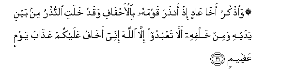
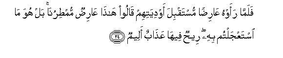
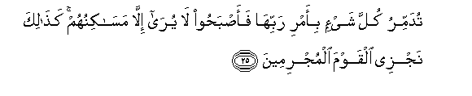
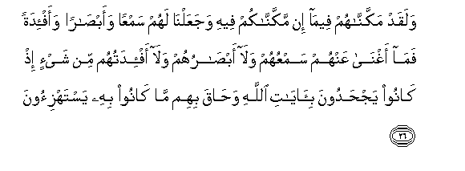

  
[Intangible Textual Heritage](../../index)  [Islam](../index.md) 
[Index](index.md)   
[Hypertext Qur'an](../htq/index)  [Unicode](../uq/046.htm#046_021.md) 
[Palmer](../sbe09/046)  [Pickthall](../pick/046.htm#046_021.md)  [Yusuf Ali
English](../yaq/yaq046)  [Rodwell](../qr/046.md)   
  
[Sūra XLVI.: Aḥqāf, or Winding Sand-tracts. Index](046.md)  
  [Previous](04602)  [Next](04604.md) 

------------------------------------------------------------------------

  
*The Holy Quran*, tr. by Yusuf Ali, \[1934\], at Intangible Textual
Heritage

------------------------------------------------------------------------

# Sūra XLVI.: Aḥqāf, or Winding Sand-tracts.

### Section 3

------------------------------------------------------------------------

21. Wa**o**<u>th</u>kur akh<u>a</u> AA<u>a</u>din i<u>th</u>
an<u>th</u>ara qawmahu bi**a**l-a<u>h</u>q<u>a</u>fi waqad khalati
a**l**nnu<u>th</u>uru min bayni yadayhi wamin khalfihi all<u>a</u>
taAAbudoo ill<u>a</u> All<u>a</u>ha innee akh<u>a</u>fu AAalaykum
AAa<u>tha</u>ba yawmin AAa*<u>th</u>*eem**in**

21\. Mention (Hūd)  
One of ‘Ād's (own) brethren:  
Behold, he warned his people  
About the winding Sand-tracts:  
But there have been Warners  
Before him and after him:  
"Worship ye none other  
Than God: truly I fear  
For you the Penalty  
Of a Mighty Day."

------------------------------------------------------------------------

22. Q<u>a</u>loo aji/tan<u>a</u> lita/fikan<u>a</u> AAan
<u>a</u>lihatin<u>a</u> fa/tin<u>a</u> bim<u>a</u> taAAidun<u>a</u> in
kunta mina a**l**<u>ssa</u>diqeen**a**

22\. They said: "Hast thou come  
In order to turn us aside  
From our gods? Then bring  
Upon us the (calamity)  
With which thou dost  
Threaten us, if thou  
Art telling the truth!"

------------------------------------------------------------------------

23. Q<u>a</u>la innam<u>a</u> alAAilmu AAinda All<u>a</u>hi
waoballighukum m<u>a</u> orsiltu bihi wal<u>a</u>kinnee ar<u>a</u>kum
qawman tajhaloon**a**

23\. He said: "The Knowledge  
(Of when it will come)  
Is only with God: I  
Proclaim to you the mission  
On which I have been sent:  
But I see that ye  
Are a people in ignorance!"…

------------------------------------------------------------------------

24. Falamm<u>a</u> raawhu AA<u>a</u>ri<u>d</u>an mustaqbila awdiyatihim
q<u>a</u>loo h<u>atha</u> AA<u>a</u>ri<u>d</u>un mum<u>t</u>irun<u>a</u>
bal huwa m<u>a</u> istaAAjaltum bihi ree<u>h</u>un feeh<u>a</u>
AAa<u>tha</u>bun aleem**un**

24\. Then, when they saw  
The (Penalty in the shape of)  
A cloud traversing the sky,  
Corning to meet their valleys,  
They said, "This cloud  
Will give us rain!"  
"Nay, it is the (calamity)  
Ye were asking to be  
Hastened!—a wind  
Wherein is a Grievous Penalty!

------------------------------------------------------------------------

25. Tudammiru kulla shay-in bi-amri rabbih<u>a</u>
faa<u>s</u>ba<u>h</u>oo l<u>a</u> yur<u>a</u> ill<u>a</u>
mas<u>a</u>kinuhum ka<u>tha</u>lika najzee alqawma almujrimeen**a**

25\. "Everything will it destroy  
By the command of its Lord!"  
Then by the morning they—  
Nothing was to be seen  
But (the ruins of) their houses!  
Thus do We recompense  
Those given to sin!

------------------------------------------------------------------------

26. Walaqad makkann<u>a</u>hum feem<u>a</u> in makkann<u>a</u>kum feehi
wajaAAaln<u>a</u> lahum samAAan waab<u>sa</u>ran waaf-idatan fam<u>a</u>
aghn<u>a</u> AAanhum samAAuhum wal<u>a</u> ab<u>sa</u>ruhum wal<u>a</u>
af-idatuhum min shay-in i<u>th</u> k<u>a</u>noo yaj<u>h</u>adoona
bi-<u>a</u>y<u>a</u>ti All<u>a</u>hi wa<u>ha</u>qa bihim m<u>a</u>
k<u>a</u>noo bihi yastahzi-oon**a**

26\. And We had firmly established  
Them in a (prosperity and) power  
Which We have not given  
To you (ye Quraish!)  
And We had endowed them  
With (faculties of)  
Hearing, seeing, heart and intellect  
But of no profit to them  
Were their (faculties of)  
Hearing, sight, and heart  
And intellect, when they  
Went on rejecting the Signs  
Of God; and they were  
(Completely) encircled  
By that which they  
Used to mock at!

------------------------------------------------------------------------

[Next: Section 4 (27-35)](04604.md)

